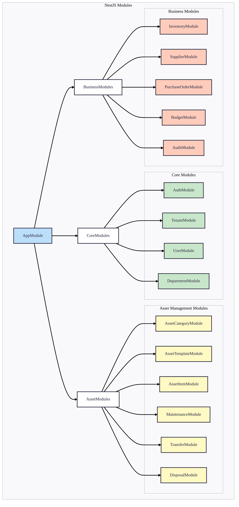
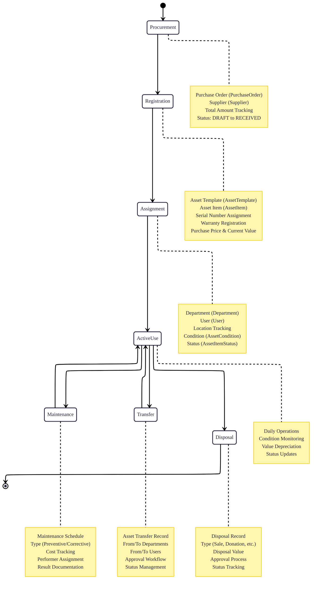

# System Overview

## Introduction

The Asset Management System is a comprehensive, multi-tenant software solution designed to help organizations effectively track, maintain, and optimize their physical assets throughout their entire lifecycle. Built with modern web technologies and a robust architecture, this system provides a centralized platform for managing everything from individual asset tracking to procurement, maintenance, and disposal processes.

## System Purpose

The primary goal of this system is to solve the common challenges organizations face in managing physical assets:

1. **Visibility**: Provide a single source of truth for all asset-related information
2. **Accountability**: Track asset ownership, location, and condition in real-time
3. **Efficiency**: Streamline asset-related processes and workflows
4. **Cost Control**: Monitor asset lifecycle costs and budget utilization
5. **Compliance**: Maintain audit trails and documentation for regulatory requirements

## Core Philosophy

This system is built on several key principles:

### Multi-tenancy First
Every aspect of the system is designed with multi-tenancy in mind, ensuring complete data isolation between organizations while maintaining efficient resource utilization.

### Lifecycle Management
The system tracks assets from acquisition through maintenance to disposal, providing a complete view of asset utilization and costs over time.

### Modular Design
Independent modules allow organizations to use only the features they need while maintaining the ability to expand functionality as requirements grow.

### User-Centric Workflows
Processes are designed around real-world user needs, with intuitive interfaces and logical workflows that mirror actual business processes.

## System Architecture

### High-Level Architecture

### Module Responsibilities

1. **Core Modules**:
   - `AuthModule`: Authentication, authorization, JWT management
   - `TenantModule`: Multi-tenant organization management
   - `UserModule`: User accounts and profiles
   - `DepartmentModule`: Organizational hierarchy

2. **Asset Management Modules**:
   - `AssetCategoryModule`: Asset classification hierarchy
   - `AssetTemplateModule`: Asset type definitions and specifications
   - `AssetItemModule`: Individual asset tracking
   - `MaintenanceModule`: Maintenance scheduling and tracking
   - `TransferModule`: Asset movement between departments/users
   - `DisposalModule`: Asset retirement and disposal

3. **Business Modules**:
   - `InventoryModule`: Consumable stock management
   - `SupplierModule`: Vendor and supplier management
   - `PurchaseOrderModule`: Procurement workflows
   - `BudgetModule`: Financial planning and tracking
   - `AuditModule`: Activity logging and change tracking

## Data Flow

### Typical Asset Lifecycle Flow

### Database Schema Integration

The Prisma schema defines 15 interconnected models with:

1. **Multi-tenant Foundation**: All models reference `Tenant` via `tenantId`
2. **Hierarchical Structures**: `Department` and `AssetCategory` with parent-child relationships
3. **Lifecycle Tracking**: Complete chain from `AssetTemplate` → `AssetItem` → `Maintenance`/`Transfer`/`Disposal`
4. **Financial Tracking**: Purchase orders, budgets, and cost tracking throughout
5. **Audit Trail**: Comprehensive logging of all system activities

## Key Features by Module

### Authentication & Authorization
- JWT-based authentication with refresh tokens
- Role-based access control (RBAC)
- Tenant isolation enforcement
- Audit logging of all authentication events

### Asset Management
- Hierarchical asset categorization
- Template-based asset definition
- Individual asset tracking with serial numbers
- Condition and status monitoring
- Warranty management with automated alerts

### Maintenance Operations
- Preventive and corrective maintenance scheduling
- Cost tracking (estimated vs actual)
- Maintenance history and reporting
- Technician assignment and performance tracking

### Inventory Control
- Stock level management with min/max thresholds
- Unit cost and total value calculation
- Supplier relationship management
- Storage location tracking

### Financial Management
- Departmental budget planning
- Purchase order management with status tracking
- Asset depreciation calculation
- Budget utilization reporting

## Security Implementation

### Authentication Flow
1. User login with credentials → JWT access token + refresh token
2. Access token used for API requests (short-lived, 15-60 minutes)
3. Refresh token used to obtain new access token (long-lived, 7-30 days)
4. Stateless validation with secret key verification

### Data Isolation
- All queries automatically filtered by `tenantId`
- No cross-tenant data access possible at ORM level
- Tenant validation on all create/update operations
- Separate database schemas optional for enhanced isolation

### Input Validation
- Class-validator decorators on all DTOs
- Prisma type safety at database level
- SQL injection prevention via parameterized queries
- XSS protection through output encoding

## Deployment Strategy

### Development Environment
- Docker Compose for local development
- Hot-reload with `npm run start:dev`
- Prisma Studio for database management
- Seed scripts for test data

### Production Considerations
- Environment-based configuration
- Database connection pooling
- Health check endpoints
- Log aggregation and monitoring
- Backup and disaster recovery procedures

## Performance Optimizations

### Database Level
- Indexed foreign keys for join performance
- Composite indexes for common query patterns
- Query optimization with Prisma includes
- Connection pooling configuration

### Application Level
- Selective field queries to minimize payload
- Pagination for large datasets
- Caching strategies for frequently accessed data
- Efficient validation pipeline

## Monitoring and Maintenance

### Application Health
- Health check endpoints (`/health`, `/ready`)
- Performance metrics collection
- Error tracking and alerting
- Log aggregation for debugging

### Database Maintenance
- Regular backups with retention policies
- Index maintenance and optimization
- Connection pool monitoring
- Query performance analysis

## Future Roadmap

### Short-term Enhancements
1. Advanced reporting with data visualization
2. Bulk import/export functionality
3. Mobile-responsive web interface
4. Enhanced search capabilities

### Long-term Vision
1. Predictive maintenance with ML algorithms
2. IoT integration for real-time asset monitoring
3. Advanced analytics and business intelligence
4. Marketplace for asset disposal and acquisition

## Conclusion

This Asset Management System provides a robust, scalable foundation for organizations to manage their physical assets efficiently. By leveraging NestJS's modular architecture and Prisma's type-safe database access, the system offers excellent developer experience while ensuring reliability and maintainability.

The Docker-based deployment with PostgreSQL ensures consistent environments from development to production, while the comprehensive schema supports complex asset management workflows with full audit capabilities.

For detailed information on specific components, refer to the related documentation:
- [ER Diagram](/docs/architecture/03-er-diagram.md)
- [Class Diagram](/docs/architecture/04-class-diagram.md)
- [Cascade Rules](/docs/architecture/05-cascade-rules.md)