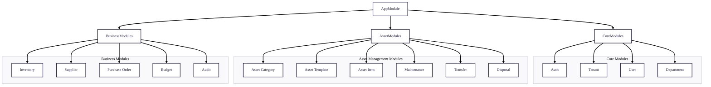
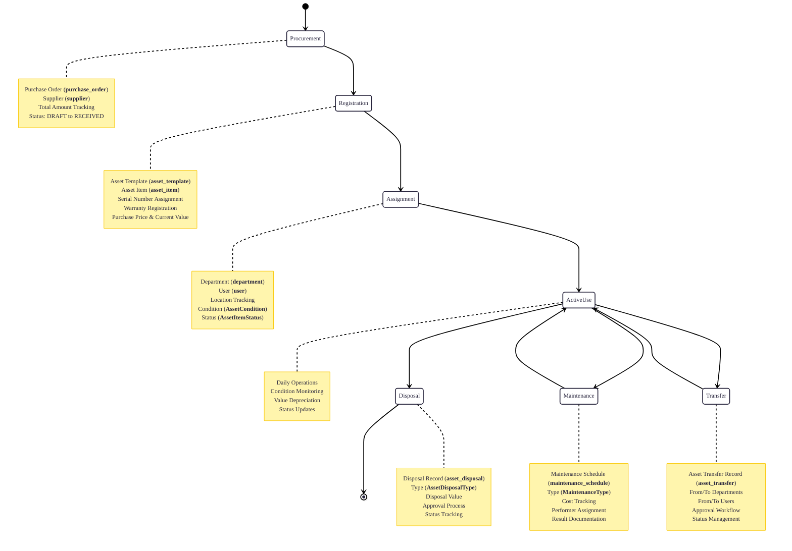

# System Overview

## Introduction

The Asset Management System is a comprehensive, multi-tenant software solution designed to help organizations effectively track, maintain, and optimize their physical assets throughout their entire lifecycle. Built with modern web technologies and a robust architecture, this system provides a centralized platform for managing everything from individual asset tracking to procurement, maintenance, and disposal processes.

## System Purpose

The primary goal of this system is to solve the common challenges organizations face in managing physical assets:

1. **Visibility**: Provide a single source of truth for all asset-related information
2. **Accountability**: Track asset ownership, location, and condition in real-time
3. **Efficiency**: Streamline asset-related processes and workflows
4. **Cost Control**: Monitor asset lifecycle costs and budget utilization
5. **Compliance**: Maintain audit trails and documentation for regulatory requirements

## Core Philosophy

This system is built on several key principles:

### Multi-tenancy First
Every aspect of the system is designed with multi-tenancy in mind, ensuring complete data isolation between organizations while maintaining efficient resource utilization.

### Lifecycle Management
The system tracks assets from acquisition through maintenance to disposal, providing a complete view of asset utilization and costs over time.

### Modular Design
Independent modules allow organizations to use only the features they need while maintaining the ability to expand functionality as requirements grow.

### User-Centric Workflows
Processes are designed around real-world user needs, with intuitive interfaces and logical workflows that mirror actual business processes.

## System Architecture

### High-Level Architecture

### Module Responsibilities

1. **Core Modules**:
   - **Auth**: Authentication, authorization, JWT management
   - **Tenant**: Multi-tenant organization management
   - **User**: User accounts and profiles
   - **Department**: Organizational hierarchy

2. **Asset Management Modules**:
   - **Asset Category**: Asset classification hierarchy
   - **Asset Template**: Asset type definitions and specifications
   - **Asset Item**: Individual asset tracking
   - **Maintenance**: Maintenance scheduling and tracking
   - **Transfer**: Asset movement between departments/users
   - **Disposal**: Asset retirement and disposal

3. **Business Modules**:
   - **Inventory**: Consumable stock management
   - **Supplier**: Vendor and supplier management
   - **Purchase Order**: Procurement workflows
   - **Budget**: Financial planning and tracking
   - **Audit**: Activity logging and change tracking

## Data Model Overview

### Enumerations (Enums)
The system uses strongly-typed enumerations for consistent data:

1. **Asset Lifecycle**:
   - **AssetCondition**: DAMAGED, EXCELLENT, FAIR, GOOD, NEW, POOR, UNUSABLE, USED
   - **AssetItemStatus**: AVAILABLE, DISPOSED, IN_USE, LOST, UNDER_MAINTENANCE, UNDER_REPAIR
   - **AssetDisposalType**: DAMAGED_BEYOND_REPAIR, DISCARD, DONATION, LOST, SALE
   - **AssetDisposalStatus**: APPROVED, CANCELLED, COMPLETED, PENDING, REJECTED

2. **Workflow Management**:
   - **MaintenanceType**: CORRECTIVE, PREVENTIVE
   - **MaintenanceStatus**: CANCELLED, COMPLETED, IN_PROGRESS, PENDING
   - **AssetTransferStatus**: APPROVED, CANCELLED, COMPLETED, IN_TRANSIT, PENDING, REJECTED
   - **PurchaseOrderStatus**: APPROVED, CANCELLED, DRAFT, ORDERED, RECEIVED

3. **System Status**:
   - **TenantStatus**: ACTIVE, INACTIVE
   - **UserStatus**: ACTIVE, INACTIVE

### Key Models
The database schema consists of 15 interconnected models:

1. **Tenant Management**: **tenant**, **department**, **user**
2. **Asset Lifecycle**: **asset_category**, **asset_template**, **asset_item**
3. **Operations**: **maintenance_schedule**, **asset_transfer**, **asset_disposal**
4. **Inventory & Procurement**: **inventory_item**, **supplier**, **purchase_order**
5. **Financial & Audit**: **budget_plan**, **audit_log**

## Data Flow

### Typical Asset Lifecycle Flow

### Database Schema Integration

The Prisma schema defines 15 interconnected models with:

1. **Multi-tenant Foundation**: All models reference **tenant** via **tenant_id**
2. **Hierarchical Structures**: **department** and **asset_category** with parent-child relationships
3. **Lifecycle Tracking**: Complete chain from **asset_template** → **asset_item** → **maintenance_schedule**/**asset_transfer**/**asset_disposal**
4. **Financial Tracking**: Purchase orders, budgets, and cost tracking throughout
5. **Audit Trail**: Comprehensive logging of all system activities
6. **Soft Delete Pattern**: **deleted_at** fields for non-destructive removal

## Key Features by Module

### Authentication & Authorization
- JWT-based authentication with refresh tokens
- Role-based access control (RBAC)
- Tenant isolation enforcement
- Root user support for system administration
- Audit logging of all authentication events

### Asset Management
- Hierarchical asset categorization with parent-child relationships
- Template-based asset definition with specifications
- Individual asset tracking with serial numbers
- Condition and status monitoring with predefined enums
- Warranty management with automated date tracking
- Purchase history and supplier tracking

### Maintenance Operations
- Preventive and corrective maintenance scheduling
- Cost tracking (estimated vs actual) with decimal precision
- Maintenance history and reporting
- Technician assignment and performance tracking
- Result documentation and status workflows

### Inventory Control
- Stock level management with min/max thresholds
- Unit cost and total value calculation with automatic updates
- Supplier relationship management
- Storage location tracking
- SKU-based inventory organization

### Financial Management
- Departmental budget planning with fiscal year support
- Purchase order management with status tracking
- Asset depreciation calculation
- Budget utilization reporting with spent vs allocated tracking
- Disposal value recording for asset retirement

### Audit & Compliance
- Comprehensive activity logging with user attribution
- Before/after value tracking for data changes
- Entity-specific audit trails
- Time-stamped action records for compliance

## Security Implementation

### Authentication Flow
1. User login with credentials → JWT access token + refresh token
2. Access token used for API requests (short-lived, 15-60 minutes)
3. Refresh token used to obtain new access token (long-lived, 7-30 days)
4. Stateless validation with secret key verification

### Data Isolation
- All queries automatically filtered by **tenant_id**
- No cross-tenant data access possible at ORM level
- Tenant validation on all create/update operations
- Database-level constraints enforcing tenant boundaries

### Input Validation
- Class-validator decorators on all DTOs
- Prisma type safety at database level
- SQL injection prevention via parameterized queries
- XSS protection through output encoding
- Enum validation for all status and type fields

## Data Management

### Soft Delete Strategy
- All major entities implement soft delete via **deleted_at** field
- Database queries automatically filter out deleted records
- Recovery possible within retention period
- Audit trail preserved even after soft deletion

### Cascade Deletion Rules
1. **Tenant Deletion**: Cascades to all related entities (complete data cleanup)
2. **Asset Item Deletion**: Cascades to maintenance, transfer, and disposal records
3. **Restricted Deletions**: Hierarchical structures prevent deletion of parent entities with children

### Data Integrity
- Foreign key constraints at database level
- Unique constraints per tenant (code, SKU, serial numbers)
- Default values for status fields
- Automatic timestamp management (**created_at**, **updated_at**)

## Deployment Strategy

### Development Environment
- Docker Compose for local development with PostgreSQL
- Hot-reload with `npm run start:dev`
- Prisma Studio for database management
- Seed scripts for test data generation
- Adminer for database administration

### Production Considerations
- Environment-based configuration management
- Database connection pooling optimization
- Health check endpoints for monitoring
- Log aggregation and centralized monitoring
- Backup and disaster recovery procedures
- Horizontal scaling with load balancing

## Performance Optimizations

### Database Level
- Indexed foreign keys for join performance
- Composite indexes for common query patterns (**tenant_id** + unique fields)
- Query optimization with Prisma includes and selects
- Connection pooling configuration for high concurrency
- Decimal precision optimization for financial data

### Application Level
- Selective field queries to minimize payload size
- Pagination support for large datasets
- Caching strategies for frequently accessed reference data
- Efficient validation pipeline with early termination
- Batch operations for bulk data processing

## Monitoring and Maintenance

### Application Health
- Health check endpoints (`/health`, `/ready`, `/live`)
- Performance metrics collection with Prometheus
- Error tracking and alerting with centralized logging
- Request/response logging for debugging
- Dependency health monitoring

### Database Maintenance
- Regular backups with retention policies
- Index maintenance and optimization
- Connection pool monitoring and tuning
- Query performance analysis and optimization
- Vacuum and analyze operations for PostgreSQL

### System Monitoring
- Tenant resource utilization tracking
- API response time monitoring
- Error rate tracking and alerting
- Database connection pool metrics
- Cache hit/miss ratios

## Technology Stack

### Backend
- **Framework**: NestJS (TypeScript)
- **ORM**: Prisma with PostgreSQL connector
- **Validation**: class-validator, class-transformer
- **Authentication**: JWT, bcrypt for password hashing
- **Documentation**: Swagger/OpenAPI

### Database
- **Primary Database**: PostgreSQL 14+
- **Features**: JSONB support, full-text search, geospatial (if needed)
- **Extensions**: UUID generation, advanced indexing

### Deployment
- **Containerization**: Docker, Docker Compose
- **Orchestration**: Kubernetes (production)
- **CI/CD**: GitHub Actions/GitLab CI
- **Monitoring**: Prometheus, Grafana, ELK Stack

For detailed information on specific components, refer to the related documentation:
- [ER Diagram](/docs/architecture/03-erd.md)
- [Class Diagram](/docs/architecture/04-class-diagram.md)
- [Cascade Rules](/docs/architecture/05-cascade-rules.md)
- [Deployment Architecture](/docs/architecture/06-deployment-architecture.md)