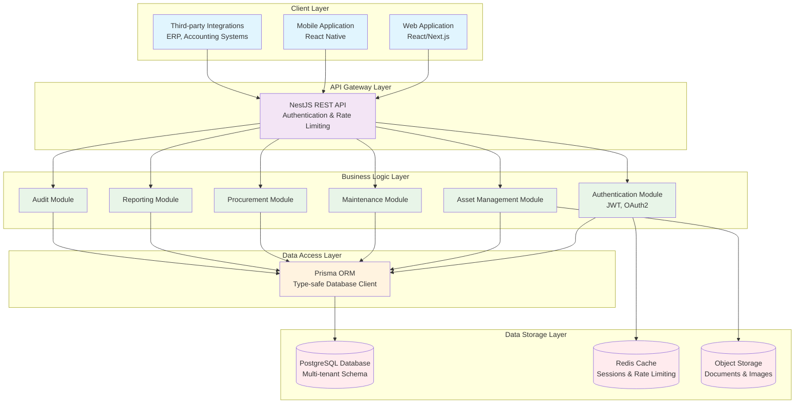
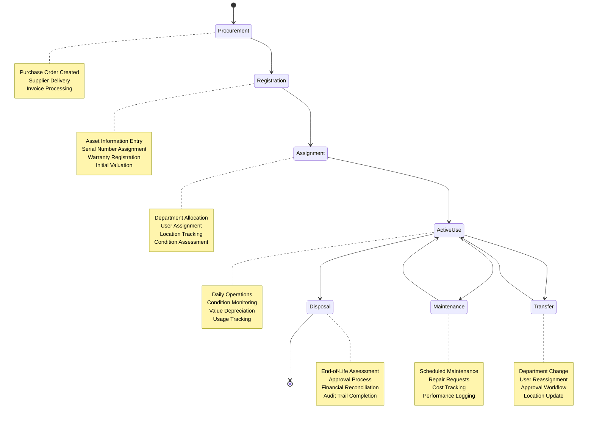

# System Overview

## Introduction

The Asset Management System is a comprehensive, multi-tenant software solution designed to help organizations effectively track, maintain, and optimize their physical assets throughout their entire lifecycle. Built with modern web technologies and a robust architecture, this system provides a centralized platform for managing everything from individual asset tracking to procurement, maintenance, and disposal processes.

## System Purpose

The primary goal of this system is to solve the common challenges organizations face in managing physical assets:

1. **Visibility**: Provide a single source of truth for all asset-related information
2. **Accountability**: Track asset ownership, location, and condition in real-time
3. **Efficiency**: Streamline asset-related processes and workflows
4. **Cost Control**: Monitor asset lifecycle costs and budget utilization
5. **Compliance**: Maintain audit trails and documentation for regulatory requirements

## Core Philosophy

This system is built on several key principles:

### Multi-tenancy First
Every aspect of the system is designed with multi-tenancy in mind, ensuring complete data isolation between organizations while maintaining efficient resource utilization.

### Lifecycle Management
The system tracks assets from acquisition through maintenance to disposal, providing a complete view of asset utilization and costs over time.

### Modular Design
Independent modules allow organizations to use only the features they need while maintaining the ability to expand functionality as requirements grow.

### User-Centric Workflows
Processes are designed around real-world user needs, with intuitive interfaces and logical workflows that mirror actual business processes.

## System Architecture

### High-Level Architecture

### Key Architectural Decisions

1. **NestJS Framework**: Chosen for its modular architecture, dependency injection, and strong TypeScript support, providing a scalable foundation for enterprise applications.

2. **Prisma ORM**: Selected for its type safety, intuitive data modeling, and excellent developer experience, particularly with complex database relationships.

3. **PostgreSQL Database**: Provides robustness, ACID compliance, and excellent support for complex queries and relationships required by asset management systems.

4. **Multi-tenancy Implementation**: Row-level isolation using tenant_id on all tenant-specific tables, balancing security with performance.

## Technology Stack

### Backend
- **Framework**: NestJS 10+
- **Language**: TypeScript 5+
- **ORM**: Prisma 5+
- **Database**: PostgreSQL 14+
- **Authentication**: JWT with Passport.js
- **Validation**: class-validator, class-transformer

### Development Tools
- **Package Manager**: npm/yarn/pnpm
- **API Documentation**: Swagger/OpenAPI
- **Code Quality**: ESLint, Prettier
- **Environment Management**: dotenv

### Deployment & Infrastructure
- **Containerization**: Docker
- **Process Management**: PM2 or container orchestration
- **Monitoring**: Application logs with structured formatting
- **Database Management**: Prisma Migrate for schema evolution

## Core Modules

The system is organized into logical modules that correspond to business functions:

### 1. Core Module
- Tenant management and system configuration
- User authentication and authorization
- Department hierarchy and organizational structure

### 2. Asset Management Module
- Asset categorization and templating
- Individual asset tracking and lifecycle management
- Condition monitoring and status tracking

### 3. Operations Module
- Maintenance scheduling and tracking
- Asset transfers and reassignments
- Disposal management and approval workflows

### 4. Procurement Module
- Supplier management and vendor relationships
- Purchase order creation and tracking
- Inventory management for consumables

### 5. Financial Module
- Budget planning and allocation
- Cost tracking and expense management
- Depreciation calculation and reporting

### 6. Reporting Module
- Standard reports for common business needs
- Custom report builder for specific requirements
- Dashboard and KPI monitoring

### 7. Audit Module
- Comprehensive activity logging
- Change tracking and audit trails
- Compliance reporting

## Data Flow

### Typical Asset Lifecycle Flow

### Key Processes

1. **Asset Registration**: New assets are registered in the system with detailed specifications, purchase information, and warranty details.

2. **Assignment & Tracking**: Assets are assigned to departments or users, with ongoing tracking of location, condition, and status.

3. **Maintenance Management**: Scheduled and ad-hoc maintenance activities are planned, executed, and documented.

4. **Transfer Processes**: Formal workflows for moving assets between departments or users, with approval mechanisms.

5. **Disposal Management**: Controlled processes for asset retirement, including approval workflows and financial reconciliation.

## Design Patterns

### Implemented Patterns

1. **Repository Pattern**: Abstracted data access through Prisma clients
2. **Service Layer**: Business logic separated from data access and presentation
3. **DTO Pattern**: Clear separation between internal entities and external interfaces
4. **Dependency Injection**: Loosely coupled components with centralized configuration
5. **Middleware Pipeline**: Request processing through configurable middleware chain

### Domain-Driven Design Elements

- **Bounded Contexts**: Clear separation between different business domains
- **Aggregates**: Transactional boundaries around related entities
- **Value Objects**: Immutable objects representing domain concepts
- **Domain Events**: System reactions to important business occurrences

## Scalability Considerations

### Vertical Scaling
- Stateless API design allows for multiple instances
- Database connection pooling and query optimization
- Caching strategies for frequently accessed data

### Horizontal Scaling
- Multi-tenant isolation enables tenant-based sharding
- Microservices-ready architecture for component decomposition
- Event-driven architecture possibilities for future expansion

### Performance Optimizations
- Selective field queries to reduce payload sizes
- Pagination and filtering for large datasets
- Indexed queries on frequently searched fields
- Efficient relationship loading with Prisma includes

## Security Model

### Authentication
- JWT-based stateless authentication
- Refresh token mechanism for extended sessions
- Password policies and encryption

### Authorization
- Role-based access control (RBAC)
- Permission checking at API endpoint level
- Tenant isolation ensuring data privacy

### Data Security
- Row-level security through tenant isolation
- Input validation and sanitization
- Audit logging of all significant actions
- No sensitive data in audit logs

## Integration Capabilities

### API-First Design
- RESTful API with consistent response formats
- OpenAPI documentation for external consumers
- Versioning strategy for API evolution

### Webhook Support
- Event notifications for external systems
- Configurable endpoints for different event types
- Retry mechanisms for failed deliveries

### Import/Export
- Bulk data import for initial setup and migrations
- Data export for reporting and external analysis
- Standardized formats (CSV, JSON, Excel)

## Future Evolution

### Planned Enhancements
1. **Real-time Features**: WebSocket support for live updates
2. **Mobile Optimization**: Dedicated mobile interfaces and APIs
3. **Advanced Analytics**: Machine learning for predictive maintenance
4. **Integration Ecosystem**: Pre-built connectors for common business systems

### Extension Points
- Plugin architecture for custom functionality
- Webhook system for event-driven integrations
- Custom field system for tenant-specific requirements
- Report builder for ad-hoc business intelligence

## Conclusion

This Asset Management System represents a comprehensive solution built with modern software engineering practices. By combining a robust backend architecture with intuitive workflows and thorough documentation, it provides organizations with the tools they need to effectively manage their physical assets while maintaining flexibility for future growth and customization.

The system's modular design, multi-tenant architecture, and focus on lifecycle management make it suitable for organizations of various sizes and industries, providing a solid foundation for asset management that can evolve with changing business needs.

For detailed information on specific components, refer to the related documentation:
- [Database Schema](/docs/architecture/02-database-schema.md)
- [ER Diagram](/docs/architecture/03-er-diagram.md)
- [Class Diagram](/docs/architecture/04-class-diagram.md)
- [Cascade Rules](/docs/architecture/05-cascade-rules.md)