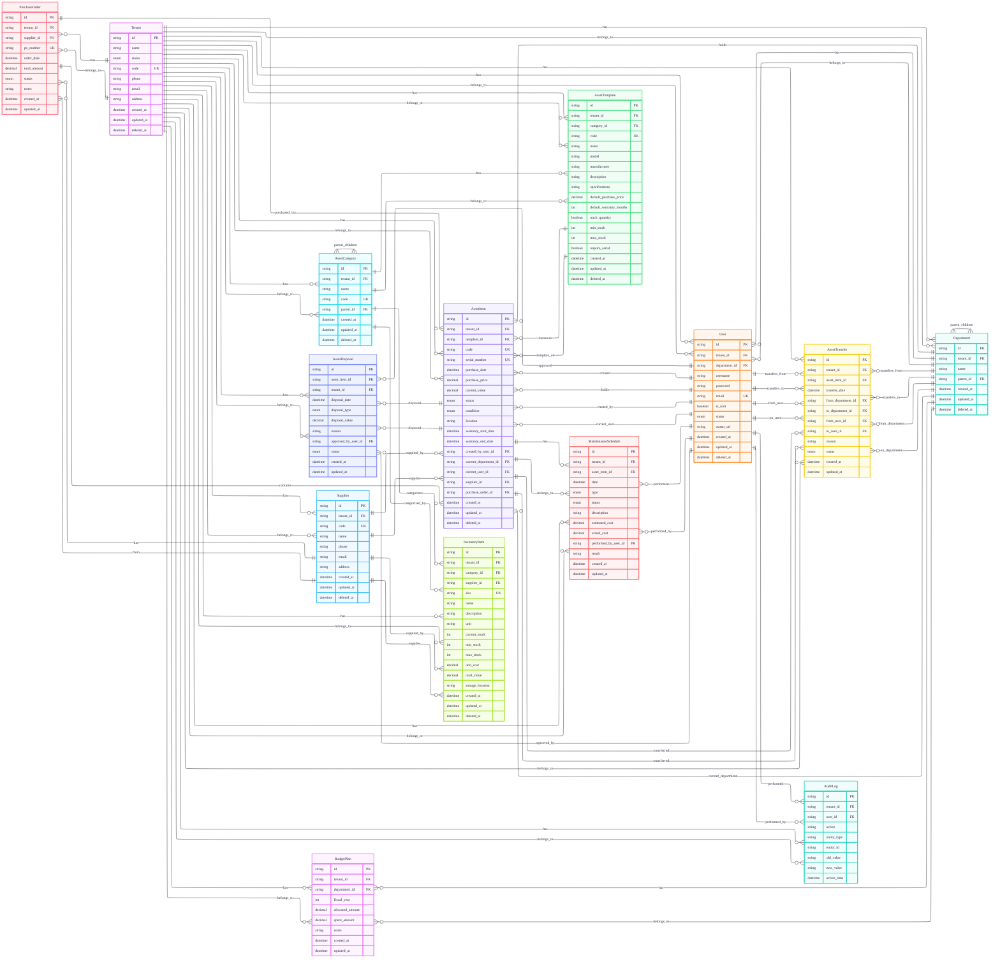

# ER Diagram - Asset Management System

## Key Design Patterns & Annotations

### 1. Multi-tenancy Foundation
- **Core Principle**: Every entity (except Tenant itself) includes a **tenant_id** foreign key
- **Data Isolation**: All queries automatically filter by tenant_id to prevent cross-tenant data access
- **Cascade Deletion**: When a Tenant is deleted, all related data is automatically removed
- **Unique Constraints**: Most unique constraints are scoped to tenant_id (e.g., department.name + tenant_id)

### 2. Soft Delete Implementation
- **Pattern**: `deleted_at` timestamp field instead of hard deletion
- **Entities with Soft Delete**: Tenant, Department, User, AssetCategory, AssetTemplate, AssetItem, InventoryItem, Supplier
- **Entities without Soft Delete**: MaintenanceSchedule, AssetTransfer, AssetDisposal, PurchaseOrder, BudgetPlan, AuditLog (these are historical/audit records)
- **Benefits**: Data recovery, audit trail preservation, referential integrity maintenance

### 3. Hierarchical Structures
- **Department Hierarchy**: Self-referencing `parent_id` for organizational tree structure
- **AssetCategory Hierarchy**: Self-referencing `parent_id` for classification taxonomy
- **Restrict Delete**: Parent entities cannot be deleted while children exist (onDelete: Restrict)
- **Use Case**: Organizational charts, nested asset classifications

### 4. Asset Lifecycle Management
- **Template → Item Pattern**: **AssetTemplate** defines specifications, **AssetItem** represents physical instances
- **Serial Tracking**: Optional `serial_number` for unique asset identification
- **Warranty Management**: `warranty_start_date` and `warranty_end_date` for service period tracking
- **Condition & Status**: Separate fields for physical condition (**AssetCondition**) and operational status (**AssetItemStatus**)

### 5. Relationship Annotations
- **Cascade Deletes**: 
  - Tenant → All related entities (complete cleanup)
  - AssetItem → MaintenanceSchedule, AssetTransfer, AssetDisposal (lifecycle cleanup)
- **Restrict Deletes**:
  - Department → Department (parent-child hierarchy)
  - AssetCategory → AssetCategory (parent-child hierarchy)
  - AssetTemplate → AssetCategory (template depends on category)
  - AssetItem → AssetTemplate (item depends on template)

### 6. Financial Tracking
- **Decimal Precision**: All monetary values use `@db.Decimal(19, 4)` for accurate financial calculations
- **Budget Management**: **BudgetPlan** tracks allocated vs spent amounts per department per fiscal year
- **Purchase Orders**: **PurchaseOrder** links suppliers to asset purchases with status tracking
- **Value Tracking**: **AssetItem** tracks both purchase price and current value for depreciation

### 7. Audit & Compliance
- **Comprehensive Logging**: **AuditLog** records all significant system actions
- **Change Tracking**: `old_value` and `new_value` fields capture data modifications
- **User Attribution**: Every audit record links to the user who performed the action
- **Entity Context**: `entity_type` and `entity_id` identify the affected record

### 8. Status Workflows
- **Multiple Status Enums**: Each entity has appropriate status enumerations (e.g., **AssetTransferStatus**, **PurchaseOrderStatus**)
- **Workflow Progression**: Status fields enable state machine patterns for approval workflows
- **Default Values**: Most status fields have sensible defaults (e.g., PENDING, ACTIVE)

### 9. Indexing Strategy
- **Primary Keys**: UUID `@id @default(uuid())` for all entities
- **Foreign Keys**: All relation fields are indexed for join performance
- **Composite Unique**: Tenant-scoped uniqueness (e.g., `@@unique([tenantId, code])`)
- **Natural Keys**: Business identifiers like `code`, `sku`, `po_number` with tenant scope

### 10. Timestamp Management
- **Automatic Timestamps**: `created_at` (default now) and `updated_at` (@updatedAt) on all entities
- **Soft Delete Marker**: `deleted_at` for non-destructive deletion
- **Action Timing**: **AuditLog** has `action_time` for precise event timestamping

## Design Considerations

### 1. Multi-tenant Data Isolation
- **Approach**: Row-level isolation via tenant_id foreign keys
- **Alternative**: Schema-per-tenant (not implemented, but possible with PostgreSQL)
- **Security**: Application-layer tenant validation required in addition to database constraints

### 2. Soft Delete vs Hard Delete
- **Soft Delete**: Used for master data (departments, users, assets)
- **Hard Delete**: Used for transactional/historical data (transfers, disposals, audits)
- **Rationale**: Master data needs recovery option, transactional data should be immutable

### 3. Hierarchy vs Flat Structures
- **Hierarchical**: Departments and AssetCategories use parent-child relationships
- **Flat**: Other entities use simple foreign key relationships
- **Performance**: Hierarchies may require recursive queries or materialized paths

### 4. Template Pattern for Assets
- **Advantage**: Centralized specification management
- **Trade-off**: Additional join required to get full asset details
- **Extension**: Could add versioning to templates for specification changes over time

### 5. Financial Decimal Precision
- **Standard**: 19 total digits, 4 decimal places (sufficient for most currencies)
- **Consideration**: May need adjustment for micro-transactions or very large values
- **Consistency**: Applied consistently across all monetary fields

## Query Performance Notes

1. **Tenant Filtering**: All queries should include `tenantId` in WHERE clause for performance
2. **Hierarchical Queries**: Department and AssetCategory hierarchies may require recursive CTEs
3. **Status-based Filtering**: Consider partial indexes on status fields for common queries
4. **Join Patterns**: AssetItem joins multiple tables (template, department, user, supplier) - consider denormalization for frequent access patterns

## Extension Points

1. **Additional Asset Attributes**: JSONB field could be added to AssetItem for flexible custom fields
2. **Document Attachment**: Could add separate Attachment entity with polymorphic relationships
3. **Notification System**: Could add Notification entity for alerts and reminders
4. **Role-Based Access**: Could extend User model with Role and Permission entities
5. **Location Hierarchy**: Could add dedicated Location entity with hierarchy support

This ERD represents a comprehensive asset management system with strong multi-tenant foundations, complete lifecycle tracking, and robust audit capabilities. The design balances normalization for data integrity with practical considerations for query performance and application development.