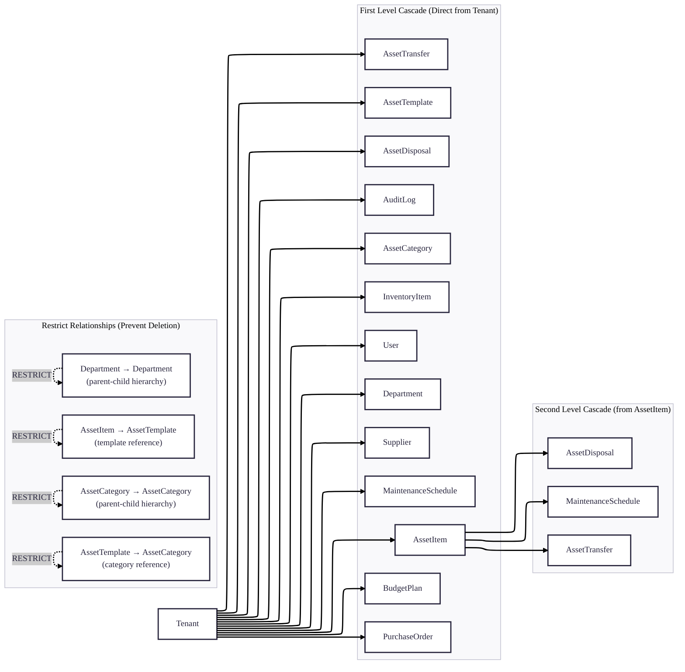

# Cascade Delete Rules

## Complete Cascade Hierarchy

```mermaid
---
config:
  layout: elk
  theme: redux
  themeVariables:
    fontFamily: EB Garamond
---
flowchart TB
    Tenant["Tenant"]
    
    subgraph subGraph0["Level 1: Direct Tenant Cascade"]
        A1["Department"]
        A2["User"]
        A3["AssetCategory"]
        A4["AssetTemplate"]
        A5["AssetItem"]
        A6["InventoryItem"]
        A7["Supplier"]
        A8["PurchaseOrder"]
        A9["MaintenanceSchedule"]
        A10["AssetTransfer"]
        A11["AssetDisposal"]
        A12["BudgetPlan"]
        A13["AuditLog"]
    end
    
    subgraph subGraph1["Level 2: AssetItem Cascade"]
        B1["MaintenanceSchedule"]
        B2["AssetTransfer"]
        B3["AssetDisposal"]
    end
    
    subgraph subGraph2["Restrict Constraints"]
        R1["Department → Department<br>(parent-child)"]
        R2["AssetCategory → AssetCategory<br>(parent-child)"]
        R3["AssetTemplate → AssetCategory"]
        R4["AssetItem → AssetTemplate"]
    end
    
    Tenant -- "onDelete: CASCADE" --> subGraph0
    A5 -- "onDelete: CASCADE" --> subGraph1
    
    R1 -. "onDelete: RESTRICT" .-> R1
    R2 -. "onDelete: RESTRICT" .-> R2
    R3 -. "onDelete: RESTRICT" .-> R3
    R4 -. "onDelete: RESTRICT" .-> R4
    
    classDef cascade fill:#e3f2fd,stroke:#1976d2
    classDef restrict fill:#ffebee,stroke:#d32f2f
    classDef tenant fill:#e8f5e8,stroke:#388e3c
    
    class Tenant tenant
    class A1,A2,A3,A4,A5,A6,A7,A8,A9,A10,A11,A12,A13,B1,B2,B3 cascade
    class R1,R2,R3,R4 restrict
```

## Cascade Delete Rules Summary

### 1. **Full Cascade from Tenant**
When a **Tenant** is deleted, ALL related entities are automatically deleted via **onDelete: Cascade**:
- **Department**, **User**, **AssetCategory**, **AssetTemplate**, **AssetItem**
- **InventoryItem**, **Supplier**, **PurchaseOrder**
- **MaintenanceSchedule**, **AssetTransfer**, **AssetDisposal**
- **BudgetPlan**, **AuditLog**

**Purpose**: Ensures complete data isolation and cleanup when an organization leaves the system.

### 2. **Cascade from AssetItem**
When an **AssetItem** is deleted:
- All **MaintenanceSchedule** records for that item are deleted
- All **AssetTransfer** records for that item are deleted
- All **AssetDisposal** records for that item are deleted

**Purpose**: Maintains referential integrity by removing dependent records when an asset is removed.

### 3. **Restrict Relationships** (Prevent deletion)
The following relationships use **onDelete: Restrict** to prevent deletion:

1. **Department → Department**: Cannot delete a department that has child departments
2. **AssetCategory → AssetCategory**: Cannot delete a category that has child categories
3. **AssetTemplate → AssetCategory**: Cannot delete a category used by templates
4. **AssetItem → AssetTemplate**: Cannot delete a template used by items

**Purpose**: Prevents accidental deletion of hierarchical or referenced data, maintaining structural integrity.

### 4. **Default Behavior for Other Relationships**
All other foreign key relationships follow the database default behavior (typically **NO ACTION** or **RESTRICT**), meaning:
- **Department → User**: No cascade (User is deleted via Tenant cascade, not Department)
- **User → AuditLog**: No cascade (AuditLog is deleted via Tenant cascade, not User)
- **Supplier → AssetItem/InventoryItem**: No cascade (both cascade from Tenant, not Supplier)
- **PurchaseOrder → AssetItem**: No cascade (AssetItem cascades from Tenant, not PurchaseOrder)

## Best Practices

### When to Use Cascade
1. **Parent-child relationships** where child data is meaningless without parent
2. **Multi-tenant systems** where tenant deletion should remove all tenant data
3. **Lifecycle dependencies** where dependent records should be cleaned up with the main entity

### When to Use Restrict
1. **Hierarchical structures** where parent-child relationships must be maintained
2. **Reference data** that may be used by multiple entities
3. **Templates or categories** that define structure for other entities
4. **Core definitions** that should not be deleted while in use

### Handling Restricted Deletions in Application Code
When a restrict constraint prevents deletion, the application should:

1. Check for existing relationships before attempting deletion
2. Provide clear error messages to users
3. Offer alternative actions (reassign, archive, or delete dependencies first)
4. Implement soft delete where appropriate instead of hard delete

## Common Scenarios

### Scenario 1: Deleting a Tenant
**Action**: Delete **Tenant** record
**Result**: All related records across all tables are automatically deleted
**Use Case**: Organization closing their account

### Scenario 2: Deleting an AssetItem
**Action**: Delete **AssetItem**
**Result**: **MaintenanceSchedule**, **AssetTransfer**, and **AssetDisposal** records for that asset are deleted
**Use Case**: Removing a defective or lost asset from the system

### Scenario 3: Attempting to delete a Department with Child Departments
**Action**: Delete **Department** that has children
**Result**: Deletion is blocked by database constraint
**Resolution**: Must delete or reassign child departments first

### Scenario 4: Attempting to delete an AssetTemplate used by AssetItems
**Action**: Delete **AssetTemplate** that has associated **AssetItem** records
**Result**: Deletion is blocked by database constraint
**Resolution**: Must delete or reassign all associated AssetItems first

## Database-Level Constraints

### Foreign Key Constraints (Explicit in Schema)

| Parent Entity | Child Entity | Constraint Type | Reason |
|--------------|--------------|-----------------|--------|
| **Tenant** | All entities | **Cascade** | Complete tenant data removal |
| **AssetItem** | **MaintenanceSchedule** | **Cascade** | Remove maintenance history |
| **AssetItem** | **AssetTransfer** | **Cascade** | Remove transfer history |
| **AssetItem** | **AssetDisposal** | **Cascade** | Remove disposal records |
| **Department** | **Department** (parent) | **Restrict** | Prevent orphaned hierarchy |
| **AssetCategory** | **AssetCategory** (parent) | **Restrict** | Maintain classification structure |
| **AssetTemplate** | **AssetCategory** | **Restrict** | Preserve template categorization |
| **AssetItem** | **AssetTemplate** | **Restrict** | Maintain item-template relationship |

### Soft Delete Interaction
- **Soft delete** (via **deleted_at** field) is independent of cascade rules
- Cascade only triggers on **hard delete** operations
- **Soft deleted** records still participate in cascade relationships
- Applications should filter **deleted_at IS NULL** in queries

## Performance Considerations

1. **Large tenant deletions**: May cause performance issues due to multiple cascade operations
2. **Indexed foreign keys**: Ensure proper indexing for cascade operations
3. **Batch operations**: Consider breaking large deletions into batches
4. **Transaction management**: Use transactions for atomic cascade operations

## Summary

The cascade delete rules in this system are designed to:

1. **Ensure data integrity** through appropriate constraint enforcement
2. **Maintain multi-tenant isolation** with tenant-level cascade
3. **Preserve structural relationships** with restrictive constraints
4. **Support asset lifecycle management** with asset-level cleanup
5. **Provide safety mechanisms** through soft delete and validation

**Key Points**:
- Only **two cascade chains** exist: Tenant→All and AssetItem→Maintenance/Transfer/Disposal
- All hierarchical and reference relationships use **Restrict** to prevent data loss
- Cascade operations are **explicitly defined** in the schema, not implicit

Understanding these rules is essential for maintaining data consistency and preventing accidental data loss in the asset management system.