# Entity Relationship Diagram (ERD)

## Overview

This ERD represents the complete database schema for the Asset Management System, showing all entities, attributes, and relationships.

## Complete ER Diagram

```mermaid
---
config:
  layout: elk
---
erDiagram

    Tenant {
        string id PK
        string name
        enum status
        string code UK
        string phone
        string email
        string address
        datetime created_at
        datetime updated_at
        datetime deleted_at
    }

    Department {
        string id PK
        string tenant_id FK
        string name
        string parent_id FK
        datetime created_at
        datetime updated_at
        datetime deleted_at
    }

    User {
        string id PK
        string tenant_id FK
        string department_id FK
        string username
        string password
        string email UK
        boolean is_root
        enum status
        string avatar_url
        datetime created_at
        datetime updated_at
        datetime deleted_at
    }

    AssetCategory {
        string id PK
        string tenant_id FK
        string name
        string code UK
        string parent_id FK
        datetime created_at
        datetime updated_at
        datetime deleted_at
    }

    AssetTemplate {
        string id PK
        string tenant_id FK
        string category_id FK
        string code UK
        string name
        string model
        string manufacturer
        string description
        string specifications
        decimal default_purchase_price
        int default_warranty_months
        boolean track_quantity
        int min_stock
        int max_stock
        boolean require_serial
        datetime created_at
        datetime updated_at
        datetime deleted_at
    }

    AssetItem {
        string id PK
        string tenant_id FK
        string template_id FK
        string code UK
        string serial_number UK
        datetime purchase_date
        decimal purchase_price
        decimal current_value
        enum status
        enum condition
        string location
        datetime warranty_start_date
        datetime warranty_end_date
        string created_by_user_id FK
        string current_department_id FK
        string current_user_id FK
        string supplier_id FK
        string purchase_order_id FK
        datetime created_at
        datetime updated_at
        datetime deleted_at
    }

    MaintenanceSchedule {
        string id PK
        string tenant_id FK
        string asset_item_id FK
        datetime date
        enum type
        enum status
        string description
        decimal estimated_cost
        decimal actual_cost
        string performed_by_user_id FK
        string result
        datetime created_at
        datetime updated_at
    }

    AssetTransfer {
        string id PK
        string tenant_id FK
        string asset_item_id FK
        datetime transfer_date
        string from_department_id FK
        string to_department_id FK
        string from_user_id FK
        string to_user_id FK
        string reason
        enum status
        datetime created_at
        datetime updated_at
    }

    AssetDisposal {
        string id PK
        string asset_item_id FK
        string tenant_id FK
        datetime disposal_date
        enum disposal_type
        decimal disposal_value
        string reason
        string approved_by_user_id FK
        enum status
        datetime created_at
        datetime updated_at
    }

    InventoryItem {
        string id PK
        string tenant_id FK
        string category_id FK
        string supplier_id FK
        string sku UK
        string name
        string description
        string unit
        int current_stock
        int min_stock
        int max_stock
        decimal unit_cost
        decimal total_value
        string storage_location
        datetime created_at
        datetime updated_at
        datetime deleted_at
    }

    Supplier {
        string id PK
        string tenant_id FK
        string code UK
        string name
        string phone
        string email
        string address
        datetime created_at
        datetime updated_at
        datetime deleted_at
    }

    PurchaseOrder {
        string id PK
        string tenant_id FK
        string supplier_id FK
        string po_number UK
        datetime order_date
        decimal total_amount
        enum status
        string notes
        datetime created_at
        datetime updated_at
    }

    BudgetPlan {
        string id PK
        string tenant_id FK
        string department_id FK
        int fiscal_year
        decimal allocated_amount
        decimal spent_amount
        string notes
        datetime created_at
        datetime updated_at
    }

    AuditLog {
        string id PK
        string tenant_id FK
        string user_id FK
        string action
        string entity_type
        string entity_id
        string old_value
        string new_value
        datetime action_time
    }

    Tenant ||--o{ Department : has
    Tenant ||--o{ User : has
    Tenant ||--o{ AssetCategory : has
    Tenant ||--o{ AssetTemplate : has
    Tenant ||--o{ AssetItem : has
    Tenant ||--o{ InventoryItem : has
    Tenant ||--o{ Supplier : has
    Tenant ||--o{ PurchaseOrder : has
    Tenant ||--o{ MaintenanceSchedule : has
    Tenant ||--o{ AssetTransfer : has
    Tenant ||--o{ AssetDisposal : has
    Tenant ||--o{ BudgetPlan : has
    Tenant ||--o{ AuditLog : has

    Department }o--|| Tenant : belongs_to
    Department }o--o{ Department : parent_children
    Department ||--o{ User : has
    Department ||--o{ AssetItem : holds
    Department ||--o{ BudgetPlan : has
    Department ||--o{ AssetTransfer : transfers_from
    Department ||--o{ AssetTransfer : transfers_to

    User }o--|| Tenant : belongs_to
    User }o--|| Department : belongs_to
    User ||--o{ AssetItem : created
    User ||--o{ AssetItem : holds
    User ||--o{ MaintenanceSchedule : performed
    User ||--o{ AssetDisposal : approved
    User ||--o{ AssetTransfer : transfers_from
    User ||--o{ AssetTransfer : transfers_to
    User ||--o{ AuditLog : performed

    AssetCategory }o--|| Tenant : belongs_to
    AssetCategory }o--o{ AssetCategory : parent_children
    AssetCategory ||--o{ AssetTemplate : has
    AssetCategory ||--o{ InventoryItem : categorizes

    AssetTemplate }o--|| Tenant : belongs_to
    AssetTemplate }o--|| AssetCategory : belongs_to
    AssetTemplate ||--o{ AssetItem : instances

    AssetItem }o--|| Tenant : belongs_to
    AssetItem }o--|| AssetTemplate : template_of
    AssetItem }o--|| User : created_by
    AssetItem }o--|| Department : current_department
    AssetItem }o--|| User : current_user
    AssetItem }o--|| Supplier : supplied_by
    AssetItem }o--|| PurchaseOrder : purchased_via
    AssetItem ||--o{ MaintenanceSchedule : has
    AssetItem ||--o{ AssetTransfer : transferred
    AssetItem ||--o{ AssetDisposal : disposed

    MaintenanceSchedule }o--|| Tenant : belongs_to
    MaintenanceSchedule }o--|| AssetItem : belongs_to
    MaintenanceSchedule }o--|| User : performed_by

    AssetTransfer }o--|| Tenant : belongs_to
    AssetTransfer }o--|| AssetItem : transferred
    AssetTransfer }o--|| Department : from_department
    AssetTransfer }o--|| Department : to_department
    AssetTransfer }o--|| User : from_user
    AssetTransfer }o--|| User : to_user

    AssetDisposal }o--|| Tenant : belongs_to
    AssetDisposal }o--|| AssetItem : disposed
    AssetDisposal }o--|| User : approved_by

    InventoryItem }o--|| Tenant : belongs_to
    InventoryItem }o--|| AssetCategory : categorized_by
    InventoryItem }o--|| Supplier : supplied_by

    Supplier }o--|| Tenant : belongs_to
    Supplier ||--o{ AssetItem : supplies
    Supplier ||--o{ InventoryItem : supplies
    Supplier ||--o{ PurchaseOrder : has

    PurchaseOrder }o--|| Tenant : belongs_to
    PurchaseOrder }o--|| Supplier : from
    PurchaseOrder ||--o{ AssetItem : contains

    BudgetPlan }o--|| Tenant : belongs_to
    BudgetPlan }o--|| Department : belongs_to

    AuditLog }o--|| Tenant : belongs_to
    AuditLog }o--|| User : performed_by
```

