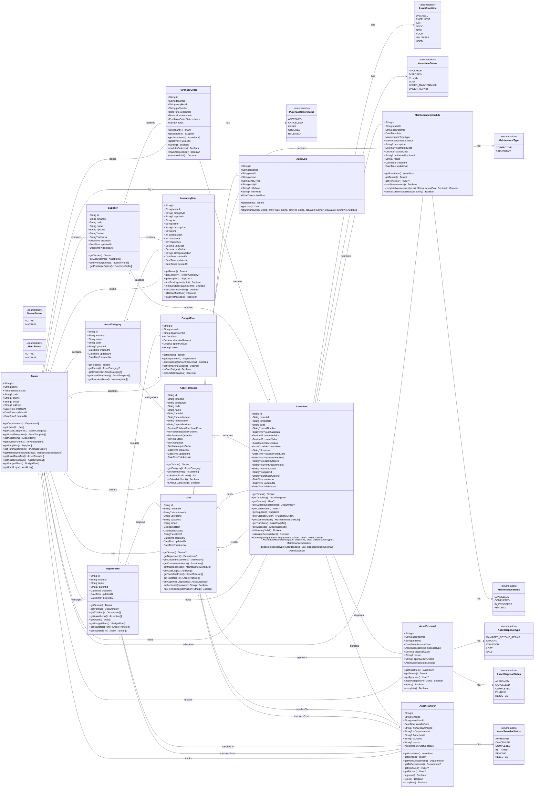

# Class Diagram - Asset Management System

```mermaid
classDiagram
    direction LR
    
    %% ========================================================
    %% ENUMS (Enumerations)
    %% ========================================================
    
    class AssetCondition {
        <<enumeration>>
        DAMAGED
        EXCELLENT
        FAIR
        GOOD
        NEW
        POOR
        UNUSABLE
        USED
    }
    
    class AssetItemStatus {
        <<enumeration>>
        AVAILABLE
        DISPOSED
        IN_USE
        LOST
        UNDER_MAINTENANCE
        UNDER_REPAIR
    }
    
    class MaintenanceType {
        <<enumeration>>
        CORRECTIVE
        PREVENTIVE
    }
    
    class MaintenanceStatus {
        <<enumeration>>
        CANCELLED
        COMPLETED
        IN_PROGRESS
        PENDING
    }
    
    class PurchaseOrderStatus {
        <<enumeration>>
        APPROVED
        CANCELLED
        DRAFT
        ORDERED
        RECEIVED
    }
    
    class AssetTransferStatus {
        <<enumeration>>
        APPROVED
        CANCELLED
        COMPLETED
        IN_TRANSIT
        PENDING
        REJECTED
    }
    
    class AssetDisposalType {
        <<enumeration>>
        DAMAGED_BEYOND_REPAIR
        DISCARD
        DONATION
        LOST
        SALE
    }
    
    class AssetDisposalStatus {
        <<enumeration>>
        APPROVED
        CANCELLED
        COMPLETED
        PENDING
        REJECTED
    }
    
    class TenantStatus {
        <<enumeration>>
        ACTIVE
        INACTIVE
    }
    
    class UserStatus {
        <<enumeration>>
        ACTIVE
        INACTIVE
    }

    %% ========================================================
    %% CORE CLASSES
    %% ========================================================

    class Tenant {
        +String id
        +String name
        +TenantStatus status
        +String? code
        +String? phone
        +String? email
        +String? address
        +DateTime createdAt
        +DateTime updatedAt
        +DateTime? deletedAt
        
        +getDepartments() Department[]
        +getUsers() User[]
        +getAssetCategories() AssetCategory[]
        +getAssetTemplates() AssetTemplate[]
        +getAssetItems() AssetItem[]
        +getInventoryItems() InventoryItem[]
        +getSuppliers() Supplier[]
        +getPurchaseOrders() PurchaseOrder[]
        +getMaintenanceSchedules() MaintenanceSchedule[]
        +getAssetTransfers() AssetTransfer[]
        +getAssetDisposals() AssetDisposal[]
        +getBudgetPlans() BudgetPlan[]
        +getAuditLogs() AuditLog[]
    }

    class Department {
        +String id
        +String tenantId
        +String name
        +String? parentId
        +DateTime createdAt
        +DateTime updatedAt
        +DateTime? deletedAt
        
        +getTenant() Tenant
        +getParent() Department?
        +getChildren() Department[]
        +getAssetItems() AssetItem[]
        +getUsers() User[]
        +getBudgetPlans() BudgetPlan[]
        +getTransfersFrom() AssetTransfer[]
        +getTransfersTo() AssetTransfer[]
    }

    class User {
        +String id
        +String? tenantId
        +String? departmentId
        +String username
        +String password
        +String email
        +Boolean isRoot
        +UserStatus status
        +String? avatarUrl
        +DateTime createdAt
        +DateTime updatedAt
        +DateTime? deletedAt
        
        +getTenant() Tenant?
        +getDepartment() Department?
        +getCreatedAssetItems() AssetItem[]
        +getCurrentAssetItems() AssetItem[]
        +getMaintenances() MaintenanceSchedule[]
        +getAuditLogs() AuditLog[]
        +getTransfersFrom() AssetTransfer[]
        +getTransfersTo() AssetTransfer[]
        +getApprovedDisposals() AssetDisposal[]
        
        +authenticate(password: String) Boolean
        +hasPermission(permission: String) Boolean
    }

    %% ========================================================
    %% ASSET MANAGEMENT CLASSES
    %% ========================================================

    class AssetCategory {
        +String id
        +String tenantId
        +String name
        +String code
        +String? parentId
        +DateTime createdAt
        +DateTime updatedAt
        +DateTime? deletedAt
        
        +getTenant() Tenant
        +getParent() AssetCategory?
        +getChildren() AssetCategory[]
        +getAssetTemplates() AssetTemplate[]
        +getInventoryItems() InventoryItem[]
    }

    class AssetTemplate {
        +String id
        +String tenantId
        +String categoryId
        +String code
        +String name
        +String? model
        +String? manufacturer
        +String? description
        +String? specifications
        +Decimal? defaultPurchasePrice
        +Int? defaultWarrantyMonths
        +Boolean trackQuantity
        +Int? minStock
        +Int? maxStock
        +Boolean requireSerial
        +DateTime createdAt
        +DateTime updatedAt
        +DateTime? deletedAt
        
        +getTenant() Tenant
        +getCategory() AssetCategory
        +getAssetItems() AssetItem[]
        
        +calculateStockLevel() Int
        +isBelowMinStock() Boolean
        +isAboveMaxStock() Boolean
    }

    class AssetItem {
        +String id
        +String tenantId
        +String templateId
        +String code
        +String? serialNumber
        +DateTime? purchaseDate
        +Decimal? purchasePrice
        +Decimal? currentValue
        +AssetItemStatus status
        +AssetCondition? condition
        +String? location
        +DateTime? warrantyStartDate
        +DateTime? warrantyEndDate
        +String? createdByUserId
        +String? currentDepartmentId
        +String? currentUserId
        +String? supplierId
        +String? purchaseOrderId
        +DateTime createdAt
        +DateTime updatedAt
        +DateTime? deletedAt
        
        +getTenant() Tenant
        +getTemplate() AssetTemplate
        +getCreator() User?
        +getCurrentDepartment() Department?
        +getCurrentUser() User?
        +getSupplier() Supplier?
        +getPurchaseOrder() PurchaseOrder?
        +getMaintenances() MaintenanceSchedule[]
        +getTransfers() AssetTransfer[]
        +getDisposals() AssetDisposal[]
        
        +isWarrantyValid() Boolean
        +calculateDepreciation() Decimal
        +transfer(toDepartment: Department, toUser: User) AssetTransfer
        +scheduleMaintenance(date: DateTime, type: MaintenanceType) MaintenanceSchedule
        +dispose(disposalType: AssetDisposalType, disposalValue: Decimal) AssetDisposal
    }

    class MaintenanceSchedule {
        +String id
        +String tenantId
        +String assetItemId
        +DateTime date
        +MaintenanceType type
        +MaintenanceStatus status
        +String? description
        +Decimal? estimatedCost
        +Decimal? actualCost
        +String? performedByUserId
        +String? result
        +DateTime createdAt
        +DateTime updatedAt
        
        +getAssetItem() AssetItem
        +getTenant() Tenant
        +getPerformer() User?
        
        +startMaintenance() Boolean
        +completeMaintenance(result: String, actualCost: Decimal) Boolean
        +cancelMaintenance(reason: String) Boolean
    }

    class AssetTransfer {
        +String id
        +String tenantId
        +String assetItemId
        +DateTime transferDate
        +String? fromDepartmentId
        +String? toDepartmentId
        +String? fromUserId
        +String? toUserId
        +String? reason
        +AssetTransferStatus status
        
        +getAssetItem() AssetItem
        +getTenant() Tenant
        +getFromDepartment() Department?
        +getToDepartment() Department?
        +getFromUser() User?
        +getToUser() User?
        
        +approve() Boolean
        +reject() Boolean
        +complete() Boolean
    }

    class AssetDisposal {
        +String id
        +String assetItemId
        +String tenantId
        +DateTime disposalDate
        +AssetDisposalType disposalType
        +Decimal disposalValue
        +String? reason
        +String? approvedByUserId
        +AssetDisposalStatus status
        
        +getAssetItem() AssetItem
        +getTenant() Tenant
        +getApprover() User?
        
        +approve(approver: User) Boolean
        +reject() Boolean
        +complete() Boolean
    }

    %% ========================================================
    %% INVENTORY MANAGEMENT CLASSES
    %% ========================================================

    class InventoryItem {
        +String id
        +String tenantId
        +String? categoryId
        +String? supplierId
        +String sku
        +String name
        +String? description
        +String unit
        +Int currentStock
        +Int? minStock
        +Int? maxStock
        +Decimal unitCost
        +Decimal totalValue
        +String? storageLocation
        +DateTime createdAt
        +DateTime updatedAt
        +DateTime? deletedAt
        
        +getTenant() Tenant
        +getCategory() AssetCategory?
        +getSupplier() Supplier?
        
        +addStock(quantity: Int) Boolean
        +removeStock(quantity: Int) Boolean
        +calculateTotalValue() Decimal
        +isBelowMinStock() Boolean
        +isAboveMaxStock() Boolean
    }

    %% ========================================================
    %% SUPPLIER & PROCUREMENT CLASSES
    %% ========================================================

    class Supplier {
        +String id
        +String tenantId
        +String code
        +String name
        +String? phone
        +String? email
        +String? address
        +DateTime createdAt
        +DateTime updatedAt
        +DateTime? deletedAt
        
        +getTenant() Tenant
        +getAssetItems() AssetItem[]
        +getInventoryItems() InventoryItem[]
        +getPurchaseOrders() PurchaseOrder[]
    }

    class PurchaseOrder {
        +String id
        +String tenantId
        +String supplierId
        +String poNumber
        +DateTime orderDate
        +Decimal totalAmount
        +PurchaseOrderStatus status
        +String? notes
        
        +getTenant() Tenant
        +getSupplier() Supplier
        +getAssetItems() AssetItem[]
        
        +approve() Boolean
        +cancel() Boolean
        +markAsOrdered() Boolean
        +markAsReceived() Boolean
        +calculateTotal() Decimal
    }

    %% ========================================================
    %% BUDGET MANAGEMENT CLASSES
    %% ========================================================

    class BudgetPlan {
        +String id
        +String tenantId
        +String departmentId
        +Int fiscalYear
        +Decimal allocatedAmount
        +Decimal spentAmount
        +String? notes
        
        +getTenant() Tenant
        +getDepartment() Department
        
        +addExpense(amount: Decimal) Boolean
        +getRemainingBudget() Decimal
        +isOverBudget() Boolean
        +calculateUtilization() Decimal
    }

    %% ========================================================
    %% AUDIT LOG CLASS
    %% ========================================================

    class AuditLog {
        +String id
        +String tenantId
        +String userId
        +String action
        +String entityType
        +String entityId
        +String? oldValue
        +String? newValue
        +DateTime actionTime
        
        +getTenant() Tenant
        +getUser() User
        
        +logAction(action: String, entityType: String, entityId: String, oldValue: String?, newValue: String?) AuditLog
    }

    %% ========================================================
    %% RELATIONSHIPS
    %% ========================================================

    Tenant "1" -- "*" Department : manages
    Tenant "1" -- "*" User : has
    Tenant "1" -- "*" AssetCategory : contains
    Tenant "1" -- "*" AssetTemplate : defines
    Tenant "1" -- "*" AssetItem : owns
    Tenant "1" -- "*" InventoryItem : stocks
    Tenant "1" -- "*" Supplier : contracts
    Tenant "1" -- "*" PurchaseOrder : issues
    Tenant "1" -- "*" MaintenanceSchedule : schedules
    Tenant "1" -- "*" AssetTransfer : tracks
    Tenant "1" -- "*" AssetDisposal : records
    Tenant "1" -- "*" BudgetPlan : allocates
    Tenant "1" -- "*" AuditLog : logs
    
    Department "1" -- "*" User : employs
    Department "1" -- "*" AssetItem : holds
    Department "1" -- "*" BudgetPlan : budgets
    Department "1" -- "*" AssetTransfer : transfersFrom
    Department "1" -- "*" AssetTransfer : transfersTo
    
    User "1" -- "*" AssetItem : creates
    User "1" -- "*" AssetItem : holds
    User "1" -- "*" MaintenanceSchedule : performs
    User "1" -- "*" AssetDisposal : approves
    User "1" -- "*" AssetTransfer : transfersFrom
    User "1" -- "*" AssetTransfer : transfersTo
    User "1" -- "*" AuditLog : creates
    
    AssetCategory "1" -- "*" AssetTemplate : categorizes
    AssetCategory "1" -- "*" InventoryItem : classifies
    
    AssetTemplate "1" -- "*" AssetItem : instances
    
    AssetItem "1" -- "*" MaintenanceSchedule : maintains
    AssetItem "1" -- "*" AssetTransfer : transfers
    AssetItem "1" -- "*" AssetDisposal : disposes
    
    AssetItem --> AssetCondition : has
    AssetItem --> AssetItemStatus : has
    
    MaintenanceSchedule --> MaintenanceType : has
    MaintenanceSchedule --> MaintenanceStatus : has
    
    AssetTransfer --> AssetTransferStatus : has
    
    AssetDisposal --> AssetDisposalType : has
    AssetDisposal --> AssetDisposalStatus : has
    
    PurchaseOrder --> PurchaseOrderStatus : has
    
    Supplier "1" -- "*" AssetItem : supplies
    Supplier "1" -- "*" InventoryItem : provides
    Supplier "1" -- "*" PurchaseOrder : receives
    
    PurchaseOrder "1" -- "*" AssetItem : contains
```