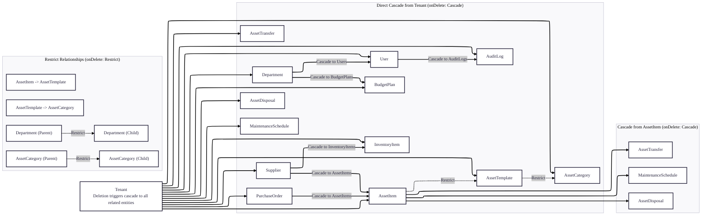
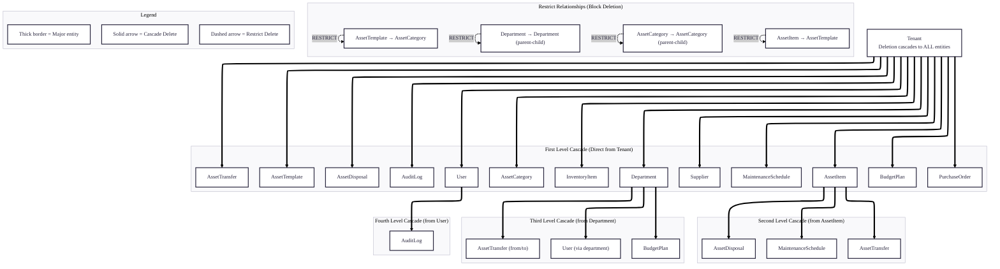

# Cascade Delete Rules

## Complete Cascade Hierarchy

## Cascade Delete Rules Summary

### 1. **Full Cascade from Tenant**
When a Tenant is deleted, ALL related entities are automatically deleted:
- Departments, Users, AssetCategories, AssetTemplates, AssetItems
- InventoryItems, Suppliers, PurchaseOrders
- MaintenanceSchedules, AssetTransfers, AssetDisposals
- BudgetPlans, AuditLogs

**Purpose**: Ensures complete data isolation and cleanup when an organization leaves the system.

### 2. **Cascade from AssetItem**
When an AssetItem is deleted:
- All MaintenanceSchedules for that item are deleted
- All AssetTransfers for that item are deleted
- All AssetDisposals for that item are deleted

**Purpose**: Maintains referential integrity by removing dependent records when an asset is removed.

### 3. **Cascade from Department**
When a Department is deleted:
- All Users in that department are deleted (cascade from Tenant relation)
- All BudgetPlans for that department are deleted
- AssetTransfer records referencing the department are affected

**Purpose**: Ensures organizational structure changes are properly propagated.

### 4. **Restrict Relationships** (Prevent deletion)
The following relationships use `onDelete: Restrict` to prevent deletion:

1. **Department hierarchy**: Cannot delete a department that has child departments
2. **AssetCategory hierarchy**: Cannot delete a category that has child categories
3. **AssetTemplate → AssetCategory**: Cannot delete a category used by templates
4. **AssetItem → AssetTemplate**: Cannot delete a template used by items

**Purpose**: Prevents accidental deletion of hierarchical or referenced data, maintaining structural integrity.

### 5. **Important Notes**
- `onDelete: Cascade` means deletion automatically propagates to related entities
- `onDelete: Restrict` means deletion is blocked if related entities exist
- All foreign keys to Tenant use Cascade for multi-tenant data isolation
- AssetItem has cascade to its maintenance/transfer/disposal records
- Self-referencing hierarchies (Department, AssetCategory) use Restrict to maintain structure

## Best Practices

### When to Use Cascade
1. **Parent-child relationships** where child data is meaningless without parent
2. **Audit/logging data** that should be cleaned up with the main entity
3. **Multi-tenant systems** where tenant deletion should remove all tenant data
4. **Dependent records** that exist only to support the main entity

### When to Use Restrict
1. **Hierarchical structures** where parent-child relationships must be maintained
2. **Reference data** that may be used by multiple entities
3. **Templates or categories** that define structure for other entities
4. **Historical records** that should be preserved even if related entities change

### Handling Restricted Deletions in Application Code
When a restrict constraint prevents deletion, the application should:

1. Check for existing relationships before attempting deletion
2. Provide clear error messages to users
3. Offer alternative actions (reassign, archive, or delete dependencies first)
4. Implement soft delete where appropriate instead of hard delete

## Common Scenarios

### Scenario 1: Deleting a Tenant
**Action**: Delete Tenant record
**Result**: All related records across all tables are automatically deleted
**Use Case**: Organization closing their account

### Scenario 2: Deleting an Asset
**Action**: Delete AssetItem
**Result**: Maintenance, transfer, and disposal records for that asset are deleted
**Use Case**: Removing a defective or lost asset from the system

### Scenario 3: Attempting to delete a Category with Child Categories
**Action**: Delete AssetCategory that has children
**Result**: Deletion is blocked by database constraint
**Use Case**: Prevent breaking hierarchical classification system

### Scenario 4: Deleting a Department
**Action**: Delete Department
**Result**: Users and BudgetPlans are deleted; transfers referencing the department are affected
**Use Case**: Organizational restructuring