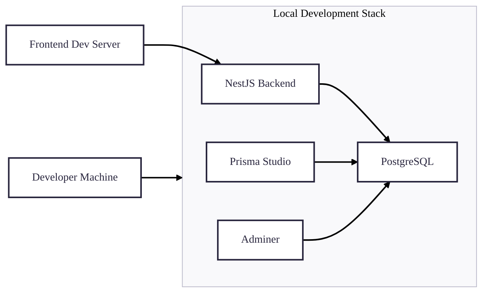

# Deployment Architecture

## Deployment Environments

### 1. Development Environment

**Purpose**: Local development and testing
**Components**:

- Docker Compose for service orchestration
- Local PostgreSQL database
- Prisma Studio for database management
- Hot-reload enabled backend service
- Development frontend server
