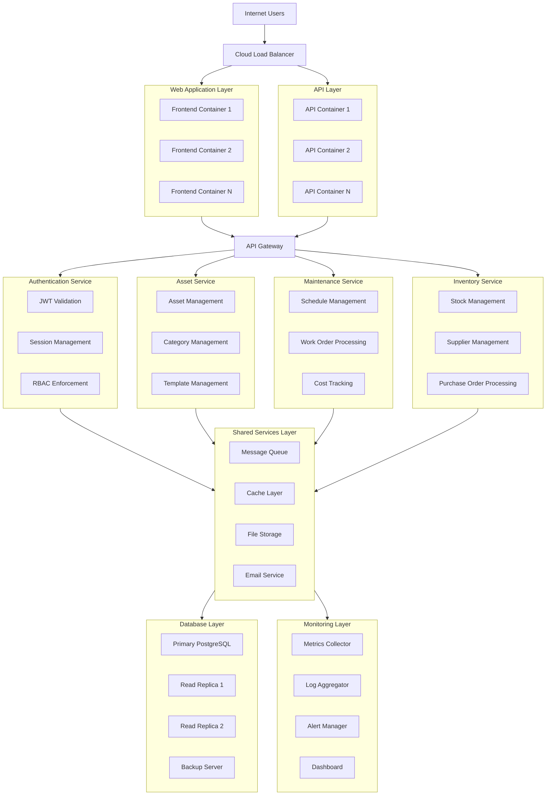
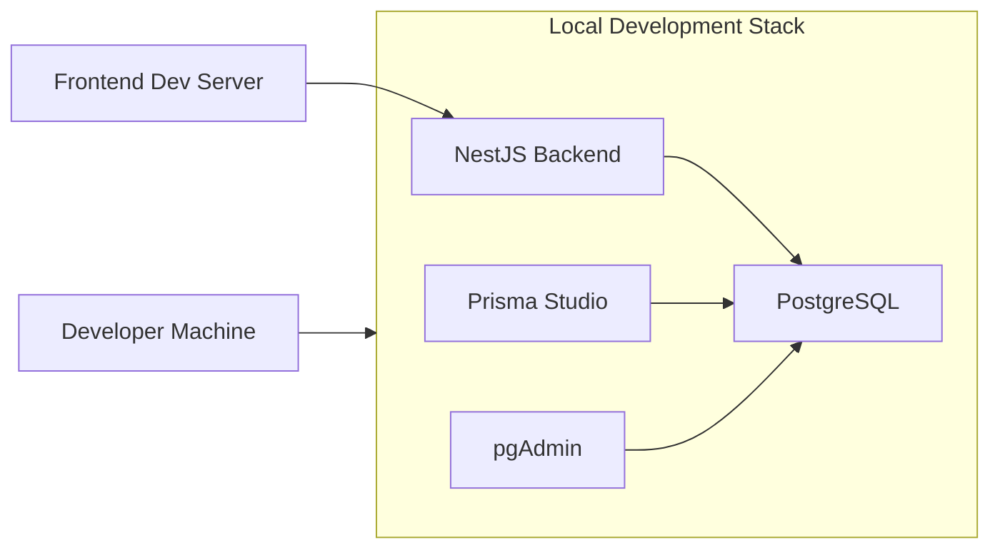
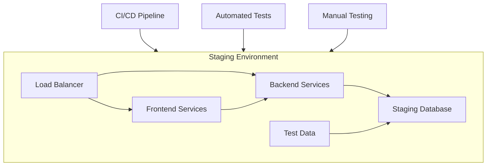
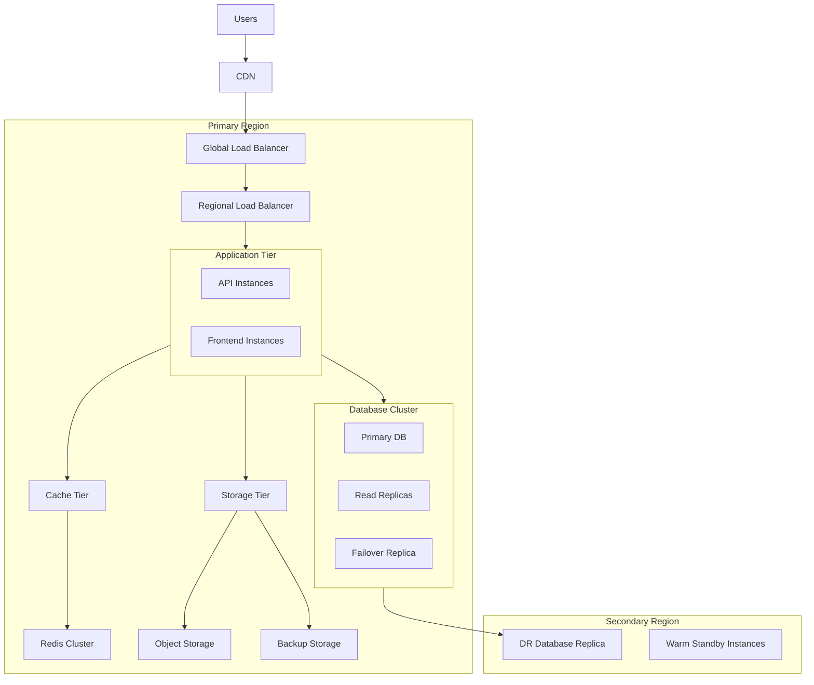
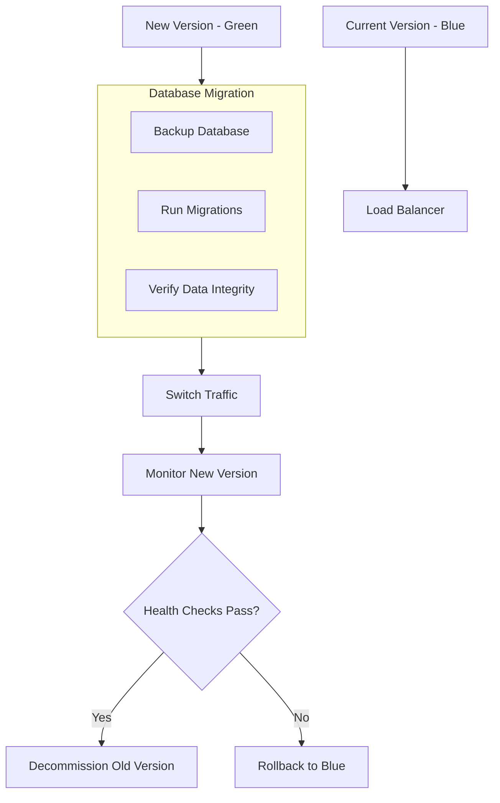
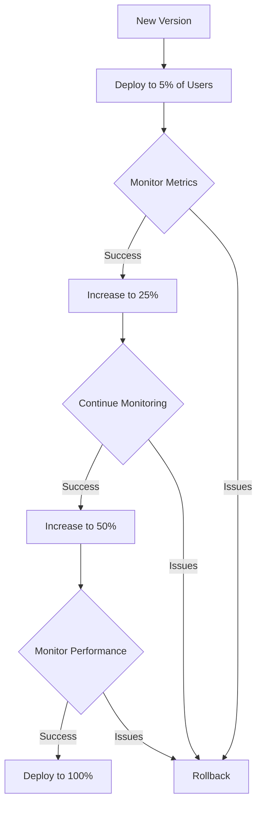

# Deployment Architecture

## Overview

The Asset Management System is designed with a modern, containerized deployment architecture that supports scalability, reliability, and ease of maintenance. This document outlines the deployment strategies, infrastructure components, and operational considerations for running the system in production environments.

## Architecture Diagram



**Screenshot file**: `screenshots/deployment-architecture.svg`

## Deployment Environments

### 1. Development Environment



**Purpose**: Local development and testing
**Components**:

- Docker Compose for service orchestration
- Local PostgreSQL database
- Prisma Studio for database management
- Hot-reload enabled backend service
- Development frontend server

### 2. Staging Environment



**Purpose**: Pre-production testing and validation
**Components**:

- Isolated cloud environment
- Production-like configuration
- Automated test suite execution
- Performance testing tools
- Test data management

### 3. Production Environment



**Purpose**: Live production serving real users
**Components**:

- Multi-zone/multi-region deployment
- Auto-scaling application instances
- Database clustering with replication
- CDN for static assets
- Comprehensive monitoring and alerting

## Infrastructure Components

### 1. Container Orchestration

**Docker Configuration**:

```dockerfile
# Backend Dockerfile
FROM node:18-alpine

WORKDIR /app

COPY package*.json ./
RUN npm ci --only=production

COPY prisma ./prisma/
RUN npx prisma generate

COPY dist ./dist/

EXPOSE 3000
CMD ["node", "dist/main.js"]
```

**Kubernetes Deployment** (Optional for scaling):

```yaml
# Deployment example
apiVersion: apps/v1
kind: Deployment
metadata:
  name: asset-management-api
spec:
  replicas: 3
  selector:
    matchLabels:
      app: asset-management-api
  template:
    metadata:
      labels:
        app: asset-management-api
    spec:
      containers:
        - name: api
          image: asset-management-api:latest
          ports:
            - containerPort: 3000
          env:
            - name: DATABASE_URL
              valueFrom:
                secretKeyRef:
                  name: database-secret
                  key: url
```

### 2. Database Architecture

**Production Database Setup**:

```
Primary PostgreSQL Cluster:
├── Primary Node (Write operations)
├── Read Replica 1 (Read operations - Reporting)
├── Read Replica 2 (Read operations - Application)
├── Failover Replica (Automatic failover)
└── Backup Node (Continuous backups)
```

**Database Configuration**:

```sql
-- Recommended PostgreSQL settings for production
max_connections = 200
shared_buffers = 4GB
effective_cache_size = 12GB
maintenance_work_mem = 1GB
checkpoint_completion_target = 0.9
wal_buffers = 16MB
default_statistics_target = 100
```

### 3. Networking and Security

**Network Architecture**:

```
Public Internet
    ↓
Cloud Load Balancer (HTTPS Termination)
    ↓
Application Load Balancer (Internal)
    ↓
Security Groups / Firewall Rules
    ↓
Application Servers (Private Subnet)
    ↓
Database Servers (Isolated Subnet)
```

**Security Measures**:

- TLS/SSL encryption for all traffic
- Database connection encryption
- Secrets management (Vault/AWS Secrets Manager)
- Regular security patching
- DDoS protection
- WAF (Web Application Firewall)

## Deployment Strategy

### 1. Blue-Green Deployment



**Advantages**:

- Zero-downtime deployments
- Easy rollback capability
- Reduced deployment risk

### 2. Canary Releases



**Advantages**:

- Gradual feature rollout
- Real-user testing
- Performance validation

## Monitoring and Observability

### 1. Metrics Collection

**Key Performance Indicators**:

- API response times (p50, p95, p99)
- Database query performance
- Error rates and types
- System resource utilization
- Business metrics (assets tracked, users active)

**Tools Stack**:

- **Metrics**: Prometheus + Grafana
- **Logs**: ELK Stack (Elasticsearch, Logstash, Kibana)
- **Traces**: Jaeger or Zipkin
- **APM**: New Relic or DataDog

### 2. Alerting Configuration

```yaml
# Example alert rules
groups:
  - name: asset_management_alerts
    rules:
      - alert: HighErrorRate
        expr: rate(http_requests_total{status=~"5.."}[5m]) > 0.05
        for: 2m
        labels:
          severity: critical
        annotations:
          summary: 'High error rate detected'

      - alert: DatabaseSlowQueries
        expr: pg_stat_database_xact_commit{datname="asset_management"} > 1000
        for: 5m
        labels:
          severity: warning
        annotations:
          summary: 'Database experiencing slow queries'
```

## Disaster Recovery

### 1. Backup Strategy

**Database Backups**:

- **Continuous**: WAL archiving
- **Daily**: Full database dumps
- **Weekly**: Point-in-time recovery snapshots
- **Monthly**: Long-term archival backups

**Application Backups**:

- Configuration files
- Uploaded files and attachments
- Application logs
- Deployment artifacts

### 2. Recovery Procedures

**Recovery Time Objective (RTO)**: 4 hours
**Recovery Point Objective (RPO)**: 15 minutes

**Recovery Procedures**:

1. Database restoration from backups
2. Application deployment from container registry
3. Configuration restoration from version control
4. Data consistency validation
5. Service verification and testing

## Scaling Strategy

### 1. Vertical Scaling

- Increase instance sizes for database and application servers
- Add more CPU/RAM to existing infrastructure
- Upgrade storage performance (SSD, NVMe)

### 2. Horizontal Scaling

- Add more application instances behind load balancer
- Implement database read replicas
- Use caching layers (Redis) for frequently accessed data
- Implement message queues for asynchronous processing

### 3. Auto-scaling Configuration

```yaml
# Example auto-scaling rules
- type: cpu_utilization
  target: 70%
  min_capacity: 2
  max_capacity: 10

- type: memory_utilization
  target: 80%
  min_capacity: 2
  max_capacity: 10

- type: request_count
  target: 1000 requests per instance
  min_capacity: 2
  max_capacity: 15
```

## Cost Optimization

### 1. Resource Optimization

- Right-size instances based on utilization metrics
- Use reserved instances for predictable workloads
- Implement auto-scaling to match demand
- Clean up unused resources regularly

### 2. Storage Optimization

- Implement data lifecycle policies
- Use appropriate storage classes (hot, warm, cold)
- Compress and deduplicate backups
- Archive historical data to cheaper storage

### 3. Network Optimization

- Use CDN for static assets
- Implement caching at multiple layers
- Optimize database queries and indexes
- Use connection pooling

## Compliance and Security

### 1. Data Protection

- Encrypt data at rest and in transit
- Implement access controls and auditing
- Regular security assessments and penetration testing
- Compliance with relevant regulations (GDPR, HIPAA, etc.)

### 2. Audit Trail

- Comprehensive logging of all system activities
- Immutable audit logs
- Regular log analysis and review
- Integration with SIEM systems

## Deployment Checklist

### Pre-deployment

- [ ] Database backups completed
- [ ] Environment variables verified
- [ ] Dependencies updated and tested
- [ ] Migration scripts tested in staging
- [ ] Performance baselines established

### During Deployment

- [ ] Deploy to staging environment
- [ ] Run automated test suite
- [ ] Perform smoke tests
- [ ] Monitor error rates and performance
- [ ] Verify database migrations

### Post-deployment

- [ ] Monitor system health for 24 hours
- [ ] Validate business functionality
- [ ] Update documentation
- [ ] Communicate deployment status
- [ ] Schedule follow-up review

## Maintenance Procedures

### Regular Maintenance

- **Daily**: Check system health, review logs
- **Weekly**: Apply security patches, clean up old data
- **Monthly**: Performance review, cost analysis
- **Quarterly**: Security audit, disaster recovery test

### Emergency Procedures

1. **Incident Identification**: Monitor alerts and user reports
2. **Initial Response**: Acknowledge incident, gather information
3. **Containment**: Isolate affected systems if necessary
4. **Resolution**: Implement fix or workaround
5. **Recovery**: Restore normal operations
6. **Post-mortem**: Document incident and lessons learned

## Conclusion

This deployment architecture provides a robust foundation for running the Asset Management System in production environments. By following these guidelines and implementing the recommended practices, organizations can ensure high availability, scalability, and security for their asset management operations.

The architecture is designed to be flexible and adaptable, allowing organizations to start with a simple deployment and scale up as their needs grow. Regular review and optimization of the deployment configuration will help maintain optimal performance and cost efficiency over time.
