# Core Features

## 1. Multi-tenancy Architecture

### Complete Data Isolation
Every organization (tenant) operates in a completely isolated data environment with no risk of cross-tenant data leakage.

### Key Features
- **Row-level isolation**: All database queries automatically filter by `tenant_id`
- **Independent configurations**: Each tenant can have custom settings and preferences
- **Scalable architecture**: Support for thousands of independent organizations
- **Complete data cleanup**: Tenant deletion removes all associated data through cascade rules

## 2. Organization Structure Management

### Department Hierarchy
Flexible organizational structure with unlimited nesting levels.

### Features
- **Unlimited nesting**: Create complex organizational hierarchies
- **Parent-child relationships**: Maintain reporting structures
- **Budget allocation**: Assign budgets at any department level
- **Asset assignment**: Track assets by department and user
- **Soft delete support**: Archive departments without losing history

### Department Management Table
| Feature | Description | Use Case |
|---------|-------------|----------|
| **Hierarchy Management** | Create, update, and reorganize department structures | Company restructuring, team expansion |
| **Budget Assignment** | Allocate budgets to departments for asset procurement | Financial planning, expense tracking |
| **User Assignment** | Assign users to departments with role-based access | Employee onboarding, team management |
| **Asset Tracking** | Monitor assets assigned to specific departments | Inventory management, cost allocation |
| **Reporting Structure** | Define reporting lines and hierarchies | Organizational planning, workflow design |

## 3. User Management & Authentication

### User Roles and Permissions
The system implements a simple role-based access control through user status and root user flag.

### Authentication Flow

### User Management Features

#### User Status Management
| Status | Description | Actions Allowed |
|--------|-------------|-----------------|
| **ACTIVE** | User can log in and perform assigned tasks | Full access based on department assignment |
| **INACTIVE** | Account disabled, cannot log in | No system access |

#### Profile Management
- **Personal information**: Username, email
- **Department assignment**: Link to organizational structure
- **Root user flag**: System-wide administrative access
- **Password management**: Secure credential storage

#### Security Features
- **JWT-based authentication**: Stateless authentication with access and refresh tokens
- **Password encryption**: BCrypt hashing for password security
- **Tenant validation**: All requests validated against user's tenant context
- **Audit logging**: All authentication events recorded in audit_log table

## 4. Root User Administration

### System Administration Capabilities
Root users (`is_root = true`) have cross-tenant administration privileges.

### Root User Access Control
| Module | Root Access | Tenant User Access |
|--------|------------|-------------------|
| **Tenant Management** | Full access (create, read, update, delete) | No access |
| **User Management** | View all users across tenants | Only users within own tenant |
| **Asset Management** | View assets across all tenants | Only assets within own tenant |
| **Audit Logs** | View all system logs | Only logs within own tenant |
| **System Configuration** | Full access | No access |

## 5. Audit & Compliance

### Comprehensive Activity Tracking
Every significant action in the system is logged in the `audit_log` table.

#### Audit Log Structure
| Field | Type | Description |
|-------|------|-------------|
| **id** | UUID | Unique identifier |
| **tenant_id** | UUID | Tenant context |
| **user_id** | UUID | User who performed action |
| **action** | String | Type of operation (CREATE, UPDATE, DELETE, LOGIN) |
| **entity_type** | String | Affected entity (User, AssetItem, Department) |
| **entity_id** | String | Specific record identifier |
| **old_value** | String (JSON) | Previous state before change |
| **new_value** | String (JSON) | New state after change |
| **action_time** | DateTime | Timestamp of action |

### Audit Scenarios

```mermaid
---
config:
  layout: elk
  theme: redux
  themeVariables:
    fontFamily: EB Garamond
---
sequenceDiagram
    participant User
    participant API
    participant BusinessLogic
    participant Database
    participant AuditService
    
    User->>API: Update asset status
    API->>BusinessLogic: Process update request
    BusinessLogic->>Database: Get current asset data
    Database-->>BusinessLogic: Current asset state
    
    BusinessLogic->>AuditService: Prepare audit data
    Note over BusinessLogic: Capture old_value
    
    BusinessLogic->>Database: Update asset record
    Database-->>BusinessLogic: Update confirmation
    
    BusinessLogic->>AuditService: Complete audit record
    Note over BusinessLogic: Add new_value, user_id, timestamp
    
    AuditService->>Database: Save audit log
    Database-->>AuditService: Log saved
    
    BusinessLogic-->>API: Success response
    API-->>User: Update confirmed
```

### Compliance Features
- **Complete audit trail**: Every data modification tracked
- **User accountability**: All actions linked to specific user
- **Data integrity**: Before/after values captured for all changes
- **Tenant isolation**: Each tenant sees only their own audit logs
- **Immutable records**: Audit logs cannot be modified or deleted

## 6. Data Management & Integrity

### Soft Delete Implementation
Strategic use of soft deletes via **deleted_at** timestamp field.

### Entities with Soft Delete
| Entity | Soft Delete Field | Cascade Behavior |
|--------|------------------|------------------|
| **Tenant** | deleted_at | Cascade delete to all related entities |
| **Department** | deleted_at | Restricted if has children or users |
| **User** | deleted_at | Cascade from tenant, restrict from department |
| **AssetCategory** | deleted_at | Restricted if has children or templates |
| **AssetTemplate** | deleted_at | Restricted if has asset items |
| **AssetItem** | deleted_at | Cascade to maintenance, transfers, disposals |
| **InventoryItem** | deleted_at | No cascade dependencies |
| **Supplier** | deleted_at | No cascade dependencies |

### Entities without Soft Delete
| Entity | Reason |
|--------|--------|
| **MaintenanceSchedule** | Historical records should be immutable |
| **AssetTransfer** | Transfer history must be preserved |
| **AssetDisposal** | Disposal records are final |
| **PurchaseOrder** | Financial records cannot be deleted |
| **BudgetPlan** | Financial planning history |
| **AuditLog** | Audit trail must be tamper-proof |

## 7. Cascade Delete Rules

### Two-Level Cascade Hierarchy

### Restricted Deletions
| Relationship | Constraint | Reason |
|--------------|------------|--------|
| **Department → Department** | RESTRICT | Cannot delete department with child departments |
| **AssetCategory → AssetCategory** | RESTRICT | Cannot delete category with child categories |
| **AssetTemplate → AssetCategory** | RESTRICT | Cannot delete category used by templates |
| **AssetItem → AssetTemplate** | RESTRICT | Cannot delete template used by items |

## 8. Module Structure (NestJS)

### Standard Module Architecture

### Module Responsibilities
| Module | Database Model | API Endpoints |
|--------|---------------|---------------|
| **TenantModule** | Tenant | CRUD, status management |
| **DepartmentModule** | Department | CRUD, hierarchy management |
| **UserModule** | User | CRUD, authentication, profile |
| **AssetCategoryModule** | AssetCategory | CRUD, hierarchy management |
| **AssetTemplateModule** | AssetTemplate | CRUD, specifications |
| **AssetItemModule** | AssetItem | CRUD, tracking, assignment |
| **MaintenanceModule** | MaintenanceSchedule | CRUD, scheduling, tracking |
| **TransferModule** | AssetTransfer | CRUD, approval workflows |
| **DisposalModule** | AssetDisposal | CRUD, approval workflows |
| **InventoryModule** | InventoryItem | CRUD, stock management |
| **SupplierModule** | Supplier | CRUD, vendor management |
| **PurchaseOrderModule** | PurchaseOrder | CRUD, procurement workflows |
| **BudgetModule** | BudgetPlan | CRUD, financial tracking |
| **AuditModule** | AuditLog | Read-only, reporting |

## 9. Security Implementation

### Multi-layer Security

### Security Features
- **JWT authentication**: Access and refresh token strategy
- **Tenant isolation**: All queries filtered by tenant_id
- **User status validation**: Only ACTIVE users can access system
- **Department scoping**: Users access only their department's data
- **Input validation**: Class-validator decorators on all DTOs
- **SQL injection prevention**: Prisma parameterized queries
- **Password hashing**: BCrypt with configurable rounds

## Key Benefits Summary

### For System Administrators (Root Users)
- **Centralized management**: Manage multiple tenants from single interface
- **Complete audit trail**: Visibility into all system activities
- **Data isolation**: Confidence in tenant data separation
- **Simple role model**: Clear distinction between root and tenant users

### For Tenant Administrators
- **Full tenant control**: Complete management of organization structure
- **User management**: Create and manage users within tenant
- **Department hierarchy**: Flexible organizational structure
- **Asset lifecycle tracking**: Complete visibility into asset utilization

### For End Users
- **Simple interface**: Easy-to-use system for daily operations
- **Department-based access**: See only relevant data
- **Asset tracking**: Easy management of assigned assets
- **Maintenance scheduling**: Simple request and tracking system

### Technical Benefits
- **Modular architecture**: Clean separation of concerns with NestJS modules
- **Database integrity**: Cascade and restrict rules maintain data consistency
- **Performance**: Efficient queries with proper indexing
- **Maintainability**: Clear structure with Prisma schema as single source of truth