# Asset Management Module

## 1. Asset Lifecycle Overview

### Complete Asset Lifecycle Management
The system manages assets from procurement through disposal, providing complete visibility and control over physical assets throughout their entire lifecycle.

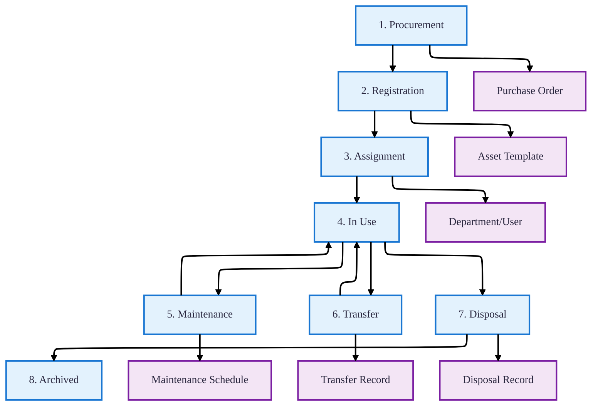

### Asset Management Process Flow
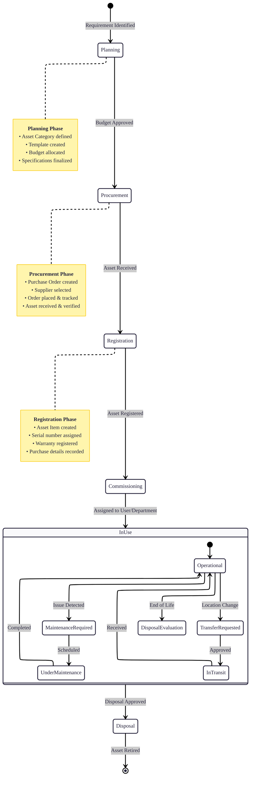

## 2. Asset Classification System

### Hierarchical Asset Categories
Flexible classification system with unlimited nesting for organizing assets by type, function, or department.

```mermaid
---
config:
  layout: elk
  theme: redux
  themeVariables:
    fontFamily: EB Garamond
---
flowchart TB
    Assets["All Assets"]
    
    subgraph IT["IT Equipment"]
        Computers["Computers"]
        Networking["Networking"]
        Peripherals["Peripherals"]
        
        subgraph Computers["Computers"]
            Laptops["Laptops"]
            Desktops["Desktops"]
            Servers["Servers"]
        end
        
        subgraph Networking["Networking"]
            Routers["Routers"]
            Switches["Switches"]
            Firewalls["Firewalls"]
        end
        
        subgraph Peripherals["Peripherals"]
            Monitors["Monitors"]
            Printers["Printers"]
            Scanners["Scanners"]
        end
    end
    
    subgraph Furniture["Office Furniture"]
        Chairs["Chairs"]
        Desks["Desks"]
        Storage["Storage"]
        
        subgraph Chairs["Chairs"]
            OfficeChairs["Office Chairs"]
            MeetingChairs["Meeting Room Chairs"]
            ReceptionChairs["Reception Area Chairs"]
        end
    end
    
    subgraph Vehicles["Company Vehicles"]
        Cars["Cars"]
        Trucks["Trucks"]
        Equipment["Special Equipment"]
    end
    
    Assets --> IT & Furniture & Vehicles
    
    classDef level1 fill:#e8f5e9,stroke:#388e3c
    classDef level2 fill:#e3f2fd,stroke:#1976d2
    classDef level3 fill:#f3e5f5,stroke:#7b1fa2
    classDef level4 fill:#fff3e0,stroke:#f57c00
    
    class Assets level1
    class IT,Furniture,Vehicles level2
    class Computers,Networking,Peripherals,Chairs,Desks,Storage,Cars,Trucks,Equipment level3
    class Laptops,Desktops,Servers,Routers,Switches,Firewalls,Monitors,Printers,Scanners,OfficeChairs,MeetingChairs,ReceptionChairs level4
```

### Asset Category Management
| Field | Type | Description | Required |
|-------|------|-------------|----------|
| **id** | UUID | Unique identifier | ✅ |
| **tenant_id** | UUID | Tenant context | ✅ |
| **name** | String | Category name (e.g., "Laptops") | ✅ |
| **code** | String | Category code (e.g., "IT-LAP") | ✅ |
| **parent_id** | UUID | Parent category for hierarchy | ❌ |
| **created_at** | DateTime | Creation timestamp | ✅ |
| **updated_at** | DateTime | Last update timestamp | ✅ |
| **deleted_at** | DateTime | Soft delete timestamp | ❌ |

### Category Features
- **Unlimited nesting**: Create complex classification hierarchies
- **Unique codes per tenant**: Ensure consistent categorization
- **Template association**: Link templates to specific categories
- **Inventory grouping**: Organize inventory items by category
- **Reporting basis**: Generate reports by category hierarchy

## 3. Asset Template Management

### Template-Based Asset Definition
Define standardized asset specifications that serve as blueprints for individual asset instances.

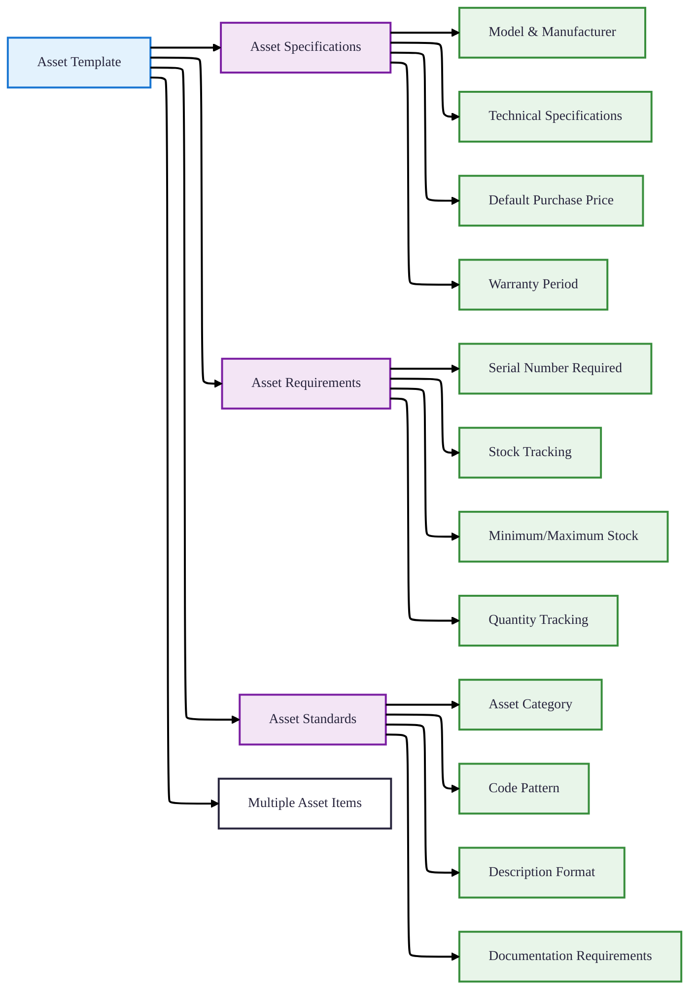

### Asset Template Fields
| Field | Type | Description | Business Purpose |
|-------|------|-------------|------------------|
| **code** | String | Unique template code | Standardized asset identification |
| **name** | String | Template name | Human-readable description |
| **model** | String | Equipment model | Technical specification |
| **manufacturer** | String | Manufacturer name | Vendor information |
| **description** | String | Detailed description | Usage and features |
| **specifications** | String | Technical specifications | Detailed technical data |
| **default_purchase_price** | Decimal | Expected purchase price | Budget planning |
| **default_warranty_months** | Int | Standard warranty period | Service planning |
| **track_quantity** | Boolean | Enable stock tracking | Inventory management |
| **min_stock** | Int | Minimum stock level | Reorder alerts |
| **max_stock** | Int | Maximum stock level | Storage planning |
| **require_serial** | Boolean | Serial number requirement | Unique asset tracking |

### Template-to-Item Relationship
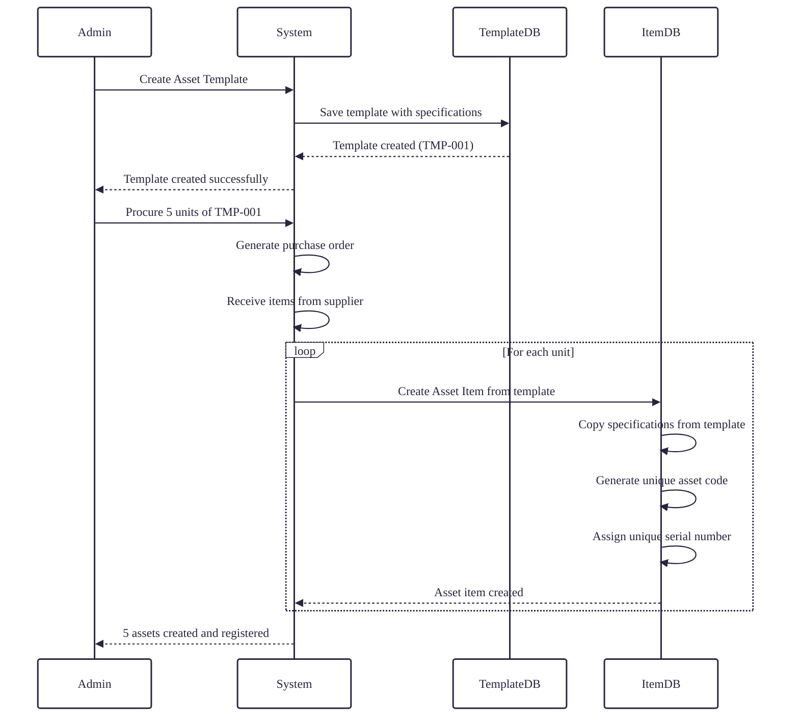

## 4. Asset Item Management

### Individual Asset Tracking
Track each physical asset instance with unique identification and detailed lifecycle information.

```mermaid
---
config:
  layout: elk
  theme: redux
  themeVariables:
    fontFamily: EB Garamond
---
flowchart TB
    AssetItem["Asset Item"] --> Identification["Identification"]
    AssetItem --> Financial["Financial Information"]
    AssetItem --> Status["Status & Condition"]
    AssetItem --> Assignment["Assignment"]
    AssetItem --> Warranty["Warranty Information"]
    
    Identification --> ID1["Asset Code"]
    Identification --> ID2["Serial Number"]
    Identification --> ID3["Template Reference"]
    
    Financial --> F1["Purchase Price"]
    Financial --> F2["Current Value"]
    Financial --> F3["Purchase Date"]
    Financial --> F4["Supplier & PO"]
    
    Status --> S1["Asset Status<br>AVAILABLE/IN_USE/DISPOSED"]
    Status --> S2["Physical Condition<br>NEW/GOOD/FAIR/DAMAGED"]
    Status --> S3["Location"]
    
    Assignment --> A1["Current Department"]
    Assignment --> A2["Current User"]
    Assignment --> A3["Creator"]
    
    Warranty --> W1["Warranty Start"]
    Warranty --> W2["Warranty End"]
    
    classDef asset fill:#e3f2fd,stroke:#1976d2
    classDef section fill:#f3e5f5,stroke:#7b1fa2
    classDef field fill:#e8f5e9,stroke:#388e3c
    
    class AssetItem asset
    class Identification,Financial,Status,Assignment,Warranty section
    class ID1,ID2,ID3,F1,F2,F3,F4,S1,S2,S3,A1,A2,A3,W1,W2 field
```

### Asset Status Workflow
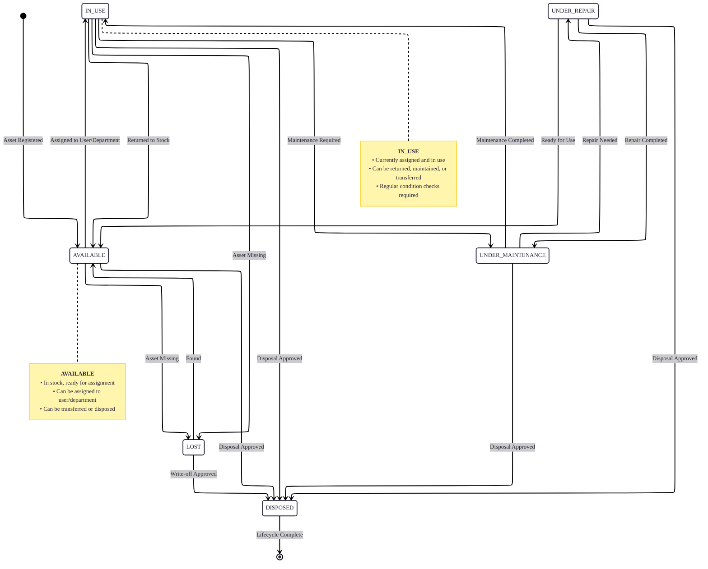

### Asset Condition Assessment
| Condition | Description | Action Required | Maintenance Priority |
|-----------|-------------|-----------------|----------------------|
| **NEW** | Brand new, unused | None | Low |
| **EXCELLENT** | Like new, minimal wear | Routine maintenance | Low |
| **GOOD** | Normal wear, fully functional | Regular maintenance | Medium |
| **FAIR** | Visible wear, functions adequately | Scheduled maintenance | High |
| **POOR** | Significant wear, reduced functionality | Immediate maintenance | Critical |
| **DAMAGED** | Damaged but repairable | Repair required | Critical |
| **UNUSABLE** | Not functional, beyond repair | Disposal recommended | N/A |
| **USED** | Previously used, condition varies | Assessment needed | Variable |

## 5. Maintenance Management

### Preventive & Corrective Maintenance
Comprehensive maintenance scheduling and tracking for asset reliability and longevity.

```mermaid
---
config:
  layout: elk
  theme: redux
  themeVariables:
    fontFamily: EB Garamond
---
flowchart TB
    Maintenance["Maintenance Management"] --> Types["Maintenance Types"]
    Maintenance --> Scheduling["Scheduling"]
    Maintenance --> Execution["Execution"]
    Maintenance --> Costing["Cost Tracking"]
    
    Types --> Preventive["PREVENTIVE<br>Regular scheduled maintenance"]
    Types --> Corrective["CORRECTIVE<br>Breakdown or repair maintenance"]
    
    Scheduling --> S1["Date-based scheduling"]
    Scheduling --> S2["Usage-based triggers"]
    Scheduling --> S3["Condition-based alerts"]
    Scheduling --> S4["Warranty tracking"]
    
    Execution --> E1["Technician assignment"]
    Execution --> E2["Status tracking<br>PENDING/IN_PROGRESS/COMPLETED"]
    Execution --> E3["Result documentation"]
    Execution --> E4["Parts replacement tracking"]
    
    Costing --> C1["Estimated Cost"]
    Costing --> C2["Actual Cost"]
    Costing --> C3["Cost variance analysis"]
    Costing --> C4["Budget impact"]
    
    classDef main fill:#e3f2fd,stroke:#1976d2
    classDef category fill:#f3e5f5,stroke:#7b1fa2
    classDef detail fill:#e8f5e9,stroke:#388e3c
    
    class Maintenance main
    class Types,Scheduling,Execution,Costing category
    class Preventive,Corrective,S1,S2,S3,S4,E1,E2,E3,E4,C1,C2,C3,C4 detail
```

### Maintenance Workflow
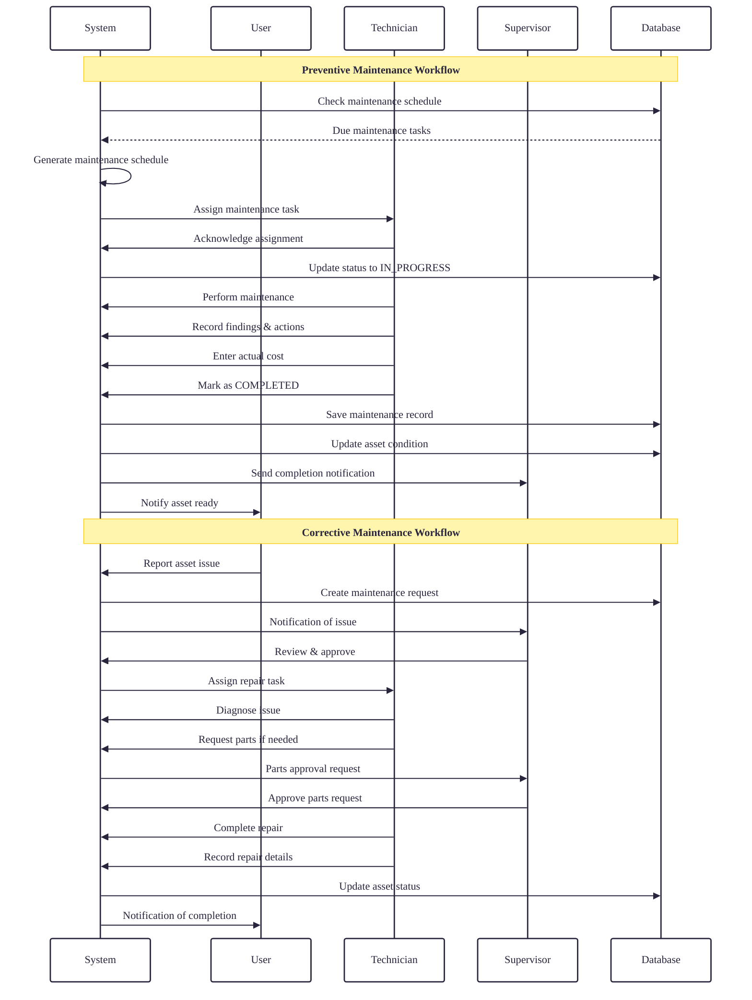

### Maintenance Status Management
| Status | Description | Allowed Actions |
|--------|-------------|-----------------|
| **PENDING** | Scheduled but not started | Assign technician, reschedule, cancel |
| **IN_PROGRESS** | Maintenance underway | Update progress, record findings, complete |
| **COMPLETED** | Maintenance finished | View details, create follow-up, close |
| **CANCELLED** | Maintenance cancelled | Reschedule, delete (with reason) |

## 6. Asset Transfer Management

### Asset Movement Tracking
Complete tracking of asset transfers between departments, users, or locations with approval workflows.

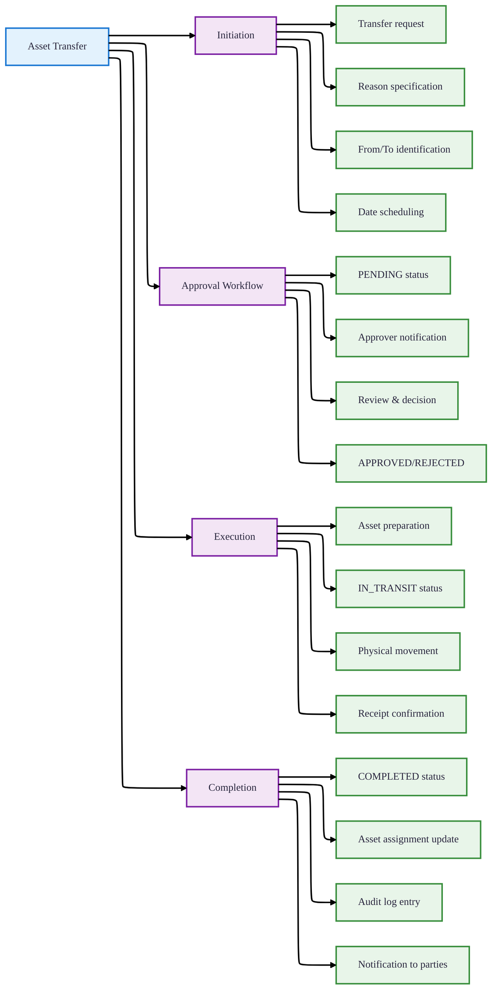

### Transfer Status Workflow
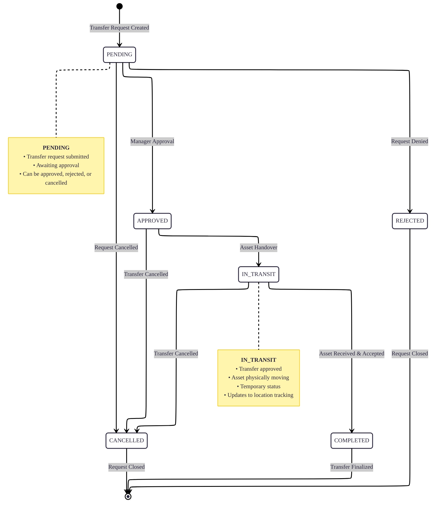

### Transfer Scenarios
| Scenario | From | To | Approval Required | Documentation |
|----------|------|----|------------------|---------------|
| **Department Transfer** | Department A | Department B | Department heads | Transfer reason, asset condition |
| **User Reassignment** | User X | User Y | Department manager | Handover notes, condition report |
| **Location Change** | Building A | Building B | Facilities manager | Transport details, insurance |
| **Temporary Loan** | Main Stock | Project Site | Asset manager | Loan period, return date |

## 7. Asset Disposal Management

### End-of-Life Asset Processing
Systematic process for retiring assets with proper approval, documentation, and financial recording.

```mermaid
---
config:
  layout: elk
  theme: redux
  themeVariables:
    fontFamily: EB Garamond
---
flowchart TB
    Disposal["Asset Disposal"] --> Initiation["Initiation"]
    Disposal --> Evaluation["Evaluation"]
    Disposal --> Approval["Approval"]
    Disposal --> Execution["Execution"]
    Disposal --> Recording["Financial Recording"]
    
    Initiation --> I1["Disposal request"]
    Initiation --> I2["Reason documentation"]
    Initiation --> I3["Disposal type selection"]
    
    Evaluation --> E1["Asset condition assessment"]
    Evaluation --> E2["Disposal value estimation"]
    Evaluation --> E3["Method evaluation<br>SALE/DONATION/DISCARD"]
    Evaluation --> E4["Regulatory compliance check"]
    
    Approval --> A1["PENDING status"]
    Approval --> A2["Approver assignment"]
    Approval --> A3["Review process"]
    Approval --> A4["APPROVED/REJECTED"]
    
    Execution --> EX1["Physical disposal"]
    Execution --> EX2["Documentation"]
    Execution --> EX3["Proof of disposal"]
    Execution --> EX4["COMPLETED status"]
    
    Recording --> R1["Disposal value recording"]
    Recording --> R2["Financial impact"]
    Recording --> R3["Asset write-off"]
    Recording --> R4["Audit trail"]
    
    classDef disposal fill:#e3f2fd,stroke:#1976d2
    classDef phase fill:#f3e5f5,stroke:#7b1fa2
    classDef step fill:#e8f5e9,stroke:#388e3c
    
    class Disposal disposal
    class Initiation,Evaluation,Approval,Execution,Recording phase
    class I1,I2,I3,E1,E2,E3,E4,A1,A2,A3,A4,EX1,EX2,EX3,EX4,R1,R2,R3,R4 step
```

### Disposal Types
| Type | Description | Approval Level | Documentation Required |
|------|-------------|----------------|------------------------|
| **SALE** | Asset sold to external party | Finance director + Department head | Sale agreement, payment receipt |
| **DONATION** | Asset donated to charity | CSR committee + Legal | Donation agreement, receipt |
| **DISCARD** | Asset disposed as waste | Department head + Facilities | Disposal certificate, photos |
| **DAMAGED_BEYOND_REPAIR** | Unrepairable asset disposal | Technical head + Department head | Technical assessment report |
| **LOST** | Asset lost or stolen | Security head + Department head | Police report, investigation |

### Disposal Status Workflow
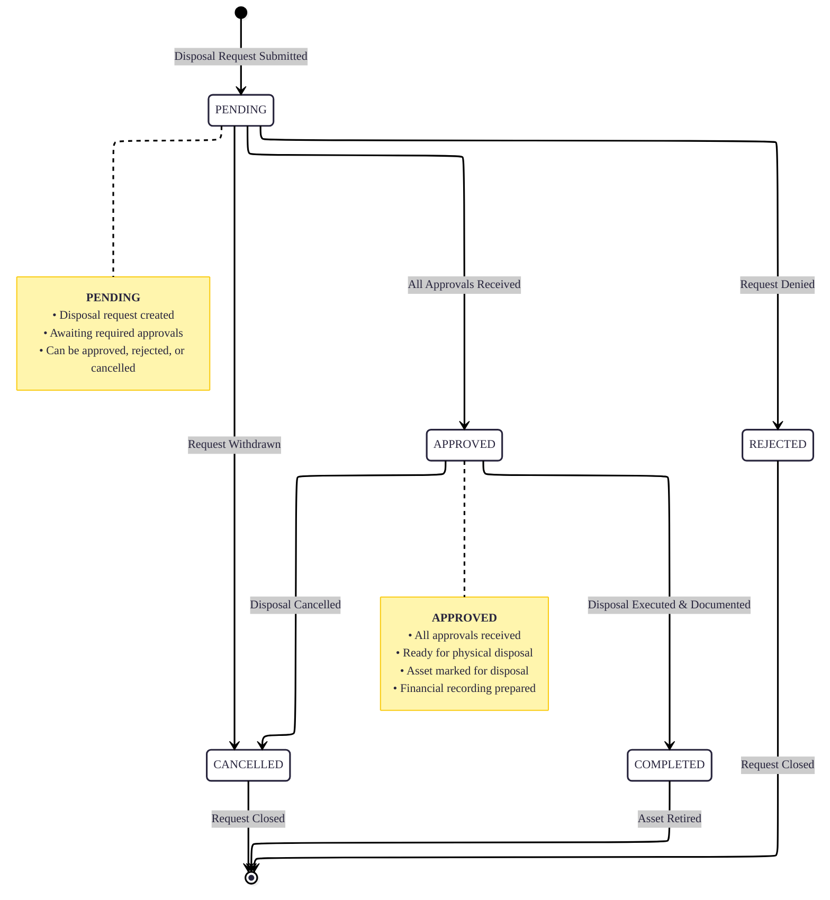

## 8. Integration Points

### Relationship with Other Modules
```mermaid
---
config:
  layout: elk
  theme: redux
  themeVariables:
    fontFamily: EB Garamond
---
flowchart TB
    AssetManagement["Asset Management"] --> Procurement["Procurement Module"]
    AssetManagement --> Inventory["Inventory Module"]
    AssetManagement --> Finance["Finance Module"]
    AssetManagement --> MaintenanceOps["Maintenance Operations"]
    AssetManagement --> Reporting["Reporting Module"]
    
    Procurement --> P1["Purchase Order creation"]
    Procurement --> P2["Supplier selection"]
    Procurement --> P3["Receiving & inspection"]
    
    Inventory --> I1["Stock level management"]
    Inventory --> I2["Consumable tracking"]
    Inventory --> I3["Reorder triggers"]
    
    Finance --> F1["Budget tracking"]
    Finance --> F2["Depreciation calculation"]
    Finance --> F3["Disposal accounting"]
    
    MaintenanceOps --> M1["Preventive scheduling"]
    MaintenanceOps --> M2["Corrective repairs"]
    MaintenanceOps --> M3["Cost tracking"]
    
    Reporting --> R1["Asset utilization"]
    Reporting --> R2["Maintenance history"]
    Reporting --> R3["Lifecycle costs"]
    Reporting --> R4["Disposal reporting"]
    
    classDef main fill:#e3f2fd,stroke:#1976d2
    classDef module fill:#f3e5f5,stroke:#7b1fa2
    classDef function fill:#e8f5e9,stroke:#388e3c
    
    class AssetManagement main
    class Procurement,Inventory,Finance,MaintenanceOps,Reporting module
    class P1,P2,P3,I1,I2,I3,F1,F2,F3,M1,M2,M3,R1,R2,R3,R4 function
```

### Data Relationships
| Asset Entity | Related Modules | Key Relationships |
|--------------|----------------|-------------------|
| **AssetCategory** | Inventory, Procurement | Categories inventory items and purchase orders |
| **AssetTemplate** | Procurement, Inventory | Defines specifications for purchased assets |
| **AssetItem** | All modules | Central entity connecting all asset activities |
| **MaintenanceSchedule** | Finance, Reporting | Tracks costs and maintenance history |
| **AssetTransfer** | User, Department | Manages organizational asset movement |
| **AssetDisposal** | Finance, Audit | Records end-of-life financial transactions |

## 9. Key Reports & Analytics

### Asset Management Reports
| Report Type | Purpose | Key Metrics | Frequency |
|-------------|---------|-------------|-----------|
| **Asset Register** | Complete inventory listing | Total assets, value by category, condition | Monthly |
| **Maintenance Schedule** | Upcoming maintenance | Due dates, assigned technicians, estimated costs | Weekly |
| **Depreciation Report** | Asset value over time | Current value, accumulated depreciation, remaining life | Quarterly |
| **Disposal Summary** | Asset retirement tracking | Disposal method, recovered value, reasons | Monthly |
| **Transfer Log** | Asset movement history | Transfers by department, approval times, reasons | Monthly |
| **Warranty Expiry** | Warranty management | Expiring warranties, coverage summary | Monthly |
| **Condition Assessment** | Asset health status | Condition distribution, aging analysis | Quarterly |
| **Utilization Report** | Asset usage efficiency | Utilization rates, idle assets, assignment history | Monthly |

### Performance Indicators
| KPI | Calculation | Target | Purpose |
|-----|-------------|--------|---------|
| **Asset Utilization Rate** | (Assets in use / Total assets) × 100 | >85% | Measure asset usage efficiency |
| **Maintenance Cost Ratio** | (Maintenance cost / Asset value) × 100 | <5% | Control maintenance expenses |
| **Mean Time Between Failure** | Total operating time / Number of failures | Maximize | Measure asset reliability |
| **Disposal Recovery Rate** | (Disposal value / Original cost) × 100 | >20% | Maximize asset residual value |
| **Transfer Processing Time** | Average time to complete transfers | <3 days | Measure process efficiency |
| **Warranty Claim Rate** | (Warranty claims / Total assets) × 100 | Minimize | Monitor asset quality |

## 10. Best Practices Implementation

### Asset Management Guidelines
1. **Standardized Classification**
   - Use consistent category codes across organization
   - Maintain hierarchical structure for reporting
   - Regularly review and update categories

2. **Template Management**
   - Create templates before procurement
   - Include comprehensive specifications
   - Set realistic stock thresholds

3. **Lifecycle Tracking**
   - Record all asset movements
   - Maintain complete maintenance history
   - Document disposal decisions

4. **Condition Monitoring**
   - Regular condition assessments
   - Proactive maintenance scheduling
   - Timely repairs to prevent deterioration

5. **Compliance & Audit**
   - Maintain complete audit trails
   - Follow approval workflows
   - Document all financial transactions

### Implementation Checklist
- [ ] Define asset categorization structure
- [ ] Create standard asset templates
- [ ] Establish maintenance schedules
- [ ] Set up transfer approval workflows
- [ ] Define disposal procedures
- [ ] Configure reporting requirements
- [ ] Train users on asset management processes
- [ ] Establish regular review cycles

---

*The Asset Management Module provides comprehensive control over physical assets throughout their entire lifecycle, from procurement to disposal, ensuring optimal utilization, maintenance, and financial management.*