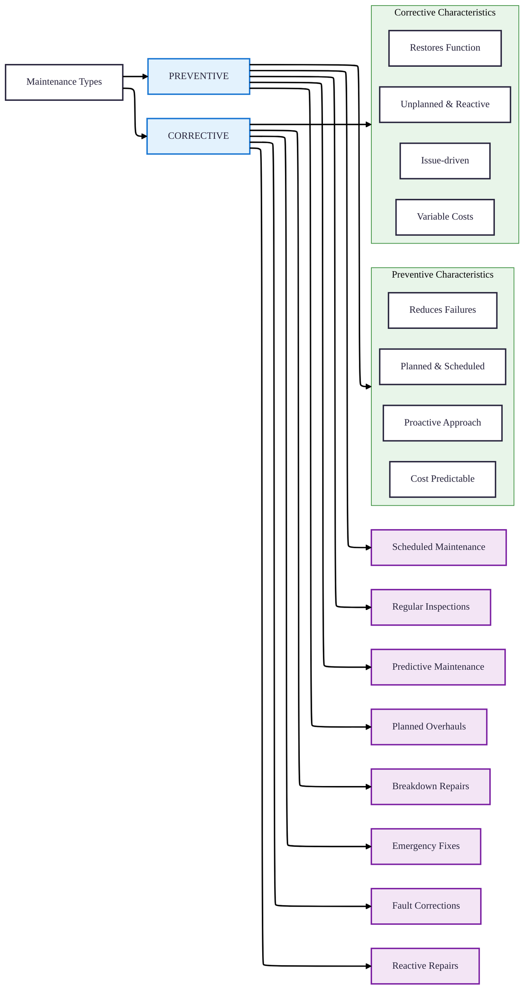
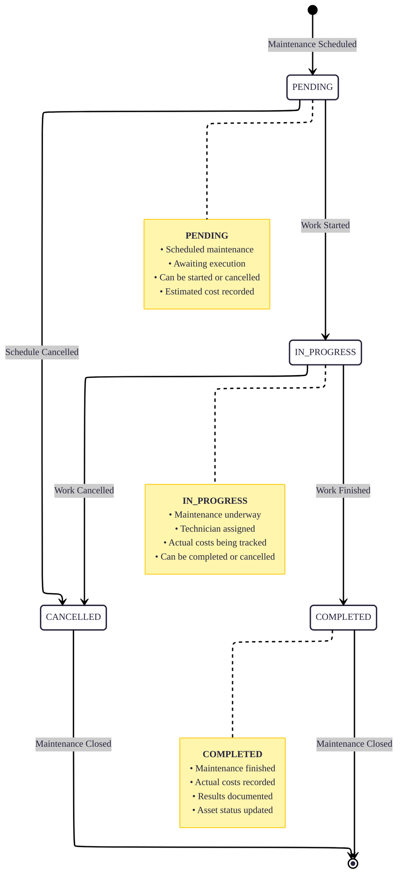
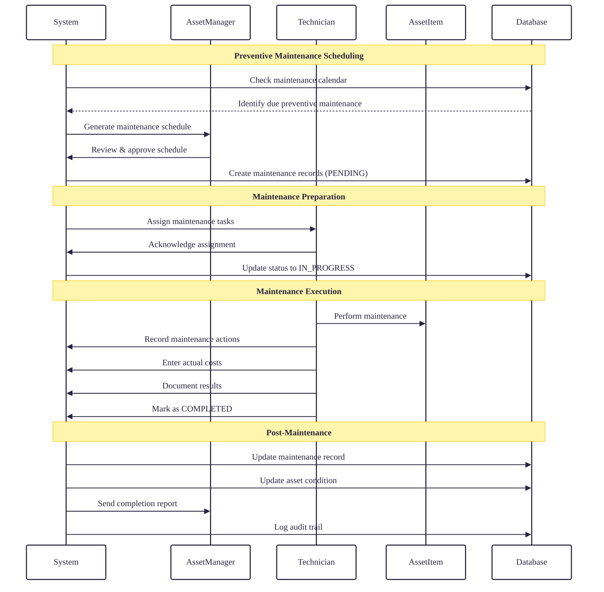
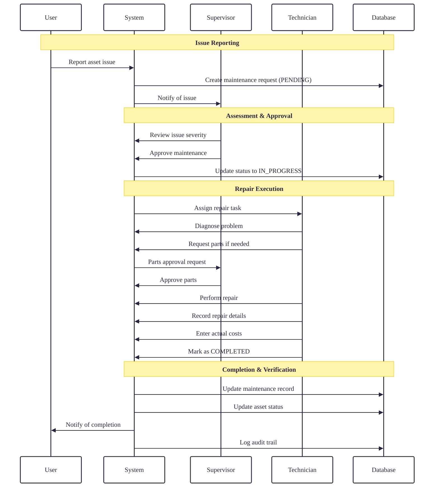
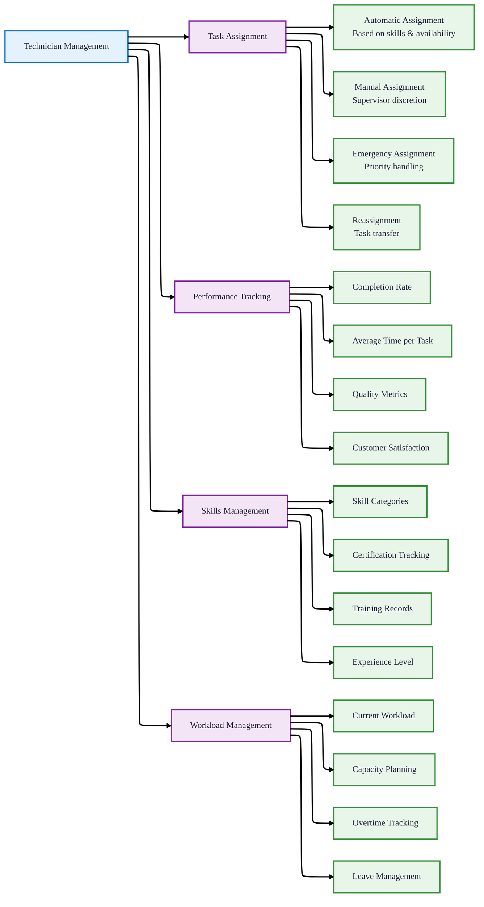
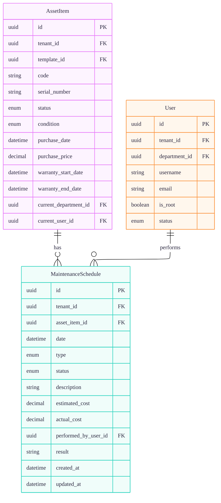

# Maintenance Module

## 1. Overview

### Maintenance Management System
The Maintenance Module provides comprehensive asset maintenance management, including preventive and corrective maintenance scheduling, tracking, and cost management.

```mermaid
---
config:
  layout: elk
  theme: redux
  themeVariables:
    fontFamily: EB Garamond
---
flowchart TB
    MaintenanceModule["Maintenance Module"] --> Scheduling["Maintenance Scheduling"]
    MaintenanceModule --> Execution["Maintenance Execution"]
    MaintenanceModule --> Tracking["Cost & Performance Tracking"]
    MaintenanceModule --> Integration["System Integration"]
    
    Scheduling --> S1["Preventive Maintenance<br>Regular, scheduled"]
    Scheduling --> S2["Corrective Maintenance<br>Breakdown, reactive"]
    Scheduling --> S3["Condition-based<br>Triggered by asset condition"]
    Scheduling --> S4["Warranty-based<br>Manufacturer coverage"]
    
    Execution --> E1["Work Order Management"]
    Execution --> E2["Technician Assignment"]
    Execution --> E3["Status Tracking"]
    Execution --> E4["Result Documentation"]
    
    Tracking --> T1["Cost Estimation"]
    Tracking --> T2["Actual Cost Recording"]
    Tracking --> T3["Performance Metrics"]
    Tracking --> T4["Budget Impact Analysis"]
    
    Integration --> I1["Asset Item Linking"]
    Integration --> I2["User Assignment"]
    Integration --> I3["Audit Logging"]
    Integration --> I4["Reporting Integration"]
    
    classDef main fill:#e3f2fd,stroke:#1976d2
    classDef category fill:#f3e5f5,stroke:#7b1fa2
    classDef feature fill:#e8f5e9,stroke:#388e3c
    
    class MaintenanceModule main
    class Scheduling,Execution,Tracking,Integration category
    class S1,S2,S3,S4,E1,E2,E3,E4,T1,T2,T3,T4,I1,I2,I3,I4 feature
```

## 2. Maintenance Types

### Preventive vs Corrective Maintenance

### Maintenance Type Comparison
| Aspect | Preventive Maintenance | Corrective Maintenance |
|--------|------------------------|------------------------|
| **Timing** | Scheduled in advance | Performed after failure |
| **Objective** | Prevent failures | Restore functionality |
| **Cost** | Predictable, planned | Variable, often higher |
| **Planning** | Systematic schedule | Reactive response |
| **Resource Allocation** | Planned utilization | Emergency allocation |
| **Impact on Operations** | Minimal disruption | Possible downtime |
| **Frequency** | Regular intervals | As needed |
| **Documentation** | Standard procedures | Incident reports |

## 3. Maintenance Schedule Entity

### Data Structure

```mermaid
---
config:
  layout: elk
  theme: redux
  themeVariables:
    fontFamily: EB Garamond
---
flowchart TB
    MaintenanceSchedule["MaintenanceSchedule Entity"] --> Core["Core Information"]
    MaintenanceSchedule --> Financial["Financial Information"]
    MaintenanceSchedule --> Execution["Execution Details"]
    MaintenanceSchedule --> Metadata["System Metadata"]
    
    Core --> C1["Asset Item ID"]
    Core --> C2["Maintenance Date"]
    Core --> C3["Maintenance Type<br>PREVENTIVE/CORRECTIVE"]
    Core --> C4["Description"]
    
    Financial --> F1["Estimated Cost"]
    Financial --> F2["Actual Cost"]
    Financial --> F3["Cost Variance"]
    
    Execution --> E1["Status<br>PENDING/IN_PROGRESS/COMPLETED/CANCELLED"]
    Execution --> E2["Performed By User"]
    Execution --> E3["Result Notes"]
    
    Metadata --> M1["Tenant Context"]
    Metadata --> M2["Creation Timestamp"]
    Metadata --> M3["Update Timestamp"]
    
    classDef entity fill:#e3f2fd,stroke:#1976d2
    classDef section fill:#f3e5f5,stroke:#7b1fa2
    classDef field fill:#e8f5e9,stroke:#388e3c
    
    class MaintenanceSchedule entity
    class Core,Financial,Execution,Metadata section
    class C1,C2,C3,C4,F1,F2,F3,E1,E2,E3,M1,M2,M3 field
```

### Maintenance Schedule Fields
| Field | Type | Required | Description |
|-------|------|----------|-------------|
| **id** | UUID | ✅ | Unique identifier |
| **tenant_id** | UUID | ✅ | Tenant context |
| **asset_item_id** | UUID | ✅ | Asset being maintained |
| **date** | DateTime | ✅ | Scheduled maintenance date |
| **type** | MaintenanceType | ✅ | PREVENTIVE or CORRECTIVE |
| **status** | MaintenanceStatus | ✅ | PENDING, IN_PROGRESS, COMPLETED, CANCELLED |
| **description** | String | ❌ | Maintenance description |
| **estimated_cost** | Decimal(19,4) | ❌ | Estimated maintenance cost |
| **actual_cost** | Decimal(19,4) | ❌ | Actual maintenance cost |
| **performed_by_user_id** | UUID | ❌ | User who performed maintenance |
| **result** | String | ❌ | Maintenance results/notes |
| **created_at** | DateTime | ✅ | Creation timestamp |
| **updated_at** | DateTime | ✅ | Last update timestamp |

## 4. Maintenance Status Workflow

### Complete Status Lifecycle

### Status Transitions & Actions
| Current Status | Allowed Transitions | Required Actions | Business Rules |
|----------------|---------------------|------------------|----------------|
| **PENDING** | → IN_PROGRESS, → CANCELLED | Assign technician, Set start date | Must have scheduled date |
| **IN_PROGRESS** | → COMPLETED, → CANCELLED | Record actual costs, Document results | Technician must be assigned |
| **COMPLETED** | None (terminal) | Update asset condition, Close maintenance | Actual cost must be recorded |
| **CANCELLED** | None (terminal) | Document cancellation reason, Update schedule | Cannot be reactivated |

## 5. Maintenance Workflows

### Preventive Maintenance Workflow

### Corrective Maintenance Workflow

## 6. Cost Management

### Maintenance Cost Tracking

```mermaid
---
config:
  layout: elk
  theme: redux
  themeVariables:
    fontFamily: EB Garamond
---
flowchart TB
    CostManagement["Maintenance Cost Management"] --> Estimation["Cost Estimation"]
    CostManagement --> Actual["Actual Cost Tracking"]
    CostManagement --> Analysis["Cost Analysis"]
    CostManagement --> Budget["Budget Impact"]
    
    Estimation --> E1["Initial Estimate"]
    Estimation --> E2["Resource Costing"]
    Estimation --> E3["Parts Costing"]
    Estimation --> E4["Labor Costing"]
    
    Actual --> A1["Actual Labor Cost"]
    Actual --> A2["Actual Parts Cost"]
    Actual --> A3["Additional Expenses"]
    Actual --> A4["Total Actual Cost"]
    
    Analysis --> AN1["Cost Variance Analysis"]
    Analysis --> AN2["Estimate vs Actual"]
    Analysis --> AN3["Trend Analysis"]
    Analysis --> AN4["Cost per Asset"]
    
    Budget --> B1["Budget Allocation"]
    Budget --> B2["Budget Utilization"]
    Budget --> B3["Overspend Alerts"]
    Budget --> B4["Budget Forecasting"]
    
    classDef main fill:#e3f2fd,stroke:#1976d2
    classDef category fill:#f3e5f5,stroke:#7b1fa2
    classDef detail fill:#e8f5e9,stroke:#388e3c
    
    class CostManagement main
    class Estimation,Actual,Analysis,Budget category
    class E1,E2,E3,E4,A1,A2,A3,A4,AN1,AN2,AN3,AN4,B1,B2,B3,B4 detail
```

### Cost Tracking Fields
| Field | Data Type | Precision | Description |
|-------|-----------|-----------|-------------|
| **estimated_cost** | Decimal | 19,4 | Estimated total cost before maintenance |
| **actual_cost** | Decimal | 19,4 | Actual total cost after completion |
| **cost_variance** | Calculated | - | Difference (actual - estimated) |
| **variance_percentage** | Calculated | - | Variance as percentage of estimate |

### Cost Analysis Metrics
| Metric | Formula | Purpose | Target Range |
|--------|---------|---------|--------------|
| **Cost Variance** | Actual Cost - Estimated Cost | Measure estimation accuracy | ±10% |
| **Variance Percentage** | (Variance / Estimated Cost) × 100 | Standardized accuracy measure | ±15% |
| **Cost per Asset** | Total Maintenance Cost / Number of Assets | Asset maintenance efficiency | Minimize |
| **Preventive vs Corrective Ratio** | Preventive Cost / Corrective Cost | Maintenance strategy effectiveness | >70% preventive |
| **Mean Time Between Maintenance** | Total Operating Time / Maintenance Count | Asset reliability | Maximize |

## 7. Technician Management

### User Assignment & Tracking

### Technician Performance Tracking
| Metric | Calculation Method | Evaluation Frequency | Performance Targets |
|--------|-------------------|---------------------|---------------------|
| **Task Completion Rate** | Completed Tasks / Assigned Tasks | Monthly | >95% |
| **Average Completion Time** | Total Time / Completed Tasks | Monthly | Below standard time |
| **First-Time Fix Rate** | First-time Fixes / Total Tasks | Quarterly | >85% |
| **Cost Efficiency** | Actual Cost / Estimated Cost | Per Task | <100% |
| **Quality Rating** | Supervisor/User Ratings | Per Task | >4.0/5.0 |
| **Safety Compliance** | Safety Incidents / Total Tasks | Monthly | 0 incidents |

## 8. Integration with Asset Management

### Asset-Maintenance Relationship

### Maintenance Impact on Asset Status
| Maintenance Type | Asset Status Before | Asset Status During | Asset Status After |
|------------------|---------------------|---------------------|-------------------|
| **Preventive** | AVAILABLE or IN_USE | UNDER_MAINTENANCE | AVAILABLE or IN_USE |
| **Corrective** | IN_USE or UNDER_REPAIR | UNDER_MAINTENANCE | AVAILABLE or IN_USE |
| **Emergency Repair** | UNDER_REPAIR | UNDER_MAINTENANCE | AVAILABLE or IN_USE |
| **Warranty Service** | IN_USE | UNDER_MAINTENANCE | AVAILABLE or IN_USE |

### Condition Improvement Tracking
| Starting Condition | Maintenance Type | Expected Improvement | Validation Method |
|-------------------|------------------|----------------------|-------------------|
| **FAIR** | Preventive | Maintain or improve to GOOD | Post-maintenance inspection |
| **POOR** | Corrective | Improve to FAIR or GOOD | Functional testing |
| **DAMAGED** | Corrective | Restore to FAIR or GOOD | Technical validation |
| **UNUSABLE** | Major Repair | Restore to WORKING condition | Comprehensive testing |

## 9. Reporting & Analytics

### Maintenance Reports

```mermaid
---
config:
  layout: elk
  theme: redux
  themeVariables:
    fontFamily: EB Garamond
---
flowchart TB
    MaintenanceReports["Maintenance Reports"] --> Operational["Operational Reports"]
    MaintenanceReports --> Financial["Financial Reports"]
    MaintenanceReports --> Performance["Performance Reports"]
    MaintenanceReports --> Predictive["Predictive Analytics"]
    
    Operational --> O1["Maintenance Schedule"]
    Operational --> O2["Work Order Status"]
    Operational --> O3["Backlog Analysis"]
    Operational --> O4["Resource Utilization"]
    
    Financial --> F1["Cost Analysis"]
    Financial --> F2["Budget vs Actual"]
    Financial --> F3["Vendor Cost Comparison"]
    Financial --> F4["ROI Analysis"]
    
    Performance --> P1["Technician Performance"]
    Performance --> P2["Asset Reliability"]
    Performance --> P3["MTBF/MTTR Analysis"]
    Performance --> P4["Preventive Effectiveness"]
    
    Predictive --> PR1["Failure Prediction"]
    Predictive --> PR2["Lifecycle Forecasting"]
    Predictive --> PR3["Optimal Maintenance Intervals"]
    Predictive --> PR4["Resource Planning"]
    
    classDef main fill:#e3f2fd,stroke:#1976d2
    classDef category fill:#f3e5f5,stroke:#7b1fa2
    classDef report fill:#e8f5e9,stroke:#388e3c
    
    class MaintenanceReports main
    class Operational,Financial,Performance,Predictive category
    class O1,O2,O3,O4,F1,F2,F3,F4,P1,P2,P3,P4,PR1,PR2,PR3,PR4 report
```

### Key Maintenance Metrics
| Metric | Formula | Reporting Frequency | Benchmark |
|--------|---------|---------------------|-----------|
| **Maintenance Backlog** | Pending Maintenance Hours | Weekly | <40 hours |
| **Schedule Compliance** | Completed on Schedule / Total Scheduled | Monthly | >90% |
| **Emergency Work %** | Emergency Maintenance / Total Maintenance | Monthly | <10% |
| **Mean Time Between Failure (MTBF)** | Operating Time / Number of Failures | Quarterly | Maximize |
| **Mean Time to Repair (MTTR)** | Total Repair Time / Number of Repairs | Quarterly | Minimize |
| **Overall Equipment Efficiency** | Availability × Performance × Quality | Monthly | >85% |
| **Maintenance Cost per Asset** | Total Maintenance Cost / Number of Assets | Quarterly | Track trend |

## 10. Best Practices & Configuration

### Maintenance Scheduling Guidelines

#### Preventive Maintenance Intervals
| Asset Type | Inspection Frequency | Service Interval | Major Overhaul |
|------------|---------------------|------------------|----------------|
| **IT Equipment** | Monthly | 6 months | 3 years |
| **Office Equipment** | Quarterly | 12 months | 5 years |
| **Production Machinery** | Weekly | 3 months | 2 years |
| **Vehicles** | Monthly | 6 months | 100,000 km |
| **HVAC Systems** | Quarterly | 12 months | 10 years |

### Configuration Parameters
| Parameter | Default Value | Configurable Range | Impact |
|-----------|---------------|-------------------|--------|
| **Reminder Lead Time** | 7 days | 1-30 days | Schedule preparation |
| **Overdue Threshold** | 14 days | 1-60 days | Compliance tracking |
| **Cost Variance Alert** | 20% | 5-50% | Budget control |
| **Backlog Warning** | 50 hours | 10-200 hours | Resource planning |
| **Emergency Response Time** | 4 hours | 1-24 hours | Service level |

### Implementation Checklist
- [ ] Define maintenance types and categories
- [ ] Establish maintenance schedules for asset types
- [ ] Configure cost estimation templates
- [ ] Set up technician skill profiles
- [ ] Define approval workflows
- [ ] Configure reporting requirements
- [ ] Establish escalation procedures
- [ ] Train maintenance staff
- [ ] Set up automated reminders
- [ ] Define performance metrics

---

*The Maintenance Module ensures optimal asset performance through systematic preventive and corrective maintenance, cost control, and performance tracking, integrated with the complete asset lifecycle management system.*