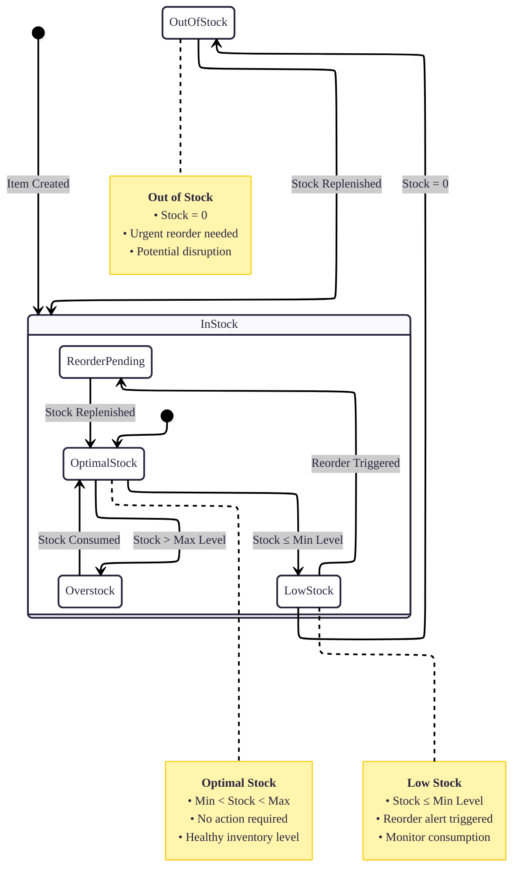
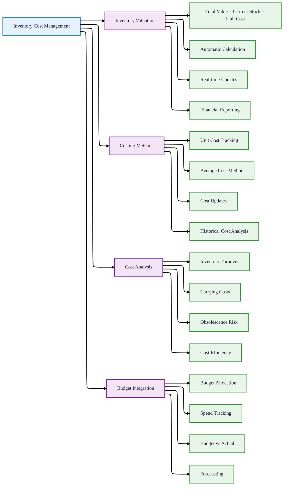
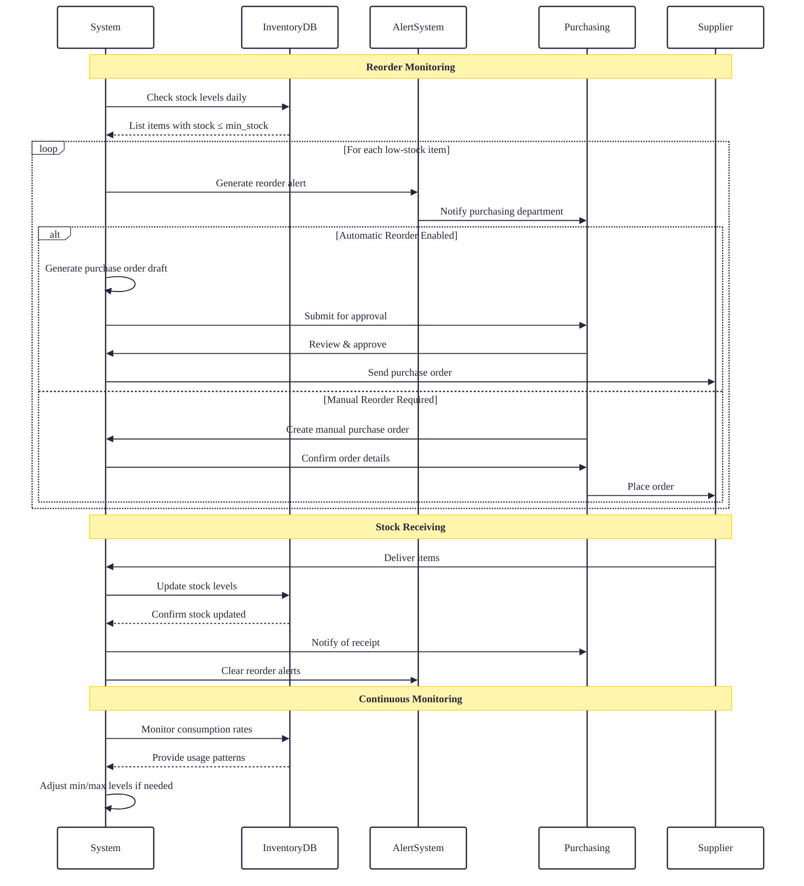
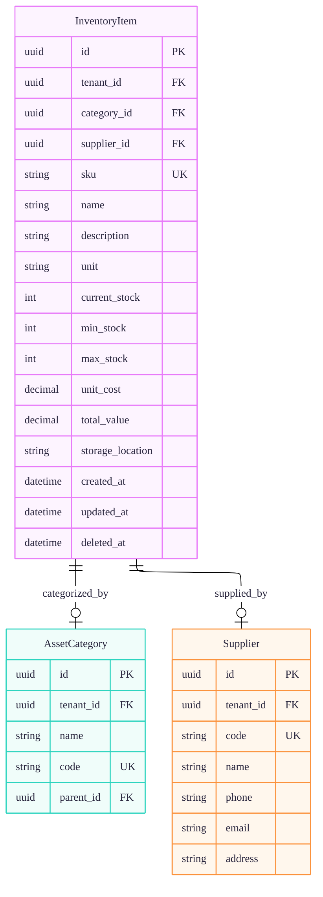

# Inventory Module

## 1. Overview

### Inventory Management System
The Inventory Module manages consumable and stockable items with comprehensive stock tracking, reordering, and cost management capabilities.

```mermaid
---
config:
  layout: elk
  theme: redux
  themeVariables:
    fontFamily: EB Garamond
---
flowchart TB
    InventoryModule["Inventory Module"] --> StockManagement["Stock Management"]
    InventoryModule --> CostControl["Cost Control"]
    InventoryModule --> Reordering["Reordering System"]
    InventoryModule --> Integration["System Integration"]
    
    StockManagement --> SM1["Stock Level Tracking"]
    StockManagement --> SM2["Minimum/Maximum Levels"]
    StockManagement --> SM3["Storage Location"]
    StockManagement --> SM4["Unit of Measure"]
    
    CostControl --> CC1["Unit Cost Tracking"]
    CostControl --> CC2["Total Value Calculation"]
    CostControl --> CC3["Cost Analysis"]
    CostControl --> CC4["Budget Impact"]
    
    Reordering --> R1["Reorder Alerts"]
    Reordering --> R2["Supplier Management"]
    Reordering --> R3["Stock Optimization"]
    
    Integration --> I1["Asset Category System"]
    Integration --> I2["Supplier Module"]
    Integration --> I3["Reporting System"]
    
    classDef main fill:#e3f2fd,stroke:#1976d2
    classDef category fill:#f3e5f5,stroke:#7b1fa2
    classDef feature fill:#e8f5e9,stroke:#388e3c
    
    class InventoryModule main
    class StockManagement,CostControl,Reordering,Integration category
    class SM1,SM2,SM3,SM4,CC1,CC2,CC3,CC4,R1,R2,R3,I1,I2,I3 feature
```



## 2. Inventory Item Entity

### Data Structure

```mermaid
---
config:
  layout: elk
  theme: redux
  themeVariables:
    fontFamily: EB Garamond
---
flowchart TB
    InventoryItem["InventoryItem Entity"] --> Identification["Identification"]
    InventoryItem --> Stock["Stock Information"]
    InventoryItem --> Financial["Financial Information"]
    InventoryItem --> Categorization["Categorization"]
    InventoryItem --> Storage["Storage Details"]
    InventoryItem --> Metadata["System Metadata"]
    
    Identification --> ID1["SKU (Stock Keeping Unit)"]
    Identification --> ID2["Item Name"]
    Identification --> ID3["Description"]
    Identification --> ID4["Unit of Measure"]
    
    Stock --> S1["Current Stock Level"]
    Stock --> S2["Minimum Stock Level"]
    Stock --> S3["Maximum Stock Level"]
    Stock --> S4["Stock Status"]
    
    Financial --> F1["Unit Cost"]
    Financial --> F2["Total Value"]
    Financial --> F3["Automatic Value Calculation"]
    
    Categorization --> C1["Asset Category"]
    Categorization --> C2["Supplier Reference"]
    
    Storage --> ST1["Storage Location"]
    
    Metadata --> M1["Tenant Context"]
    Metadata --> M2["Creation Timestamp"]
    Metadata --> M3["Update Timestamp"]
    Metadata --> M4["Soft Delete Timestamp"]
    
    classDef entity fill:#e3f2fd,stroke:#1976d2
    classDef section fill:#f3e5f5,stroke:#7b1fa2
    classDef field fill:#e8f5e9,stroke:#388e3c
    
    class InventoryItem entity
    class Identification,Stock,Financial,Categorization,Storage,Metadata section
    class ID1,ID2,ID3,ID4,S1,S2,S3,S4,F1,F2,F3,C1,C2,ST1,M1,M2,M3,M4 field
```



### Inventory Item Fields
| Field | Type | Required | Description | Business Purpose |
|-------|------|----------|-------------|------------------|
| **id** | UUID | ✅ | Unique identifier | Database primary key |
| **tenant_id** | UUID | ✅ | Tenant context | Multi-tenancy isolation, cascades on tenant deletion |
| **category_id** | UUID | ❌ | Asset category reference | Inventory categorization |
| **supplier_id** | UUID | ❌ | Supplier reference | Vendor management |
| **sku** | String | ✅ | Stock Keeping Unit | Unique inventory identifier within tenant |
| **name** | String | ✅ | Item name | Human-readable identification |
| **description** | String | ❌ | Item description | Detailed information |
| **unit** | String | ✅ | Unit of measure | Standard measurement unit (default: "piece") |
| **current_stock** | Int | ✅ | Current stock quantity | Real-time stock tracking (default: 0) |
| **min_stock** | Int | ❌ | Minimum stock level | Reorder trigger point |
| **max_stock** | Int | ❌ | Maximum stock level | Storage capacity limit |
| **unit_cost** | Decimal(19,4) | ✅ | Cost per unit | Financial tracking |
| **total_value** | Decimal(19,4) | ✅ | Total inventory value | Auto-calculated (current_stock × unit_cost), stored in DB (default: 0) |
| **storage_location** | String | ❌ | Storage location | Physical location tracking |
| **created_at** | DateTime | ✅ | Creation timestamp | Audit trail |
| **updated_at** | DateTime | ✅ | Update timestamp | Change tracking |
| **deleted_at** | DateTime | ❌ | Soft delete timestamp | Non-destructive deletion |

## 3. Stock Management

### Stock Level Tracking



### Stock Status Indicators
| Stock Level | Condition | Action Required | Priority |
|-------------|-----------|-----------------|----------|
| **Out of Stock** | current_stock = 0 | Immediate reorder | Critical |
| **Very Low** | current_stock ≤ (min_stock × 0.25) | Urgent reorder | High |
| **Low** | current_stock ≤ min_stock | Standard reorder | Medium |
| **Optimal** | min_stock < current_stock < max_stock | Monitor | Low |
| **High** | current_stock ≥ (max_stock × 0.8) | Review consumption | Low |
| **Overstock** | current_stock > max_stock | Reduce ordering | Medium |

## 4. Cost Management

### Inventory Valuation



### Cost Calculation Formula
```
Total Inventory Value = ∑(current_stock × unit_cost) for all inventory items
```

### Financial Fields
| Field | Data Type | Precision | Auto-calculated | Description |
|-------|-----------|-----------|-----------------|-------------|
| **unit_cost** | Decimal | 19,4 | No | Cost per unit of item |
| **total_value** | Decimal | 19,4 | Yes | current_stock × unit_cost (stored in DB, default: 0) |
| **value_per_category** | Calculated | - | Yes | Sum of total_value by category |
| **inventory_turnover** | Calculated | - | Yes | Cost of goods sold / Average inventory |

## 5. Reordering System

### Automated Reorder Management



### Reorder Parameters
| Parameter | Default Value | Calculation | Impact |
|-----------|---------------|-------------|--------|
| **Reorder Point** | min_stock | User-defined | Trigger for reordering |
| **Reorder Quantity** | max_stock - current_stock | Automatic calculation | Order quantity |
| **Safety Stock** | min_stock × 0.5 | Buffer stock | Prevent stockouts |
| **Lead Time Demand** | Average daily usage × Supplier lead time | Historical analysis | Timing consideration |
| **Economic Order Quantity** | √(2 × Demand × Order Cost / Holding Cost) | EOQ formula | Cost optimization |

## 6. Unit of Measure Management

### Standard Units System

```mermaid
---
config:
  layout: elk
  theme: redux
  themeVariables:
    fontFamily: EB Garamond
---
flowchart TB
    UnitSystem["Unit of Measure System"] --> StandardUnits["Standard Units"]
    UnitSystem --> Conversions["Unit Conversions"]
    UnitSystem --> Consistency["Data Consistency"]
    UnitSystem --> Reporting["Reporting Standardization"]
    
    StandardUnits --> U1["Piece (default)"]
    StandardUnits --> U2["Kilogram"]
    StandardUnits --> U3["Liter"]
    StandardUnits --> U4["Meter"]
    StandardUnits --> U5["Box"]
    StandardUnits --> U6["Package"]
    
    Conversions --> C1["Base Unit Definition"]
    Conversions --> C2["Conversion Factors"]
    Conversions --> C3["Automatic Calculations"]
    Conversions --> C4["Multi-unit Support"]
    
    Consistency --> CO1["Uniform Reporting"]
    Consistency --> CO2["Stock Accuracy"]
    Consistency --> CO3["Cost Consistency"]
    Consistency --> CO4["Purchase Alignment"]
    
    Reporting --> R1["Standardized Metrics"]
    Reporting --> R2["Comparative Analysis"]
    Reporting --> R3["Trend Tracking"]
    Reporting --> R4["Benchmarking"]
    
    classDef main fill:#e3f2fd,stroke:#1976d2
    classDef category fill:#f3e5f5,stroke:#7b1fa2
    classDef detail fill:#e8f5e9,stroke:#388e3c
    
    class UnitSystem main
    class StandardUnits,Conversions,Consistency,Reporting category
    class U1,U2,U3,U4,U5,U6,C1,C2,C3,C4,CO1,CO2,CO3,CO4,R1,R2,R3,R4 detail
```



### Common Unit Types
| Unit Type | Description | Typical Use | Conversion Factor |
|-----------|-------------|-------------|-------------------|
| **piece** | Individual items | Electronics, furniture | 1 (base unit) |
| **kilogram** | Weight measurement | Raw materials, chemicals | N/A |
| **liter** | Volume measurement | Liquids, gases | N/A |
| **meter** | Length measurement | Cables, fabrics | N/A |
| **box** | Packaged units | Consumables, spare parts | Variable |
| **package** | Bundled items | Software, kits | Variable |

## 7. Integration Points

### System Integration Architecture



### Integration Workflows
| Integration Point | Data Flow | Purpose | Frequency |
|------------------|-----------|---------|-----------|
| **Asset Category** | Inventory items categorized by AssetCategory | Standardized classification | Real-time |
| **Supplier Management** | Supplier information linked to inventory items | Vendor performance tracking | Real-time |
| **Budget Planning** | Inventory costs impact budget utilization | Financial planning through reporting | Monthly |
| **Reporting Module** | Inventory data feeds into reports | Performance analysis | As needed |

## 8. Storage Location Management

### Location Hierarchy

```mermaid
---
config:
  layout: elk
  theme: redux
  themeVariables:
    fontFamily: EB Garamond
---
flowchart TB
    StorageSystem["Storage Location System"] --> Physical["Physical Storage"]
    StorageSystem --> Logical["Logical Organization"]
    StorageSystem --> Access["Access Control"]
    StorageSystem --> Optimization["Space Optimization"]
    
    Physical --> P1["Building/Warehouse"]
    Physical --> P2["Room/Section"]
    Physical --> P3["Shelf/Rack"]
    Physical --> P4["Bin/Position"]
    
    Logical --> L1["Category-based Storage"]
    Logical --> L2["Usage Frequency"]
    Logical --> L3["Hazard/Safety Zones"]
    Logical --> L4["Temperature Control"]
    
    Access --> A1["Authorized Personnel"]
    Access --> A2["Access Logs"]
    Access --> A3["Restricted Areas"]
    Access --> A4["Security Levels"]
    
    Optimization --> O1["Space Utilization"]
    Optimization --> O2["Picking Efficiency"]
    Optimization --> O3["Inventory Rotation"]
    Optimization --> O4["Expansion Planning"]
    
    classDef main fill:#e3f2fd,stroke:#1976d2
    classDef category fill:#f3e5f5,stroke:#7b1fa2
    classDef detail fill:#e8f5e9,stroke:#388e3c
    
    class StorageSystem main
    class Physical,Logical,Access,Optimization category
    class P1,P2,P3,P4,L1,L2,L3,L4,A1,A2,A3,A4,O1,O2,O3,O4 detail
```



### Storage Best Practices
| Practice | Description | Implementation | Benefits |
|----------|-------------|----------------|----------|
| **ABC Analysis** | Categorize items by value/usage | A: High value, frequent use<br>B: Medium<br>C: Low value, infrequent use | Optimized storage space |
| **FIFO/LIFO** | Stock rotation methods | First-In-First-Out or Last-In-First-Out | Reduced obsolescence |
| **Zone Picking** | Organize by picking frequency | Fast-moving items near entry | Improved efficiency |
| **Safety Stock** | Buffer for demand variability | Extra stock beyond minimum | Reduced stockouts |
| **Cycle Counting** | Regular partial counts | Scheduled counting of sections | Accuracy maintenance |

## 9. Reporting & Analytics

### Inventory Reports

```mermaid
---
config:
  layout: elk
  theme: redux
  themeVariables:
    fontFamily: EB Garamond
---
flowchart TB
    InventoryReports["Inventory Reports"] --> Operational["Operational Reports"]
    InventoryReports --> Financial["Financial Reports"]
    InventoryReports --> Performance["Performance Reports"]
    InventoryReports --> Predictive["Predictive Analytics"]
    
    Operational --> O1["Stock Level Report"]
    Operational --> O2["Reorder List"]
    Operational --> O3["Stock Movement"]
    Operational --> O4["Storage Utilization"]
    
    Financial --> F1["Inventory Valuation"]
    Financial --> F2["Cost Analysis"]
    Financial --> F3["Budget vs Actual"]
    Financial --> F4["Carrying Costs"]
    
    Performance --> P1["Inventory Turnover"]
    Performance --> P2["Stockout Frequency"]
    Performance --> P3["Order Accuracy"]
    Performance --> P4["Supplier Performance"]
    
    Predictive --> PR1["Demand Forecasting"]
    Predictive --> PR2["Seasonal Trends"]
    Predictive --> PR3["Optimal Stock Levels"]
    Predictive --> PR4["Risk Analysis"]
    
    classDef main fill:#e3f2fd,stroke:#1976d2
    classDef category fill:#f3e5f5,stroke:#7b1fa2
    classDef report fill:#e8f5e9,stroke:#388e3c
    
    class InventoryReports main
    class Operational,Financial,Performance,Predictive category
    class O1,O2,O3,O4,F1,F2,F3,F4,P1,P2,P3,P4,PR1,PR2,PR3,PR4 report
```



### Key Inventory Metrics
| Metric | Formula | Target | Reporting Frequency |
|--------|---------|--------|---------------------|
| **Inventory Turnover** | Cost of Goods Sold / Average Inventory | Industry benchmark | Quarterly |
| **Days Inventory Outstanding** | 365 / Inventory Turnover | Lower is better | Monthly |
| **Stockout Rate** | Stockout Occurrences / Total Time Period | <2% | Monthly |
| **Inventory Accuracy** | (Physical Count / System Count) × 100 | >98% | Quarterly |
| **Carrying Cost %** | Total Carrying Costs / Total Inventory Value | 20-30% | Annually |
| **Order Fill Rate** | Orders Filled Completely / Total Orders | >95% | Weekly |
| **Excess Stock %** | Excess Inventory Value / Total Inventory Value | <10% | Monthly |

## 10. Best Practices & Configuration

### Inventory Management Guidelines

#### Stock Level Optimization
| Item Type | Min Stock Strategy | Max Stock Strategy | Reorder Frequency |
|-----------|-------------------|-------------------|-------------------|
| **Fast-moving** | 2 weeks supply | 4 weeks supply | Weekly |
| **Slow-moving** | 1 month supply | 3 months supply | Monthly |
| **Critical** | 1 month supply | 2 months supply | Continuous review |
| **Seasonal** | Variable based on season | Peak season capacity | Seasonal planning |
| **Perishable** | Just-in-time | Minimal storage | Frequent small orders |

### Configuration Parameters
| Parameter | Default Value | Configurable Range | Impact |
|-----------|---------------|-------------------|--------|
| **Low Stock Alert Threshold** | At min_stock | 0-200% of min_stock | Reorder timing |
| **Overstock Alert Threshold** | At max_stock | 80-120% of max_stock | Storage management |
| **Auto-reorder Percentage** | 100% of min_stock | 50-200% | Order quantity |
| **Stock Count Frequency** | Quarterly | Monthly to Annually | Accuracy control |
| **Value Update Frequency** | Real-time | Real-time to Monthly | Financial reporting |

### Implementation Checklist
- [ ] Define inventory categorization structure
- [ ] Set up supplier database
- [ ] Configure unit of measure system
- [ ] Establish min/max stock levels
- [ ] Set up reorder alert system
- [ ] Configure storage location system
- [ ] Define reporting requirements
- [ ] Train inventory staff
- [ ] Set up cycle counting procedures
- [ ] Establish audit procedures

*The Inventory Module provides comprehensive control over stockable items with real-time tracking, automated reordering, and detailed cost management, integrated with the complete asset management ecosystem.*