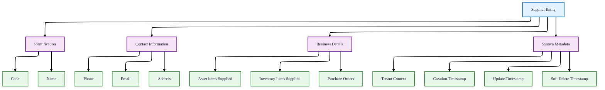
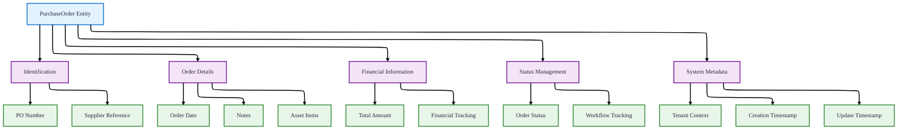
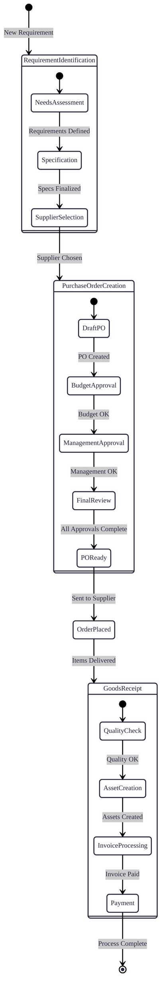
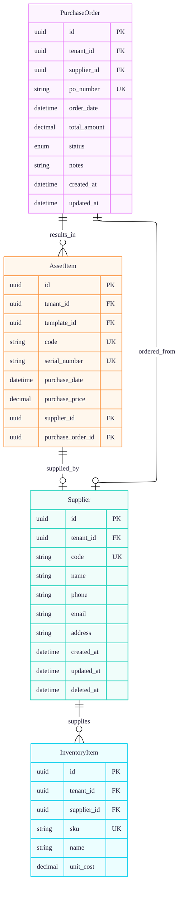
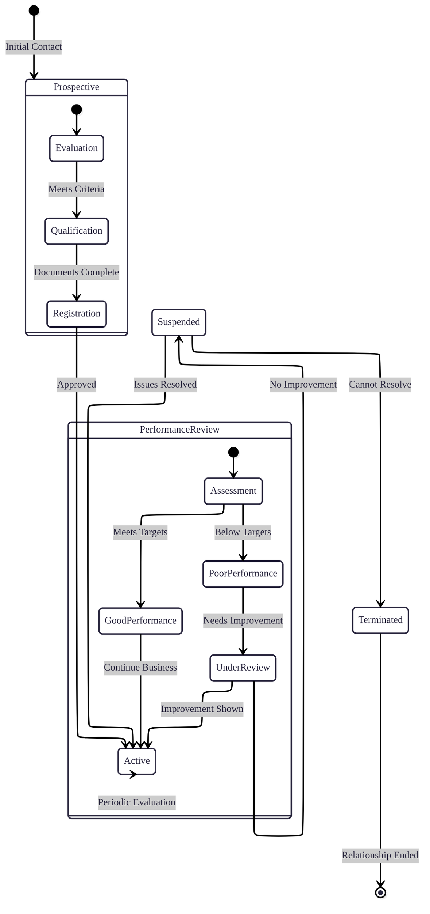

# Procurement Module

## 1. Overview

### Procurement Management System
The Procurement Module manages the purchasing lifecycle for assets, including supplier management, purchase order creation, and order tracking. Note: This module handles asset purchases, while inventory items are managed separately in the Inventory Module.

```mermaid
---
config:
  layout: elk
  theme: redux-color
  themeVariables:
    fontFamily: EB Garamond
---
flowchart TB
    ProcurementModule["Procurement Module"] --> SupplierManagement["Supplier Management"]
    ProcurementModule --> PurchaseOrderSystem["Purchase Order System"]
    ProcurementModule --> ApprovalWorkflow["Approval Workflow"]
    ProcurementModule --> Integration["System Integration"]
    
    SupplierManagement --> SM1["Supplier Database"]
    SupplierManagement --> SM2["Supplier Performance"]
    SupplierManagement --> SM3["Contact Management"]
    SupplierManagement --> SM4["Supplier Evaluation"]
    
    PurchaseOrderSystem --> PO1["PO Creation"]
    PurchaseOrderSystem --> PO2["Status Tracking"]
    PurchaseOrderSystem --> PO3["Order History"]
    PurchaseOrderSystem --> PO4["Delivery Tracking"]
    
    ApprovalWorkflow --> AW1["Multi-level Approval"]
    ApprovalWorkflow --> AW2["Budget Check"]
    ApprovalWorkflow --> AW3["Audit Trail"]
    ApprovalWorkflow --> AW4["Notification System"]
    
    Integration --> I1["Asset Management"]
    Integration --> I2["Inventory Module"]
    Integration --> I3["Budget Planning"]
    Integration --> I4["Financial Reporting"]
    
    classDef main fill:#e3f2fd,stroke:#1976d2
    classDef category fill:#f3e5f5,stroke:#7b1fa2
    classDef feature fill:#e8f5e9,stroke:#388e3c
    
    class ProcurementModule main
    class SupplierManagement,PurchaseOrderSystem,ApprovalWorkflow,Integration category
    class SM1,SM2,SM3,SM4,PO1,PO2,PO3,PO4,AW1,AW2,AW3,AW4,I1,I2,I3,I4 feature
```

## 2. Supplier Entity

### Data Structure

### Supplier Fields
| Field | Type | Required | Description | Business Purpose |
|-------|------|----------|-------------|------------------|
| **id** | UUID | ✅ | Unique identifier | Database primary key |
| **tenant_id** | UUID | ✅ | Tenant context | Multi-tenancy isolation, cascades on tenant deletion |
| **code** | String | ✅ | Supplier code | Unique identifier within tenant (@@unique([tenantId, code])) |
| **name** | String | ✅ | Supplier name | Business name |
| **phone** | String | ❌ | Contact phone | Communication channel |
| **email** | String | ❌ | Contact email | Electronic communication |
| **address** | String | ❌ | Physical address | Location information |
| **created_at** | DateTime | ✅ | Creation timestamp | Audit trail |
| **updated_at** | DateTime | ✅ | Update timestamp | Change tracking |
| **deleted_at** | DateTime | ❌ | Soft delete timestamp | Non-destructive deletion |

### Supplier Relationships
| Relationship | Type | Model | Cascade Rule | Description |
|--------------|------|-------|--------------|-------------|
| **tenant** | Many-to-One | Tenant | Cascade | Supplier belongs to a tenant |
| **assetItems** | One-to-Many | AssetItem | None | Assets supplied by this supplier |
| **inventoryItems** | One-to-Many | InventoryItem | None | Inventory items supplied by this supplier |
| **purchaseOrders** | One-to-Many | PurchaseOrder | None | Purchase orders with this supplier |

## 3. Purchase Order Entity

### Data Structure

### Purchase Order Fields
| Field | Type | Required | Description | Business Purpose |
|-------|------|----------|-------------|------------------|
| **id** | UUID | ✅ | Unique identifier | Database primary key |
| **tenant_id** | UUID | ✅ | Tenant context | Multi-tenancy isolation, cascades on tenant deletion |
| **supplier_id** | UUID | ✅ | Supplier reference | Vendor identification |
| **po_number** | String | ✅ | Purchase Order Number | Unique identifier within tenant (@@unique([tenantId, poNumber])) |
| **order_date** | DateTime | ✅ | Order date | When the order was placed |
| **total_amount** | Decimal(19,4) | ✅ | Total order amount | Financial tracking |
| **status** | PurchaseOrderStatus | ✅ | Order status | Workflow tracking (DRAFT, APPROVED, ORDERED, RECEIVED, CANCELLED) |
| **notes** | String | ❌ | Additional notes | Order details/comments |
| **created_at** | DateTime | ✅ | Creation timestamp | Audit trail |
| **updated_at** | DateTime | ✅ | Update timestamp | Change tracking |

**Note:** PurchaseOrder does NOT have `deleted_at` field - purchase orders are kept as historical records.

### Purchase Order Status Enum (from schema.prisma)
| Status | Default | Description | Allowed Next Status | Business Rules |
|--------|---------|-------------|---------------------|----------------|
| **DRAFT** | ✅ | Initial creation | APPROVED, CANCELLED | Editable, not yet submitted |
| **APPROVED** | - | Approved for ordering | ORDERED, CANCELLED | Budget checked, ready to send |
| **ORDERED** | - | Sent to supplier | RECEIVED, CANCELLED | Order placed with supplier |
| **RECEIVED** | - | Items received | - | Order completed, assets created |
| **CANCELLED** | - | Order cancelled | - | No further actions allowed |

### Purchase Order Relationships
| Relationship | Type | Model | Cascade Rule | Description |
|--------------|------|-------|--------------|-------------|
| **tenant** | Many-to-One | Tenant | Cascade | Purchase order belongs to a tenant |
| **supplier** | Many-to-One | Supplier | None | Order placed with this supplier |
| **assetItems** | One-to-Many | AssetItem | None | Assets purchased through this order |

## 4. Procurement Workflow

### End-to-End Procurement Process

### Workflow Steps

| Step | Responsible Role | Actions | System Status |
|------|-----------------|---------|---------------|
| **1. Requirement Identification** | Department User | Identify need, specify requirements | - |
| **2. Supplier Selection** | Procurement Officer | Research suppliers, get quotes | - |
| **3. PO Creation** | Requester | Create purchase order in system | **DRAFT** |
| **4. Budget Approval** | Department Head | Verify budget availability | **APPROVED** |
| **5. Management Approval** | Senior Management | Final approval for large purchases | **APPROVED** |
| **6. Order Placement** | Procurement Officer | Send PO to supplier | **ORDERED** |
| **7. Goods Receipt** | Store/Warehouse | Receive and inspect items | **RECEIVED** |
| **8. Asset Creation** | System/Admin | Create asset records from PO | - |
| **9. Invoice Processing** | Finance | Process supplier invoice | - |
| **10. Payment** | Finance | Make payment to supplier | - |

## 5. Integration Points

### System Integration Architecture

### Integration Workflows

| Integration Point | Data Flow | Purpose | Trigger |
|------------------|-----------|---------|---------|
| **Asset Creation** | PurchaseOrder → AssetItem | Create asset records from purchase orders | When PO status changes to RECEIVED |
| **Supplier Reference** | Supplier → AssetItem/InventoryItem | Track supplier for all purchased items | When creating assets/inventory |
| **Budget Validation** | PurchaseOrder → BudgetPlan | Check budget availability before approval | During PO approval workflow |
| **Financial Reporting** | PurchaseOrder → Reporting | Include procurement data in financial reports | Monthly/quarterly reporting |
| **Audit Trail** | PurchaseOrder → AuditLog | Track all procurement activities | All procurement transactions |

## 6. Supplier Management

### Supplier Evaluation Criteria

| Criteria | Weight | Measurement Method | Target |
|----------|--------|-------------------|--------|
| **Quality** | 30% | Defect rate, returns | <2% defect rate |
| **Delivery** | 25% | On-time delivery rate | >95% on-time |
| **Price** | 20% | Competitive pricing | Within 5% of market average |
| **Service** | 15% | Response time, support | <24hr response time |
| **Compliance** | 10% | Documentation, certifications | 100% compliant |

### Supplier Lifecycle Management

## 7. Reporting & Analytics

### Procurement Reports

```mermaid
---
config:
  layout: elk
  theme: redux-color
  themeVariables:
    fontFamily: EB Garamond
---
flowchart TB
    ProcurementReports["Procurement Reports"] --> Operational["Operational Reports"]
    ProcurementReports --> Financial["Financial Reports"]
    ProcurementReports --> Performance["Performance Reports"]
    ProcurementReports --> Compliance["Compliance Reports"]
    
    Operational --> O1["Open Purchase Orders"]
    Operational --> O2["Order Status Tracking"]
    Operational --> O3["Delivery Schedule"]
    Operational --> O4["Pending Approvals"]
    
    Financial --> F1["Spend by Supplier"]
    Financial --> F2["Spend by Department"]
    Financial --> F3["Budget vs Actual"]
    Financial --> F4["Payment Tracking"]
    
    Performance --> P1["Supplier Performance"]
    Performance --> P2["Lead Time Analysis"]
    Performance --> P3["Procurement Cycle Time"]
    Performance --> P4["Cost Savings"]
    
    Compliance --> C1["Approval Compliance"]
    Compliance --> C2["Documentation Status"]
    Compliance --> C3["Policy Adherence"]
    Compliance --> C4["Audit Trail"]
    
    classDef main fill:#e3f2fd,stroke:#1976d2
    classDef category fill:#f3e5f5,stroke:#7b1fa2
    classDef report fill:#e8f5e9,stroke:#388e3c
    
    class ProcurementReports main
    class Operational,Financial,Performance,Compliance category
    class O1,O2,O3,O4,F1,F2,F3,F4,P1,P2,P3,P4,C1,C2,C3,C4 report
```

### Key Procurement Metrics

| Metric | Formula | Target | Reporting Frequency |
|--------|---------|--------|---------------------|
| **Procurement Cycle Time** | Average days from need to receipt | <30 days | Monthly |
| **Purchase Order Accuracy** | (Accurate POs / Total POs) × 100 | >98% | Monthly |
| **Supplier On-time Delivery** | (On-time deliveries / Total deliveries) × 100 | >95% | Quarterly |
| **Cost Savings** | (Budget - Actual) / Budget × 100 | 5-10% | Quarterly |
| **Purchase Order Value** | ∑ Total amount of POs | Department budget | Monthly |
| **Approval Compliance** | (Compliant POs / Total POs) × 100 | 100% | Monthly |
| **Supplier Defect Rate** | (Defective items / Total items) × 100 | <2% | Quarterly |

## 8. Key Integration Points

### Asset Creation Workflow
When a Purchase Order status changes to **RECEIVED**:
1. System creates AssetItem records for each asset purchased
2. Links AssetItem to PurchaseOrder via `purchase_order_id` field
3. Links AssetItem to Supplier via `supplier_id` field
4. Updates purchase details (purchase_date, purchase_price) on AssetItem

### Budget Integration
Purchase Orders should validate against BudgetPlan:
- Check `allocated_amount` vs `spent_amount` for the department
- Update `spent_amount` when PO is APPROVED or RECEIVED
- Budget validation occurs during approval workflow

### Cascade Delete Rules
1. **Tenant Deletion**: All Suppliers and PurchaseOrders are deleted (Cascade)
2. **Supplier Deletion**: PurchaseOrders remain (no cascade), but supplier reference becomes null
3. **PurchaseOrder Deletion**: AssetItems remain (no cascade), but purchase_order reference becomes null

## 9. Data Flow Example

### Purchasing an Asset
1. **Create PurchaseOrder** (Status: DRAFT)
2. **Add Supplier reference** to PurchaseOrder
3. **Approve PurchaseOrder** (Status: APPROVED) with budget check
4. **Place order** (Status: ORDERED)
5. **Receive items** (Status: RECEIVED)
6. **System automatically** creates AssetItem with:
   - `purchase_order_id` = reference to PO
   - `supplier_id` = reference to Supplier
   - `purchase_date` = from PO or receipt date
   - `purchase_price` = from PO line items

## 10. Best Practices & Configuration

### Procurement Policies

| Policy Area | Guideline | Implementation | Exception Process |
|-------------|-----------|----------------|-------------------|
| **Approval Thresholds** | POs > $1,000 require management approval | Automated workflow routing | Emergency procurement process |
| **Supplier Qualification** | Minimum 2 years in business | Supplier evaluation checklist | Single-source justification required |
| **Competitive Bidding** | 3 quotes for purchases > $5,000 | Quote collection workflow | Sole supplier documentation |
| **Budget Compliance** | PO must have budget allocation | System validation before approval | Budget transfer approval required |
| **Documentation** | Complete PO documentation | Required fields validation | Provisional approval with follow-up |

### Configuration Parameters

| Parameter | Default Value | Configurable Range | Impact |
|-----------|---------------|-------------------|--------|
| **Approval Thresholds** | $1,000, $5,000, $10,000 | $100 - $100,000 | Workflow routing |
| **PO Number Format** | PO-YYYY-XXXXX | Customizable prefix/sequence | Identification system |
| **Default PO Status** | DRAFT | DRAFT, APPROVED | Workflow starting point |
| **Auto-close Period** | 90 days after RECEIVED | 30-180 days | PO lifecycle management |
| **Supplier Evaluation Frequency** | Quarterly | Monthly to Annually | Performance management |

### Implementation Checklist

- [ ] Define procurement approval matrix
- [ ] Set up supplier evaluation criteria
- [ ] Configure PO numbering system
- [ ] Establish budget validation rules
- [ ] Set up approval workflows
- [ ] Define supplier qualification process
- [ ] Configure reporting requirements
- [ ] Train procurement staff
- [ ] Establish audit procedures
- [ ] Set up integration with asset creation

### Best Practices

#### Purchase Order Management
1. **Numbering**: Use sequential PO numbers per tenant (PO-2024-0001, etc.)
2. **Status Flow**: Follow DRAFT → APPROVED → ORDERED → RECEIVED sequence
3. **Budget Check**: Validate against department budget before approval
4. **Supplier Validation**: Ensure supplier is active (deleted_at IS NULL)

#### Supplier Management
1. **Unique Codes**: Maintain unique supplier codes within tenant
2. **Soft Delete**: Use deleted_at for supplier deactivation, not hard delete
3. **Reference Integrity**: Check for existing PurchaseOrders before deleting supplier

#### Integration Notes
1. **Inventory Items**: Managed separately via InventoryModule, not through PurchaseOrder
2. **Asset Tracking**: All assets from PurchaseOrders are tracked via AssetItem
3. **Financial Reporting**: PurchaseOrder amounts feed into budget and financial reports

*The Procurement Module focuses on asset purchasing through formal purchase orders, with supplier management and integration with asset creation workflows. Inventory purchases are handled separately through the Inventory Module.*