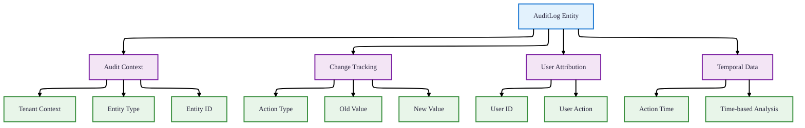
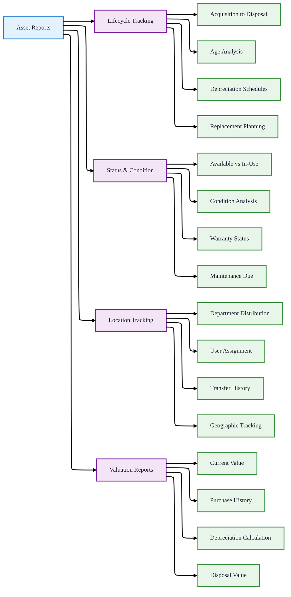
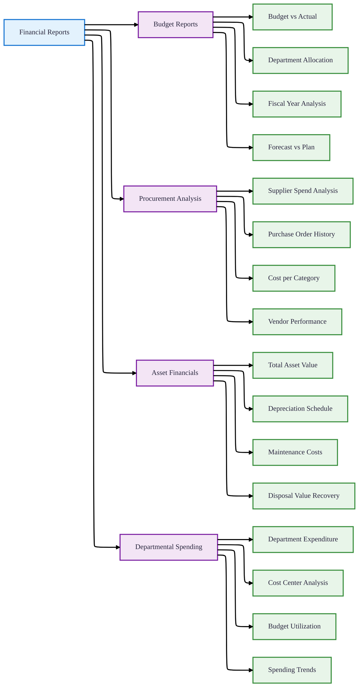
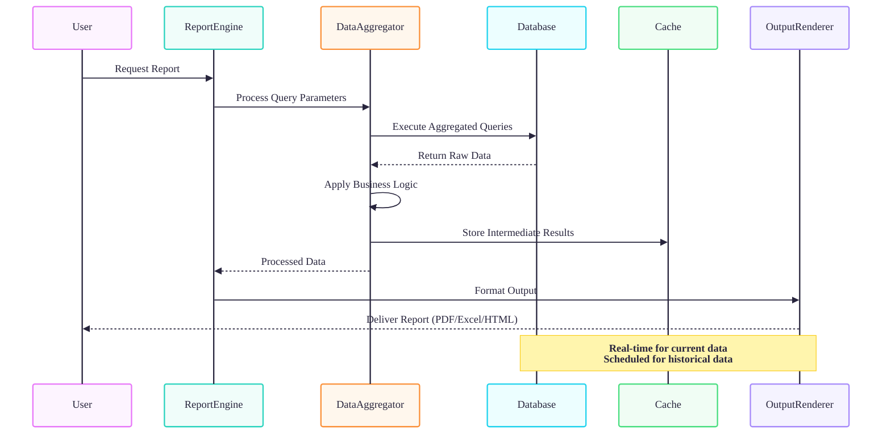
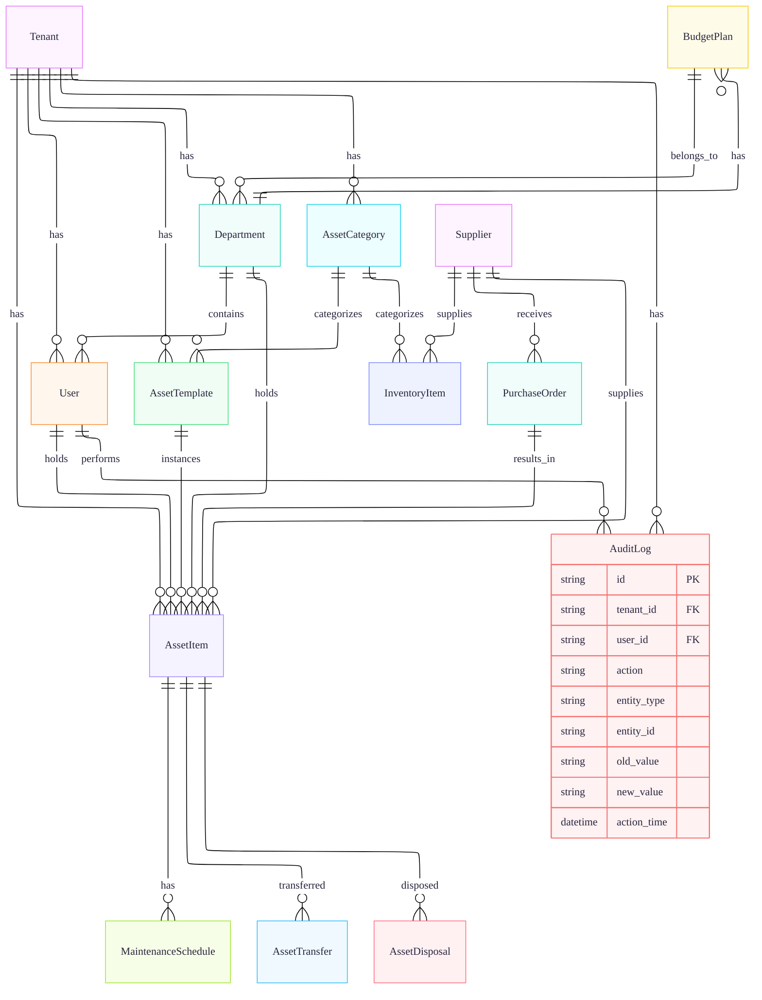

# Reporting Module

## 1. Overview

### Reporting & Analytics System
The Reporting Module provides comprehensive analytics, dashboards, and reporting capabilities across all system modules. It enables data-driven decision making with real-time metrics, historical trends, and customizable reports.

```mermaid
---
config:
  layout: elk
  theme: redux-color
  themeVariables:
    fontFamily: EB Garamond
---
flowchart TB
    ReportingModule["Reporting Module"] --> OperationalReports["Operational Reports"]
    ReportingModule --> FinancialReports["Financial Reports"]
    ReportingModule --> ComplianceReports["Compliance Reports"]
    ReportingModule --> Analytics["Advanced Analytics"]
    
    OperationalReports --> OR1["Asset Status & Location"]
    OperationalReports --> OR2["Maintenance History"]
    OperationalReports --> OR3["Inventory Levels"]
    OperationalReports --> OR4["Procurement Status"]
    
    FinancialReports --> FR1["Asset Valuation"]
    FinancialReports --> FR2["Budget Utilization"]
    FinancialReports --> FR3["Depreciation Analysis"]
    FinancialReports --> FR4["Cost Tracking"]
    
    ComplianceReports --> CR1["Audit Trails"]
    ComplianceReports --> CR2["Regulatory Compliance"]
    ComplianceReports --> CR3["Policy Adherence"]
    ComplianceReports --> CR4["Documentation Status"]
    
    Analytics --> A1["Predictive Maintenance"]
    Analytics --> A2["Usage Patterns"]
    Analytics --> A3["Cost Optimization"]
    Analytics --> A4["Risk Assessment"]
    
    classDef main fill:#e3f2fd,stroke:#1976d2
    classDef category fill:#f3e5f5,stroke:#7b1fa2
    classDef feature fill:#e8f5e9,stroke:#388e3c
    
    class ReportingModule main
    class OperationalReports,FinancialReports,ComplianceReports,Analytics category
    class OR1,OR2,OR3,OR4,FR1,FR2,FR3,FR4,CR1,CR2,CR3,CR4,A1,A2,A3,A4 feature
```

## 2. Core Reporting Entities

### Audit Log Entity (Primary Reporting Source)

### Audit Log Fields
| Field | Schema Type | Required | Description | Reporting Purpose |
|-------|------------|----------|-------------|-------------------|
| **id** | String @id @default(uuid()) | ✅ | Unique identifier | Primary key for audit records |
| **tenant_id** | String | ✅ | Tenant context | Multi-tenancy isolation |
| **user_id** | String | ✅ | User reference | Track who performed actions |
| **action** | String | ✅ | Action type | What was done (CREATE, UPDATE, DELETE, etc.) |
| **entity_type** | String | ✅ | Entity type | Which entity was affected (AssetItem, PurchaseOrder, etc.) |
| **entity_id** | String | ✅ | Entity ID | Specific record identifier |
| **old_value** | String? | ❌ | Previous value | Before change (JSON format) |
| **new_value** | String? | ❌ | New value | After change (JSON format) |
| **action_time** | DateTime @default(now()) | ✅ | Action timestamp | When the action occurred |

### Audit Log Relationships
| Relationship | Type | Model | Description |
|--------------|------|-------|-------------|
| **tenant** | Many-to-One | Tenant | Audit log belongs to a tenant |
| **user** | Many-to-One | User | Action performed by this user |

### Additional Reporting Entities from Schema

#### Tenant Entity
| Field | Schema Type | Description | Reporting Use |
|-------|------------|-------------|---------------|
| name | String | Tenant name | Multi-tenant reporting |
| status | TenantStatus | Active/Inactive status | Tenant health monitoring |
| code | String? @unique | Tenant code | Cross-tenant analytics |

#### Department Entity
| Field | Schema Type | Description | Reporting Use |
|-------|------------|-------------|---------------|
| name | String | Department name | Cost center analysis |
| parentId | String? | Parent department | Organizational hierarchy reporting |
| tenantId | String | Tenant reference | Tenant filtering |

#### User Entity
| Field | Schema Type | Description | Reporting Use |
|-------|------------|-------------|---------------|
| username | String | Username | User activity tracking |
| email | String @unique | Email address | User identification |
| departmentId | String? | Department assignment | Department-level reporting |
| status | UserStatus | Active/Inactive | User management reporting |

#### AssetCategory Entity
| Field | Schema Type | Description | Reporting Use |
|-------|------------|-------------|---------------|
| code | String | Category code | Asset classification reporting |
| name | String | Category name | Standardized categorization |
| parentId | String? | Parent category | Hierarchical analysis |

#### AssetTemplate Entity
| Field | Schema Type | Description | Reporting Use |
|-------|------------|-------------|---------------|
| code | String | Template code | Standardization reports |
| name | String | Template name | Model-based analysis |
| trackQuantity | Boolean | Inventory tracking flag | Stock management |
| requireSerial | Boolean | Serial number requirement | Compliance reports |
| defaultPurchasePrice | Decimal? | Default price | Cost analysis |

#### Supplier Entity
| Field | Schema Type | Description | Reporting Use |
|-------|------------|-------------|---------------|
| code | String | Supplier code | Vendor performance |
| name | String | Supplier name | Spend analysis |
| phone | String? | Contact phone | Supplier communication |

### Soft Delete Tracking
All major entities include `deletedAt` DateTime? field for soft delete tracking:
- **deletedAt** field present on: Tenant, Department, User, AssetCategory, AssetTemplate, AssetItem, InventoryItem, Supplier
- **Reporting Use**: Track deleted records for compliance, historical analysis, and recovery audit trails
- **Implementation**: All queries filter out deleted records unless specifically requested for audit purposes

## 3. Report Categories

### Asset Management Reports

### Asset Template & Category Reports
| Report | Data Source | Key Metrics | Business Value |
|--------|-------------|-------------|----------------|
| **Template Utilization** | AssetTemplate + AssetItem | Items per template, Purchase frequency | Standardization effectiveness |
| **Category Distribution** | AssetCategory + AssetItem | Assets per category, Value by category | Portfolio analysis |
| **Model Specifications** | AssetTemplate | Models by manufacturer, Technical specs | Technical planning |
| **Stock Level Monitoring** | AssetTemplate.trackQuantity | Current vs min/max stock | Inventory optimization |

### Inventory Management Reports

```mermaid
---
config:
  layout: elk
  theme: redux-color
  themeVariables:
    fontFamily: EB Garamond
---
flowchart TB
    InventoryReports["Inventory Reports"] --> Stock["Stock Analysis"]
    InventoryReports --> Cost["Cost Analysis"]
    InventoryReports --> Movement["Movement Tracking"]
    InventoryReports --> Optimization["Optimization Reports"]
    
    Stock --> ST1["Current Stock Levels"]
    Stock --> ST2["Minimum/Maximum Analysis"]
    Stock --> ST3["Stockout History"]
    Stock --> ST4["Excess Inventory"]
    
    Cost --> CO1["Inventory Valuation"]
    Cost --> CO2["Carrying Costs"]
    Cost --> CO3["Reorder Cost Analysis"]
    Cost --> CO4["Obsolescence Risk"]
    
    Movement --> MV1["Issue/Receipt History"]
    Movement --> MV2["Consumption Patterns"]
    Movement --> MV3["Turnover Rates"]
    Movement --> MV4["Seasonal Trends"]
    
    Optimization --> OP1["ABC Analysis"]
    Optimization --> OP2["Economic Order Quantity"]
    Optimization --> OP3["Safety Stock Levels"]
    Optimization --> OP4["Storage Optimization"]
    
    classDef main fill:#e3f2fd,stroke:#1976d2
    classDef category fill:#f3e5f5,stroke:#7b1fa2
    classDef report fill:#e8f5e9,stroke:#388e3c
    
    class InventoryReports main
    class Stock,Cost,Movement,Optimization category
    class ST1,ST2,ST3,ST4,CO1,CO2,CO3,CO4,MV1,MV2,MV3,MV4,OP1,OP2,OP3,OP4 report
```

### Financial Reports

### Department & Organizational Reports
| Report | Data Source | Key Metrics | Business Value |
|--------|-------------|-------------|----------------|
| **Department Asset Summary** | Department + AssetItem | Assets per department, Value distribution | Resource allocation |
| **User Assignment Report** | User + AssetItem | Assets per user, Assignment history | Responsibility tracking |
| **Organizational Hierarchy** | Department.parentId | Reporting structure, Depth analysis | Organizational planning |
| **Tenant Activity Summary** | Tenant + AuditLog | Activity per tenant, Growth metrics | Multi-tenant management |

## 4. Key Metrics & KPIs

### Asset Management Metrics

| Metric | Formula | Target | Frequency | Data Source |
|--------|---------|--------|-----------|-------------|
| **Asset Utilization Rate** | (Assets in Use / Total Assets) × 100 | >85% | Monthly | AssetItem.status |
| **Mean Time Between Failures** | ∑(Operational Time) / Number of Failures | Industry specific | Quarterly | MaintenanceSchedule |
| **Asset Downtime** | ∑(Downtime Hours) / Total Assets | <5% | Monthly | AssetItem.status + MaintenanceSchedule |
| **Maintenance Cost per Asset** | Total Maintenance Cost / Number of Assets | Decreasing trend | Quarterly | MaintenanceSchedule.actual_cost |
| **Disposal Recovery Rate** | (Disposal Value / Original Value) × 100 | >20% | Annually | AssetDisposal.disposal_value |
| **Template Standardization Rate** | (Assets with Template / Total Assets) × 100 | >90% | Quarterly | AssetItem.templateId |
| **Category Coverage** | (Categories with Assets / Total Categories) × 100 | >70% | Semi-annually | AssetCategory + AssetItem |

### Inventory Management Metrics

| Metric | Formula | Target | Frequency | Data Source |
|--------|---------|--------|-----------|-------------|
| **Inventory Turnover** | Cost of Goods Sold / Average Inventory | 4-6 times/year | Quarterly | InventoryItem |
| **Days Inventory Outstanding** | 365 / Inventory Turnover | 60-90 days | Monthly | InventoryItem |
| **Stockout Rate** | (Stockout Events / Total Period) × 100 | <2% | Monthly | InventoryItem.current_stock |
| **Inventory Accuracy** | (Physical Count / System Count) × 100 | >98% | Quarterly | Cycle counting |
| **Carrying Cost Percentage** | (Carrying Costs / Total Inventory Value) × 100 | 20-30% | Annually | InventoryItem.total_value |

### Financial Metrics

| Metric | Formula | Target | Frequency | Data Source |
|--------|---------|--------|-----------|-------------|
| **Budget Utilization** | (Actual Spend / Budget) × 100 | 95-105% | Monthly | BudgetPlan |
| **Cost per Department** | Department Spend / Number of Assets | Benchmarking | Quarterly | Department + AssetItem |
| **Asset ROI** | (Asset Value - Cost) / Cost × 100 | Positive | Annually | AssetItem + MaintenanceSchedule |
| **Procurement Cycle Time** | Average days from need to receipt | <30 days | Monthly | PurchaseOrder |
| **Maintenance Cost Ratio** | Maintenance Cost / Asset Value × 100 | 2-5% | Quarterly | MaintenanceSchedule + AssetItem |
| **Supplier Performance Index** | (On-time deliveries / Total orders) × 100 | >95% | Quarterly | Supplier + PurchaseOrder |
| **Department Budget Adherence** | (Actual / Budget) × 100 per department | 90-110% | Monthly | Department + BudgetPlan |

## 5. Report Generation Process

### Data Flow Architecture

### Report Types & Frequencies

| Report Type | Generation Frequency | Retention Period | Primary Audience |
|-------------|---------------------|------------------|------------------|
| **Daily Dashboard** | Real-time | 30 days | Operations Managers |
| **Weekly Status** | Weekly | 90 days | Department Heads |
| **Monthly Financial** | Monthly | 3 years | Finance Department |
| **Quarterly Analysis** | Quarterly | 5 years | Senior Management |
| **Annual Compliance** | Annually | 7 years | Regulatory/Compliance |
| **Ad-hoc Reports** | On-demand | Based on need | All authorized users |

## 6. Audit & Compliance Reporting

### Audit Trail Reports

| Report | Purpose | Key Fields | Compliance Standard |
|--------|---------|------------|---------------------|
| **User Activity Log** | Track all user actions | user_id, action, entity_type, action_time | SOX, GDPR |
| **Data Change History** | Record all data modifications | old_value, new_value, entity_id | ISO 27001 |
| **Access Audit Report** | Monitor system access | user_id, action_time, action | HIPAA, PCI-DSS |
| **Approval Workflow Audit** | Track approval processes | entity_type, entity_id, old_value, new_value | Internal Controls |
| **System Configuration Changes** | Record configuration changes | entity_type="SystemConfig", old_value, new_value | IT Governance |
| **Soft Delete Audit** | Track deleted records | deletedAt, entity_type, entity_id | Data retention policies |

### Compliance Metrics

| Compliance Area | Metric | Target | Reporting Requirement |
|-----------------|--------|--------|----------------------|
| **Data Integrity** | Audit Trail Completeness | 100% | Quarterly |
| **Access Control** | Unauthorized Access Attempts | 0 | Monthly |
| **Financial Controls** | Segregation of Duties Violations | 0 | Quarterly |
| **Asset Management** | Asset Reconciliation Variance | <1% | Monthly |
| **Inventory Control** | Physical vs System Count Variance | <2% | Quarterly |
| **Data Retention** | Deleted Record Audit Coverage | 100% | Annually |

## 7. Integration Points

### Data Source Integration

### Cross-Module Reporting

| Report | Data Sources | Integration Points | Output Format |
|--------|--------------|-------------------|---------------|
| **Asset Lifecycle Report** | AssetItem, PurchaseOrder, MaintenanceSchedule, AssetDisposal | Template → Item → Maintenance → Disposal | PDF, Excel |
| **Total Cost of Ownership** | AssetItem.purchase_price, MaintenanceSchedule.actual_cost, AssetDisposal.disposal_value | Financial tracking across lifecycle | Dashboard, PDF |
| **Supplier Performance** | Supplier, PurchaseOrder, AssetItem, InventoryItem | Procurement + Asset quality tracking | Scorecard, PDF |
| **Department Budget Utilization** | BudgetPlan, AssetItem, PurchaseOrder, MaintenanceSchedule | Financial planning vs actual spend | Dashboard, Excel |
| **Maintenance Effectiveness** | MaintenanceSchedule, AssetItem.condition | Preventive vs corrective analysis | Chart, PDF |
| **Organizational Asset Distribution** | Department, User, AssetItem | Hierarchy + Assignment tracking | Organizational chart, PDF |
| **Template Standardization Report** | AssetTemplate, AssetItem, AssetCategory | Standardization across categories | Dashboard, Excel |

## 8. Report Configuration & Scheduling

### Configuration Parameters

| Parameter | Default Value | Options | Impact |
|-----------|---------------|---------|--------|
| **Data Refresh Rate** | Real-time | Real-time, Hourly, Daily | Report accuracy vs performance |
| **Report Retention** | 3 years | 1-7 years | Storage requirements |
| **Auto-generation Schedule** | End of month | Daily, Weekly, Monthly, Quarterly | Timeliness of reports |
| **Data Aggregation Level** | Department | Tenant, Department, User, Category | Report granularity |
| **Export Formats** | PDF, Excel | PDF, Excel, CSV, HTML | User accessibility |
| **Include Deleted Records** | No | Yes/No | Historical completeness |

### Scheduling Framework

| Report Schedule | Time of Generation | Recipients | Delivery Method |
|-----------------|-------------------|------------|-----------------|
| **Daily Operations** | 8:00 AM daily | Operations Managers | Email, Dashboard |
| **Weekly Status** | Monday 9:00 AM | Department Heads | Email, Portal |
| **Monthly Financial** | 1st business day | Finance Team | Email, Secure Portal |
| **Quarterly Review** | 10 days after quarter-end | Senior Management | Presentation, PDF |
| **Annual Compliance** | January 31st | Compliance Officers | Secure Archive |
| **Template & Category Review** | Quarterly | Asset Managers | Dashboard, PDF |

## 9. Security & Access Control

### Report Access Matrix

| Report Category | User Role | Access Level | Export Permission |
|-----------------|-----------|--------------|-------------------|
| **Operational Reports** | Department User | View own department | Limited export |
| **Financial Reports** | Finance Staff | View all departments | Full export |
| **Asset Management** | Asset Manager | View assigned assets | Export with approval |
| **Inventory Reports** | Store Manager | View all inventory | Full export |
| **Audit Reports** | Compliance Officer | View all audit logs | Export with audit trail |
| **Executive Dashboards** | Senior Management | View all data | Dashboard only |
| **Template & Category Reports** | System Administrator | View all templates | Full export |
| **Tenant Reports** | Tenant Administrator | View own tenant only | Limited export |

### Data Privacy Controls

| Control | Implementation | Purpose |
|---------|----------------|---------|
| **Tenant Isolation** | All queries filtered by tenant_id | Multi-tenant data separation |
| **Role-Based Access** | User roles determine data visibility | Principle of least privilege |
| **Field-Level Security** | Sensitive fields masked based on role | PII and financial data protection |
| **Audit Trail** | All report access logged in AuditLog | Compliance and monitoring |
| **Data Encryption** | Reports encrypted in transit and at rest | Data security |
| **Soft Delete Filtering** | Default exclusion of deleted records | Data privacy compliance |

## 10. Best Practices & Implementation

### Report Design Principles

| Principle | Description | Implementation |
|-----------|-------------|----------------|
| **Relevance** | Reports should answer specific business questions | Define clear objectives before design |
| **Accuracy** | Data must be correct and verifiable | Implement data validation and reconciliation |
| **Timeliness** | Reports delivered when needed | Set appropriate scheduling |
| **Clarity** | Easy to understand and interpret | Use consistent formats and visualizations |
| **Actionability** | Enable data-driven decisions | Include insights and recommendations |
| **Completeness** | Include all relevant data sources | Map all schema entities to reporting needs |

### Performance Optimization

| Optimization | Technique | Benefit |
|--------------|-----------|---------|
| **Data Aggregation** | Pre-calculate summary tables | Faster report generation |
| **Caching Strategy** | Cache frequently accessed reports | Reduced database load |
| **Query Optimization** | Use indexed fields and efficient joins | Improved query performance |
| **Incremental Updates** | Update only changed data | Reduced processing time |
| **Compression** | Compress historical data | Reduced storage requirements |
| **Partitioning** | Partition by tenant_id and date | Scalable multi-tenant performance |

### Implementation Checklist

- [ ] Define reporting requirements for each user role
- [ ] Establish data governance policies
- [ ] Configure audit logging for all critical actions
- [ ] Set up report scheduling and distribution
- [ ] Implement data validation and reconciliation processes
- [ ] Configure security and access controls
- [ ] Train users on report interpretation
- [ ] Establish report maintenance procedures
- [ ] Set up monitoring for report performance
- [ ] Create documentation for all reports
- [ ] Map all schema entities to reporting capabilities
- [ ] Configure soft delete reporting policies
- [ ] Set up template and category reporting
- [ ] Implement multi-tenant data isolation

### Monitoring & Maintenance

| Activity | Frequency | Responsibility |
|----------|-----------|----------------|
| **Report Accuracy Check** | Monthly | Data Steward |
| **Performance Monitoring** | Weekly | System Administrator |
| **User Access Review** | Quarterly | Security Officer |
| **Report Usage Analysis** | Monthly | Business Analyst |
| **Storage Management** | Monthly | System Administrator |
| **Compliance Audit** | Annually | Compliance Officer |
| **Schema Synchronization** | After each schema change | Database Administrator |
| **Template & Category Review** | Quarterly | Asset Manager |

---

**Schema Integration Notes:**
1. **Complete Data Coverage**: All 14 entities from schema.prisma are integrated into reporting
2. **Multi-tenancy**: All reports respect tenant isolation through tenant_id filtering
3. **Data Relationships**: Leverages all entity relationships for comprehensive reporting
4. **Financial Precision**: Uses Decimal(19,4) for accurate financial calculations
5. **Historical Data**: Maintains complete history through non-deletable audit trails
6. **Soft Delete Tracking**: deletedAt fields enable tracking of deleted records
7. **Template Standardization**: AssetTemplate entity enables standardization reporting
8. **Organizational Hierarchy**: Department.parentId enables organizational reporting

**Schema Entities Covered:**
- Tenant, Department, User
- AssetCategory, AssetTemplate, AssetItem
- InventoryItem, Supplier, PurchaseOrder
- BudgetPlan, AuditLog
- MaintenanceSchedule, AssetTransfer, AssetDisposal

*The Reporting Module transforms raw system data into actionable insights through comprehensive analytics, standardized reports, and customizable dashboards, supporting data-driven decision making across the organization while fully utilizing all schema entities.*